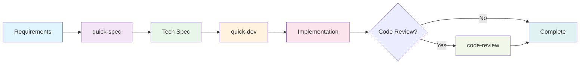
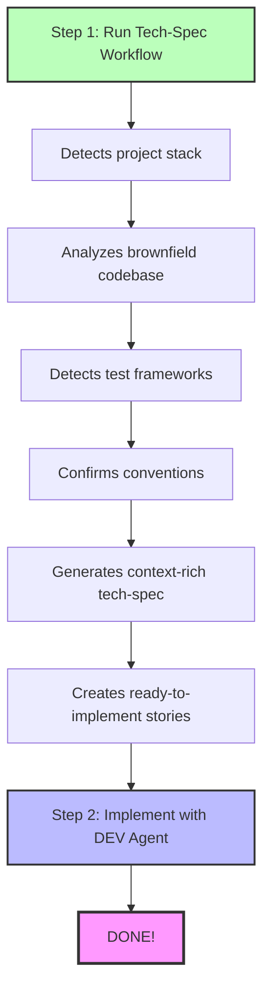
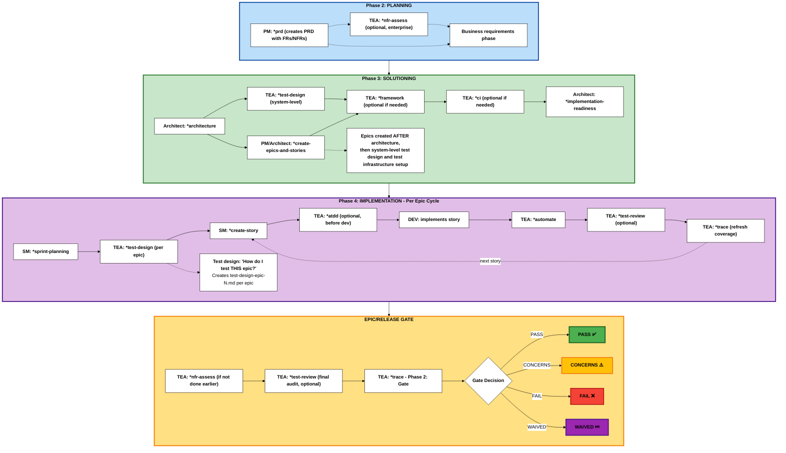

# BMAD Method Documentation (Full)

> Complete documentation for AI consumption
> Generated: 2026-01-15
> Repository: https://github.com/bmad-code-org/BMAD-METHOD

<document path="404.md">
The page you're looking for doesn't exist or has been moved.

[Return to Home](/docs/index.md)
</document>

<document path="_README_WORKFLOW_DIAGRAMS.md">
## Regenerating SVG from Excalidraw

When you edit `workflow-method-greenfield.excalidraw`, regenerate the SVG:

1. Open <https://excalidraw.com/>
2. Load the `.excalidraw` file
3. Click menu (☰) → Export image → SVG
4. **Set "Scale" to 1x** (default is 2x)
5. Click "Export"
6. Save as `workflow-method-greenfield.svg`
7. **Validate the changes** (see below)
8. Commit both files together

**Important:**

- Always use **1x scale** to maintain consistent dimensions
- Automated export tools (`excalidraw-to-svg`) are broken - use manual export only

## Visual Validation

After regenerating the SVG, validate that it renders correctly:

```bash
./tools/validate-svg-changes.sh path/to/workflow-method-greenfield.svg
```

This script:

- Checks for required dependencies (Playwright, ImageMagick)
- Installs Playwright locally if needed (no package.json pollution)
- Renders old vs new SVG using browser-accurate rendering
- Compares pixel-by-pixel and generates a diff image
- Outputs a prompt for AI visual analysis (paste into Gemini/Claude)

**Threshold**: <0.01% difference is acceptable (anti-aliasing variations)
</document>

<document path="_STYLE_GUIDE.md">
Internal guidelines for maintaining consistent, high-quality documentation across the BMad Method project. This document is not included in the Starlight sidebar — it's for contributors and maintainers, not end users.

## Quick Principles

1. **Clarity over brevity** — Be concise, but never at the cost of understanding
2. **Consistent structure** — Follow established patterns so readers know what to expect
3. **Strategic visuals** — Use admonitions, tables, and diagrams purposefully
4. **Scannable content** — Headers, lists, and callouts help readers find what they need

## Validation Steps

Before submitting documentation changes, run these checks from the repo root:

1. **Fix link format** — Convert relative links (`./`, `../`) to site-relative paths (`/path/`)
   ```bash
   npm run docs:fix-links            # Preview changes
   npm run docs:fix-links -- --write # Apply changes
   ```

2. **Validate links** — Check all links point to existing files
   ```bash
   npm run docs:validate-links            # Preview issues
   npm run docs:validate-links -- --write # Auto-fix where possible
   ```

3. **Build the site** — Verify no build errors
   ```bash
   npm run docs:build
   ```

## Tutorial Structure

Every tutorial should follow this structure:

```
1. Title + Hook (1-2 sentences describing the outcome)
2. Version/Module Notice (info or warning admonition as appropriate)
3. What You'll Learn (bullet list of outcomes)
4. Prerequisites (info admonition)
5. Quick Path (tip admonition - TL;DR summary)
6. Understanding [Topic] (context before steps - tables for phases/agents)
7. Installation (if applicable)
8. Step 1: [First Major Task]
9. Step 2: [Second Major Task]
10. Step 3: [Third Major Task]
11. What You've Accomplished (summary + folder structure if applicable)
12. Quick Reference (commands table)
13. Common Questions (FAQ format)
14. Getting Help (community links)
15. Key Takeaways (tip admonition - memorable points)
```

Not all sections are required for every tutorial, but this is the standard flow.

## How-To Structure

How-to guides are task-focused and shorter than tutorials. They answer "How do I do X?" for users who already understand the basics.

```
1. Title + Hook (one sentence: "Use the `X` workflow to...")
2. When to Use This (bullet list of scenarios)
3. When to Skip This (optional - for workflows that aren't always needed)
4. Prerequisites (note admonition)
5. Steps (numbered ### subsections)
6. What You Get (output/artifacts produced)
7. Example (optional - concrete usage scenario)
8. Tips (optional - best practices, common pitfalls)
9. Next Steps (optional - what to do after completion)
```

Include sections only when they add value. A simple how-to might only need Hook, Prerequisites, Steps, and What You Get.

### How-To vs Tutorial

| Aspect | How-To | Tutorial |
|--------|--------|----------|
| **Length** | 50-150 lines | 200-400 lines |
| **Audience** | Users who know the basics | New users learning concepts |
| **Focus** | Complete a specific task | Understand a workflow end-to-end |
| **Sections** | 5-8 sections | 12-15 sections |
| **Examples** | Brief, inline | Detailed, step-by-step |

### How-To Visual Elements

Use admonitions strategically in how-to guides:

| Admonition | Use In How-To |
|------------|---------------|
| `:::note[Prerequisites]` | Required dependencies, agents, prior steps |
| `:::tip[Pro Tip]` | Optional shortcuts or best practices |
| `:::caution[Common Mistake]` | Pitfalls to avoid |
| `:::note[Example]` | Brief usage example inline with steps |

**Guidelines:**
- **1-2 admonitions max** per how-to (they're shorter than tutorials)
- **Prerequisites as admonition** makes scanning easier
- **Tips section** can be a flat list instead of admonition if there are multiple tips
- **Skip admonitions entirely** for very simple how-tos

### How-To Checklist

Before submitting a how-to:

- [ ] Hook is one clear sentence starting with "Use the `X` workflow to..."
- [ ] When to Use This has 3-5 bullet points
- [ ] Prerequisites listed (admonition or flat list)
- [ ] Steps are numbered `###` subsections with action verbs
- [ ] What You Get describes output artifacts
- [ ] No horizontal rules (`---`)
- [ ] No `####` headers
- [ ] No "Related" section (sidebar handles navigation)
- [ ] 1-2 admonitions maximum

## Explanation Structure

Explanation documents help users understand concepts, features, and design decisions. They answer "What is X?" and "Why does X matter?" rather than "How do I do X?"

### Types of Explanation Documents

| Type | Purpose | Example |
|------|---------|---------|
| **Index/Landing** | Overview of a topic area with navigation | `core-concepts/index.md` |
| **Concept** | Define and explain a core concept | `what-are-agents.md` |
| **Feature** | Deep dive into a specific capability | `quick-flow.md` |
| **Philosophy** | Explain design decisions and rationale | `why-solutioning-matters.md` |
| **FAQ** | Answer common questions (see FAQ Sections below) | `brownfield-faq.md` |

### General Explanation Structure

```
1. Title + Hook (1-2 sentences explaining the topic)
2. Overview/Definition (what it is, why it matters)
3. Key Concepts (### subsections for main ideas)
4. Comparison Table (optional - when comparing options)
5. When to Use / When Not to Use (optional - decision guidance)
6. Diagram (optional - mermaid for processes/flows)
7. Next Steps (optional - where to go from here)
```

### Index/Landing Pages

Index pages orient users within a topic area.

```
1. Title + Hook (one sentence overview)
2. Content Table (links with descriptions)
3. Getting Started (numbered list for new users)
4. Choose Your Path (optional - decision tree for different goals)
```

**Example hook:** "Understanding the fundamental building blocks of the BMad Method."

### Concept Explainers

Concept pages define and explain core ideas.

```
1. Title + Hook (what it is in one sentence)
2. Types/Categories (if applicable, with ### subsections)
3. Key Differences Table (comparing types/options)
4. Components/Parts (breakdown of elements)
5. Which Should You Use? (decision guidance)
6. Creating/Customizing (brief pointer to how-to guides)
```

**Example hook:** "Agents are AI assistants that help you accomplish tasks. Each agent has a unique personality, specialized capabilities, and an interactive menu."

### Feature Explainers

Feature pages provide deep dives into specific capabilities.

```
1. Title + Hook (what the feature does)
2. Quick Facts (optional - "Perfect for:", "Time to:")
3. When to Use / When Not to Use (with bullet lists)
4. How It Works (process overview, mermaid diagram if helpful)
5. Key Benefits (what makes it valuable)
6. Comparison Table (vs alternatives if applicable)
7. When to Graduate/Upgrade (optional - when to use something else)
```

**Example hook:** "Quick Spec Flow is a streamlined alternative to the full BMad Method for Quick Flow track projects."

### Philosophy/Rationale Documents

Philosophy pages explain design decisions and reasoning.

```
1. Title + Hook (the principle or decision)
2. The Problem (what issue this addresses)
3. The Solution (how this approach solves it)
4. Key Principles (### subsections for main ideas)
5. Benefits (what users gain)
6. When This Applies (scope of the principle)
```

**Example hook:** "Phase 3 (Solutioning) translates **what** to build (from Planning) into **how** to build it (technical design)."

### Explanation Visual Elements

Use these elements strategically in explanation documents:

| Element | Use For |
|---------|---------|
| **Comparison tables** | Contrasting types, options, or approaches |
| **Mermaid diagrams** | Process flows, phase sequences, decision trees |
| **"Best for:" lists** | Quick decision guidance |
| **Code examples** | Illustrating concepts (keep brief) |

**Guidelines:**
- **Use diagrams sparingly** — one mermaid diagram per document maximum
- **Tables over prose** — for any comparison of 3+ items
- **Avoid step-by-step instructions** — point to how-to guides instead

### Explanation Checklist

Before submitting an explanation document:

- [ ] Hook clearly states what the document explains
- [ ] Content organized into scannable `##` sections
- [ ] Comparison tables used for contrasting options
- [ ] No horizontal rules (`---`)
- [ ] No `####` headers
- [ ] No "Related" section (sidebar handles navigation)
- [ ] No "Next:" navigation links (sidebar handles navigation)
- [ ] Diagrams have clear labels and flow
- [ ] Links to how-to guides for "how do I do this?" questions
- [ ] 2-3 admonitions maximum

## Reference Structure

Reference documents provide quick lookup information for users who know what they're looking for. They answer "What are the options?" and "What does X do?" rather than explaining concepts or teaching skills.

### Types of Reference Documents

| Type | Purpose | Example |
|------|---------|---------|
| **Index/Landing** | Navigation to reference content | `workflows/index.md` |
| **Catalog** | Quick-reference list of items | `agents/index.md` |
| **Deep-Dive** | Detailed single-item reference | `document-project.md` |
| **Configuration** | Settings and config documentation | `core-tasks.md` |
| **Glossary** | Term definitions | `glossary/index.md` |
| **Comprehensive** | Extensive multi-item reference | `bmgd-workflows.md` |

### Reference Index Pages

For navigation landing pages:

```
1. Title + Hook (one sentence describing scope)
2. Content Sections (## for each category)
   - Bullet list with links and brief descriptions
```

Keep these minimal — their job is navigation, not explanation.

### Catalog Reference (Item Lists)

For quick-reference lists of items:

```
1. Title + Hook (one sentence)
2. Items (## for each item)
   - Brief description (one sentence)
   - **Commands:** or **Key Info:** as flat list
3. Universal/Shared (## section if applicable)
```

**Guidelines:**
- Use `##` for items, not `###`
- No horizontal rules between items — whitespace is sufficient
- No "Related" section — sidebar handles navigation
- Keep descriptions to 1 sentence per item

### Item Deep-Dive Reference

For detailed single-item documentation:

```
1. Title + Hook (one sentence purpose)
2. Quick Facts (optional note admonition)
   - Module, Command, Input, Output as list
3. Purpose/Overview (## section)
4. How to Invoke (code block)
5. Key Sections (## for each major aspect)
   - Use ### for sub-options within sections
6. Notes/Caveats (tip or caution admonition)
```

**Guidelines:**
- Start with "quick facts" so readers immediately know scope
- Use admonitions for important caveats
- No "Related Documentation" section — sidebar handles this

### Configuration Reference

For settings, tasks, and config documentation:

```
1. Title + Hook (one sentence explaining what these configure)
2. Table of Contents (jump links if 4+ items)
3. Items (## for each config/task)
   - **Bold summary** — one sentence describing what it does
   - **Use it when:** bullet list of scenarios
   - **How it works:** numbered steps
   - **Output:** expected result (if applicable)
```

**Guidelines:**
- Table of contents only needed for 4+ items
- Keep "How it works" to 3-5 steps maximum
- No horizontal rules between items

### Glossary Reference

For term definitions:

```
1. Title + Hook (one sentence)
2. Navigation (jump links to categories)
3. Categories (## for each category)
   - Terms (### for each term)
   - Definition (1-3 sentences, no prefix)
   - Related context or example (optional)
```

**Guidelines:**
- Group related terms into categories
- Keep definitions concise — link to explanation docs for depth
- Use `###` for terms (makes them linkable and scannable)
- No horizontal rules between terms

### Comprehensive Reference Guide

For extensive multi-item references:

```
1. Title + Hook (one sentence)
2. Overview (## section)
   - Diagram or table showing organization
3. Major Sections (## for each phase/category)
   - Items (### for each item)
   - Standardized fields: Command, Agent, Input, Output, Description
   - Optional: Steps, Features, Use when
4. Next Steps (optional — only if genuinely helpful)
```

**Guidelines:**
- Standardize item fields across all items in the guide
- Use tables for comparing multiple items at once
- One diagram maximum per document
- No horizontal rules — use `##` sections for separation

### General Reference Guidelines

These apply to all reference documents:

| Do | Don't |
|----|-------|
| Use `##` for major sections, `###` for items within | Use `####` headers |
| Use whitespace for separation | Use horizontal rules (`---`) |
| Link to explanation docs for "why" | Explain concepts inline |
| Use tables for structured data | Use nested lists |
| Use admonitions for important notes | Use bold paragraphs for callouts |
| Keep descriptions to 1-2 sentences | Write paragraphs of explanation |

### Reference Admonitions

Use sparingly — 1-2 maximum per reference document:

| Admonition | Use In Reference |
|------------|------------------|
| `:::note[Prerequisites]` | Dependencies needed before using |
| `:::tip[Pro Tip]` | Shortcuts or advanced usage |
| `:::caution[Important]` | Critical caveats or warnings |

### Reference Checklist

Before submitting a reference document:

- [ ] Hook clearly states what the document references
- [ ] Appropriate structure for reference type (catalog, deep-dive, etc.)
- [ ] No horizontal rules (`---`)
- [ ] No `####` headers
- [ ] No "Related" section (sidebar handles navigation)
- [ ] Items use consistent structure throughout
- [ ] Descriptions are 1-2 sentences maximum
- [ ] Tables used for structured/comparative data
- [ ] 1-2 admonitions maximum
- [ ] Links to explanation docs for conceptual depth

## Glossary Structure

Glossaries provide quick-reference definitions for project terminology. Unlike other reference documents, glossaries prioritize compact scanability over narrative explanation.

### Layout Strategy

Starlight auto-generates a right-side "On this page" navigation from headers. Use this to your advantage:

- **Categories as `##` headers** — Appear in right nav for quick jumping
- **Terms in tables** — Compact rows, not individual headers
- **No inline TOC** — Right sidebar handles navigation; inline TOC is redundant
- **Right nav shows categories only** — Cleaner than listing every term

This approach reduces content length by ~70% while improving navigation.

### Table Format

Each category uses a two-column table:

```md
## Category Name

| Term | Definition |
|------|------------|
| **Agent** | Specialized AI persona with specific expertise that guides users through workflows. |
| **Workflow** | Multi-step guided process that orchestrates AI agent activities to produce deliverables. |
```

### Definition Guidelines

| Do | Don't |
|----|-------|
| Start with what it IS or DOES | Start with "This is..." or "A [term] is..." |
| Keep to 1-2 sentences | Write multi-paragraph explanations |
| Bold the term name in the cell | Use plain text for terms |
| Link to docs for deep dives | Explain full concepts inline |

### Context Markers

For terms with limited scope, add italic context at the start of the definition:

```md
| **Tech-Spec** | *Quick Flow only.* Comprehensive technical plan for small changes. |
| **PRD** | *BMad Method/Enterprise.* Product-level planning document with vision and goals. |
```

Standard markers:
- `*Quick Flow only.*`
- `*BMad Method/Enterprise.*`
- `*Phase N.*`
- `*BMGD.*`
- `*Brownfield.*`

### Cross-References

Link related terms when helpful. Reference the category anchor since individual terms aren't headers:

```md
| **Tech-Spec** | *Quick Flow only.* Technical plan for small changes. See [PRD](#planning-documents). |
```

### Organization

- **Alphabetize terms** within each category table
- **Alphabetize categories** or order by logical progression (foundational → specific)
- **No catch-all sections** — Every term belongs in a specific category

### Glossary Checklist

Before submitting glossary changes:

- [ ] Terms in tables, not individual headers
- [ ] Terms alphabetized within each category
- [ ] No inline TOC (right nav handles navigation)
- [ ] No horizontal rules (`---`)
- [ ] Definitions are 1-2 sentences
- [ ] Context markers italicized at definition start
- [ ] Term names bolded in table cells
- [ ] No "A [term] is..." definitions

## Visual Hierarchy

### Avoid

| Pattern | Problem |
|---------|---------|
| `---` horizontal rules | Fragment the reading flow |
| `####` deep headers | Create visual noise |
| **Important:** bold paragraphs | Blend into body text |
| Deeply nested lists | Hard to scan |
| Code blocks for non-code | Confusing semantics |

### Use Instead

| Pattern | When to Use |
|---------|-------------|
| White space + section headers | Natural content separation |
| Bold text within paragraphs | Inline emphasis |
| Admonitions | Callouts that need attention |
| Tables | Structured comparisons |
| Flat lists | Scannable options |

## Admonitions

Use Starlight admonitions strategically:

```md
:::tip[Title]
Shortcuts, best practices, "pro tips"
:::

:::note[Title]
Context, definitions, examples, prerequisites
:::

:::caution[Title]
Caveats, potential issues, things to watch out for
:::

:::danger[Title]
Critical warnings only — data loss, security issues
:::
```

### Standard Admonition Uses

| Admonition | Standard Use in Tutorials |
|------------|---------------------------|
| `:::note[Prerequisites]` | What users need before starting |
| `:::tip[Quick Path]` | TL;DR summary at top of tutorial |
| `:::caution[Fresh Chats]` | Context limitation reminders |
| `:::note[Example]` | Command/response examples |
| `:::tip[Check Your Status]` | How to verify progress |
| `:::tip[Remember These]` | Key takeaways at end |

### Admonition Guidelines

- **Always include a title** for tip, info, and warning
- **Keep content brief** — 1-3 sentences ideal
- **Don't overuse** — More than 3-4 per major section feels noisy
- **Don't nest** — Admonitions inside admonitions are hard to read

## Headers

### Budget

- **8-12 `##` sections** for full tutorials following standard structure
- **2-3 `###` subsections** per `##` section maximum
- **Avoid `####` entirely** — use bold text or admonitions instead

### Naming

- Use action verbs for steps: "Install BMad", "Create Your Plan"
- Use nouns for reference sections: "Common Questions", "Quick Reference"
- Keep headers short and scannable

## Code Blocks

### Do

```md
```bash
npx bmad-method install
```
```

### Don't

````md
```
You: Do something
Agent: [Response here]
```
````

For command/response examples, use an admonition instead:

```md
:::note[Example]
Run `workflow-status` and the agent will tell you the next recommended workflow.
:::
```

## Tables

Use tables for:
- Phases and what happens in each
- Agent roles and when to use them
- Command references
- Comparing options
- Step sequences with multiple attributes

Keep tables simple:
- 2-4 columns maximum
- Short cell content
- Left-align text, right-align numbers

### Standard Tables

**Phases Table:**
```md
| Phase | Name | What Happens |
|-------|------|--------------|
| 1 | Analysis | Brainstorm, research *(optional)* |
| 2 | Planning | Requirements — PRD or tech-spec *(required)* |
```

**Quick Reference Table:**
```md
| Command | Agent | Purpose |
|---------|-------|---------|
| `*workflow-init` | Analyst | Initialize a new project |
| `*prd` | PM | Create Product Requirements Document |
```

**Build Cycle Table:**
```md
| Step | Agent | Workflow | Purpose |
|------|-------|----------|---------|
| 1 | SM | `create-story` | Create story file from epic |
| 2 | DEV | `dev-story` | Implement the story |
```

## Lists

### Flat Lists (Preferred)

```md
- **Option A** — Description of option A
- **Option B** — Description of option B
- **Option C** — Description of option C
```

### Numbered Steps

```md
1. Load the **PM agent** in a new chat
2. Run the PRD workflow: `*prd`
3. Output: `PRD.md`
```

### Avoid Deep Nesting

```md
<!-- Don't do this -->
1. First step
   - Sub-step A
     - Detail 1
     - Detail 2
   - Sub-step B
2. Second step
```

Instead, break into separate sections or use an admonition for context.

## Links

- Use descriptive link text: `[Tutorial Style Guide](./tutorial-style.md)`
- Avoid "click here" or bare URLs
- Prefer relative paths within docs

## Images

- Always include alt text
- Add a caption in italics below: `*Description of the image.*`
- Use SVG for diagrams when possible
- Store in `./images/` relative to the document

## FAQ Sections

Use a TOC with jump links, `###` headers for questions, and direct answers:

```md
## Questions

- [Do I always need architecture?](#do-i-always-need-architecture)
- [Can I change my plan later?](#can-i-change-my-plan-later)

### Do I always need architecture?

Only for BMad Method and Enterprise tracks. Quick Flow skips to implementation.

### Can I change my plan later?

Yes. The SM agent has a `correct-course` workflow for handling scope changes.

**Have a question not answered here?** Please [open an issue](...) or ask in [Discord](...) so we can add it!
```

### FAQ Guidelines

- **TOC at top** — Jump links under `## Questions` for quick navigation
- **`###` headers** — Questions are scannable and linkable (no `Q:` prefix)
- **Direct answers** — No `**A:**` prefix, just the answer
- **No "Related Documentation"** — Sidebar handles navigation; avoid repetitive links
- **End with CTA** — "Have a question not answered here?" with issue/Discord links

## Folder Structure Blocks

Show project structure in "What You've Accomplished":

````md
Your project now has:

```
your-project/
├── _bmad/                         # BMad configuration
├── _bmad-output/
│   ├── PRD.md                     # Your requirements document
│   └── bmm-workflow-status.yaml   # Progress tracking
└── ...
```
````

## Example: Before and After

### Before (Noisy)

```md
---

## Getting Started

### Step 1: Initialize

#### What happens during init?

**Important:** You need to describe your project.

1. Your project goals
   - What you want to build
   - Why you're building it
2. The complexity
   - Small, medium, or large

---
```

### After (Clean)

```md
## Step 1: Initialize Your Project

Load the **Analyst agent** in your IDE, wait for the menu, then run `workflow-init`.

:::note[What Happens]
You'll describe your project goals and complexity. The workflow then recommends a planning track.
:::
```

## Checklist

Before submitting a tutorial:

- [ ] Follows the standard structure
- [ ] Has version/module notice if applicable
- [ ] Has "What You'll Learn" section
- [ ] Has Prerequisites admonition
- [ ] Has Quick Path TL;DR admonition
- [ ] No horizontal rules (`---`)
- [ ] No `####` headers
- [ ] Admonitions used for callouts (not bold paragraphs)
- [ ] Tables used for structured data (phases, commands, agents)
- [ ] Lists are flat (no deep nesting)
- [ ] Has "What You've Accomplished" section
- [ ] Has Quick Reference table
- [ ] Has Common Questions section
- [ ] Has Getting Help section
- [ ] Has Key Takeaways admonition
- [ ] All links use descriptive text
- [ ] Images have alt text and captions
</document>

<document path="_archive/customize-workflows.md">
Customize and optimize workflows with step replacement and hooks.

## Status

:::note[Coming Soon]
Workflow customization is an upcoming capability. This guide will be updated when the feature is available.
:::

## What to Expect

Workflow customization will allow you to:

- **Replace Steps** - Swap out specific workflow steps with custom implementations
- **Add Hooks** - Inject custom behavior before/after workflow steps
- **Extend Workflows** - Create new workflows based on existing ones
- **Override Behavior** - Customize workflow logic for your project's needs

## For Now

While workflow customization is in development, you can:

- **Create Custom Workflows** - Use the BMad Builder to create entirely new workflows
- **Customize Agents** - Modify agent behavior using [Agent Customization](/docs/how-to/customization/customize-agents.md)
- **Provide Feedback** - Share your workflow customization needs with the community

**In the meantime:** Learn how to [create custom workflows](/docs/explanation/bmad-builder/index.md) from scratch.
</document>

<document path="_archive/getting-started-bmadv4.md">
Build software faster using AI-powered workflows with specialized agents that guide you through planning, architecture, and implementation.

:::note[Stable Release]
This tutorial covers BMad v4, the current stable release. For the latest features (with potential breaking changes), see the [BMad v6 Alpha tutorial](./getting-started-bmadv6.md).
:::

## What You'll Learn

- Install and configure BMad for your IDE
- Understand how BMad organizes work into phases and agents
- Initialize a project and choose a planning track
- Create your first requirements document

:::note[Prerequisites]
- **Node.js 20+** — Required for the installer
- **Git** — Recommended for version control
- **AI-powered IDE** — Claude Code, Cursor, Windsurf, or similar
- **A project idea** — Even a simple one works for learning
:::

:::tip[Quick Path]
**Install** → `npx bmad-method install`
**Initialize** → Load Analyst agent, run `workflow-init`
**Plan** → PM creates PRD, Architect creates architecture
**Build** → SM manages sprints, DEV implements stories
**Always use fresh chats** for each workflow to avoid context issues.
:::

## Understanding BMad

BMad helps you build software through guided workflows with specialized AI agents. The process follows four phases:

| Phase | Name | What Happens |
|-------|------|--------------|
| 1 | Analysis | Brainstorm, research *(optional)* |
| 2 | Planning | Requirements — PRD or tech-spec *(required)* |
| 3 | Solutioning | Architecture, design decisions *(varies by track)* |
| 4 | Implementation | Build code story by story *(required)* |

Based on your project's complexity, BMad offers three planning tracks:

| Track | Best For | Documents Created |
|-------|----------|-------------------|
| **Quick Flow** | Bug fixes, simple features, clear scope | Tech-spec only |
| **BMad Method** | Products, platforms, complex features | PRD + Architecture + UX |
| **Enterprise** | Compliance, multi-tenant, enterprise needs | PRD + Architecture + Security + DevOps |

## Installation

Open a terminal in your project directory and run:

```bash
npx bmad-method install
```

The interactive installer guides you through setup:

- **Choose Installation Location** — Select current directory (recommended), subdirectory, or custom path
- **Select Your AI Tool** — Claude Code, Cursor, Windsurf, or other
- **Choose Modules** — Select **BMM** (BMad Method) for this tutorial
- **Accept Defaults** — Customize later in `_bmad/[module]/config.yaml`

Verify your installation:

```
your-project/
├── _bmad/
│   ├── bmm/            # Method module
│   │   ├── agents/     # Agent files
│   │   ├── workflows/  # Workflow files
│   │   └── config.yaml # Module config
│   └── core/           # Core utilities
├── _bmad-output/       # Generated artifacts (created later)
└── .claude/            # IDE configuration (if using Claude Code)
```

:::tip[Troubleshooting]
Having issues? See [Install BMad](../../how-to/installation/install-bmad.md) for common solutions.
:::

## Step 1: Initialize Your Project

Load the **Analyst agent** in your IDE:
- **Claude Code**: Type `/analyst` or load the agent file directly
- **Cursor/Windsurf**: Open the agent file from `_bmad/bmm/agents/`

Wait for the agent's menu to appear, then run:

```
Run workflow-init
```

Or use the shorthand: `*workflow-init`

The workflow asks you to describe:
- **Your project and goals** — What are you building? What problem does it solve?
- **Existing codebase** — Is this new (greenfield) or existing code (brownfield)?
- **Size and complexity** — Roughly how big is this? (adjustable later)

Based on your description, the workflow suggests a planning track. For this tutorial, choose **BMad Method**.

Once you confirm, the workflow creates `bmm-workflow-status.yaml` to track your progress.

:::caution[Fresh Chats]
Always start a fresh chat for each workflow. This prevents context limitations from causing issues.
:::

## Step 2: Create Your Plan

With your project initialized, work through the planning phases.

### Phase 1: Analysis (Optional)

If you want to brainstorm or research first:
- **brainstorm-project** — Guided ideation with the Analyst
- **research** — Market and technical research
- **product-brief** — Recommended foundation document

### Phase 2: Planning (Required)

**Start a fresh chat** and load the **PM agent**.

```
Run prd
```

Or use shortcuts: `*prd`, select "create-prd" from the menu, or say "Let's create a PRD".

The PM agent guides you through:
1. **Project overview** — Refine your project description
2. **Goals and success metrics** — What does success look like?
3. **User personas** — Who uses this product?
4. **Functional requirements** — What must the system do?
5. **Non-functional requirements** — Performance, security, scalability needs

When complete, you'll have `PRD.md` in your `_bmad-output/` folder.

:::note[UX Design (Optional)]
If your project has a user interface, load the **UX-Designer agent** and run the UX design workflow after creating your PRD.
:::

### Phase 3: Solutioning (Required for BMad Method)

**Start a fresh chat** and load the **Architect agent**.

```
Run create-architecture
```

The architect guides you through technical decisions: tech stack, database design, API patterns, and system structure.

:::tip[Check Your Status]
Unsure what's next? Load any agent and run `workflow-status`. It tells you the next recommended or required workflow.
:::

## Step 3: Build Your Project

Once planning is complete, move to implementation.

### Initialize Sprint Planning

Load the **SM agent** and run `sprint-planning`. This creates `sprint-status.yaml` to track all epics and stories.

### The Build Cycle

For each story, repeat this cycle with fresh chats:

| Step | Agent | Workflow | Purpose |
|------|-------|----------|---------|
| 1 | SM | `create-story` | Create story file from epic |
| 2 | DEV | `dev-story` | Implement the story |
| 3 | DEV | `code-review` | Quality validation *(recommended)* |

After completing all stories in an epic, load the **SM agent** and run `retrospective`.

## What You've Accomplished

You've learned the foundation of building with BMad:

- Installed BMad and configured it for your IDE
- Initialized a project with your chosen planning track
- Created planning documents (PRD, Architecture)
- Understood the build cycle for implementation

Your project now has:

```
your-project/
├── _bmad/                         # BMad configuration
├── _bmad-output/
│   ├── PRD.md                     # Your requirements document
│   ├── architecture.md            # Technical decisions
│   └── bmm-workflow-status.yaml   # Progress tracking
└── ...
```

## Quick Reference

| Command | Agent | Purpose |
|---------|-------|---------|
| `*workflow-init` | Analyst | Initialize a new project |
| `*workflow-status` | Any | Check progress and next steps |
| `*prd` | PM | Create Product Requirements Document |
| `*create-architecture` | Architect | Create architecture document |
| `*sprint-planning` | SM | Initialize sprint tracking |
| `*create-story` | SM | Create a story file |
| `*dev-story` | DEV | Implement a story |
| `*code-review` | DEV | Review implemented code |

## Common Questions

**Do I need to create a PRD for every project?**
Only for BMad Method and Enterprise tracks. Quick Flow projects use a simpler tech-spec instead.

**Can I skip Phase 1 (Analysis)?**
Yes, Phase 1 is optional. If you already know what you're building, start with Phase 2 (Planning).

**What if I want to brainstorm first?**
Load the Analyst agent and run `*brainstorm-project` before `workflow-init`.

**Why start fresh chats for each workflow?**
Workflows are context-intensive. Reusing chats can cause the AI to hallucinate or lose track of details. Fresh chats ensure maximum context capacity.

## Getting Help

- **During workflows** — Agents guide you with questions and explanations
- **Check status** — Run `workflow-status` with any agent
- **Community** — [Discord](https://discord.gg/gk8jAdXWmj) (#bmad-method-help, #report-bugs-and-issues)
- **Video tutorials** — [BMad Code YouTube](https://www.youtube.com/@BMadCode)

## Key Takeaways

:::tip[Remember These]
- **Always use fresh chats** — Load agents in new chats for each workflow
- **Let workflow-status guide you** — Ask any agent for status when unsure
- **Track matters** — Quick Flow uses tech-spec; Method/Enterprise need PRD and architecture
- **Tracking is automatic** — Status files update themselves
- **Agents are flexible** — Use menu numbers, shortcuts (`*prd`), or natural language
:::

Ready to start? Install BMad, load the Analyst, run `workflow-init`, and let the agents guide you.
</document>

<document path="_archive/vendor-workflows.md">
Use workflow vendoring and inheritance to share or reutilize workflows across modules.

## Workflow Vendoring

Workflow Vendoring allows an agent to have access to a workflow from another module, without having to install said module. At install time, the module workflow being vendored will be cloned and installed into the module that is receiving the vendored workflow the agent needs.

### How to Vendor

Lets assume you are building a module, and you do not want to recreate a workflow from the BMad Method, such as workflows/4-implementation/dev-story/workflow.md. Instead of copying all the context to your module, and having to maintain it over time as updates are made, you can instead use the exec-vendor menu item in your agent.

From your modules agent definition, you would implement the menu item as follows in the agent:

```yaml
    - trigger: develop-story
      exec-vendor: "{project-root}/_bmad/<source-module>/workflows/4-production/dev-story/workflow.md"
      exec: "{project-root}/_bmad/<my-module>/workflows/dev-story/workflow.md"
      description: "Execute Dev Story workflow, implementing tasks and tests, or performing updates to the story"
```

At install time, it will clone the workflow and all of its required assets, and the agent that gets built will have an exec to a path installed in its own module. The content gets added to the folder you specify in exec. While it does not have to exactly match the source path, you will want to ensure you are specifying the workflow.md to be in a new location (in other words in this example, dev-story would not already be the path of another custom module workflow that already exists.)

## Workflow Inheritance

:::note[Coming Soon]
Official support for workflow inheritance is coming post beta.
:::

Workflow Inheritance is a different concept, that allows you to modify or extend existing workflow.

Party Mode from the core is an example of a workflow that is designed with inheritance in mind - customization for specific party needs. While party mode itself is generic - there might be specific agent collaborations you want to create. Without having to reinvent the whole party mode concept, or copy and paste all of its content - you could inherit from party mode to extend it to be specific.

Some possible examples could be:

- Retrospective
- Sprint Planning
- Collaborative Brainstorming Sessions

## Workflow Customization

:::note[Coming Soon]
Official support for workflow customization is coming post beta.
:::

Similar to Workflow Inheritance, Workflow Customization will soon be allowed for certain workflows that are meant to be user customized - similar in process to how agents are customized now.

This will take the shape of workflows with optional hooks, configurable inputs, and the ability to replace whole at install time.

For example, assume you are using the Create PRD workflow, which is comprised of 11 steps, and you want to always include specifics about your companies domain, technical landscape or something else. While project-context can be helpful with that, you can also through hooks and step overrides, have full replace steps, the key requirement being to ensure your step replace file is an exact file name match of an existing step, follows all conventions, and ends in a similar fashion to either hook back in to call the next existing step, or more custom steps that eventually hook back into the flow.
</document>

<document path="downloads.md">
Download BMad Method resources for offline use, AI training, or integration.

## Source Bundles

| File | Description |
|------|-------------|
| **[bmad-sources.zip](/downloads/bmad-sources.zip)** | Complete BMad source files |
| **[bmad-prompts.zip](/downloads/bmad-prompts.zip)** | Agent and workflow prompts only |

## LLM-Optimized Files

These files are designed for AI consumption - perfect for loading into Claude, ChatGPT, or any LLM context window.

| File | Description | Use Case |
|------|-------------|----------|
| **[llms.txt](/llms.txt)** | Documentation index with summaries | Quick overview, navigation |
| **[llms-full.txt](/llms-full.txt)** | Complete documentation concatenated | Full context loading |

### Using with LLMs

**Claude Projects:**
```
Upload llms-full.txt as project knowledge
```

**ChatGPT:**
```
Paste llms.txt for navigation, or sections from llms-full.txt as needed
```

**API Usage:**
```python
import requests
docs = requests.get("https://bmad-code-org.github.io/BMAD-METHOD/llms-full.txt").text
# Include in your system prompt or context
```

## Installation Options

### NPM (Recommended)

```bash
npx bmad-method@alpha install
```

## Version Information

- **Current Version:** See [CHANGELOG](https://github.com/bmad-code-org/BMAD-METHOD/blob/main/CHANGELOG.md)
- **Release Notes:** Available on [GitHub Releases](https://github.com/bmad-code-org/BMAD-METHOD/releases)

## API Access

For programmatic access to BMad documentation:

```bash
# Get documentation index
curl https://bmad-code-org.github.io/BMAD-METHOD/llms.txt

# Get full documentation
curl https://bmad-code-org.github.io/BMAD-METHOD/llms-full.txt
```

## Contributing

Want to improve BMad Method? Check out:

- [Contributing Guide](https://github.com/bmad-code-org/BMAD-METHOD/blob/main/CONTRIBUTING.md)
- [GitHub Repository](https://github.com/bmad-code-org/BMAD-METHOD)
</document>

<document path="explanation/agents/barry-quick-flow.md">
Barry is the elite solo developer who takes projects from concept to deployment with ruthless efficiency — no handoffs, no delays, just pure focused development.

:::note[Agent Info]
- **Agent ID:** `_bmad/bmm/agents/quick-flow-solo-dev.md`
- **Icon:** 🚀
- **Module:** BMM
:::

## Overview

Barry is the elite solo developer who lives and breathes the BMad Quick Flow workflow. He takes projects from concept to deployment with ruthless efficiency - no handoffs, no delays, just pure focused development. Barry architects specs, writes the code, and ships features faster than entire teams. When you need it done right and done now, Barry's your dev.

### Agent Persona

**Name:** Barry
**Title:** Quick Flow Solo Dev

**Identity:** Barry is an elite developer who thrives on autonomous execution. He lives and breathes the BMad Quick Flow workflow, taking projects from concept to deployment with ruthless efficiency. No handoffs, no delays - just pure, focused development. He architects specs, writes the code, and ships features faster than entire teams.

**Communication Style:** Direct, confident, and implementation-focused. Uses tech slang and gets straight to the point. No fluff, just results. Every response moves the project forward.

**Core Principles:**

- Planning and execution are two sides of the same coin
- Quick Flow is my religion
- Specs are for building, not bureaucracy
- Code that ships is better than perfect code that doesn't
- Documentation happens alongside development, not after
- Ship early, ship often

## Menu Commands

Barry owns the entire BMad Quick Flow path, providing a streamlined 3-step development process that eliminates handoffs and maximizes velocity.

### 1. **quick-spec**

- **Workflow:** `_bmad/bmm/workflows/bmad-quick-flow/quick-spec/workflow.md`
- **Description:** Architect a technical spec with implementation-ready stories
- **Use when:** You need to transform requirements into a buildable spec

### 2. **quick-dev**

- **Workflow:** `_bmad/bmm/workflows/bmad-quick-flow/quick-dev/workflow.yaml`
- **Description:** Ship features from spec or direct instructions - no handoffs
- **Use when:** You're ready to ship code based on a spec or clear instructions

### 3. **code-review**

- **Workflow:** `_bmad/bmm/workflows/4-implementation/code-review/workflow.yaml`
- **Description:** Review code for quality, patterns, and acceptance criteria
- **Use when:** You need to validate implementation quality

### 4. **party-mode**

- **Workflow:** `_bmad/core/workflows/party-mode/workflow.yaml`
- **Description:** Bring in other experts when I need specialized backup
- **Use when:** You need collaborative problem-solving or specialized expertise

## When to Use Barry

### Ideal Scenarios

1. **Quick Flow Development** - Small to medium features that need rapid delivery
2. **Technical Specification Creation** - When you need detailed implementation plans
3. **Direct Development** - When requirements are clear and you want to skip extensive planning
4. **Code Reviews** - When you need senior-level technical validation
5. **Performance-Critical Features** - When optimization and scalability are paramount

### Project Types

- **Greenfield Projects** - New features or components
- **Brownfield Modifications** - Enhancements to existing codebases
- **Bug Fixes** - Complex issues requiring deep technical understanding
- **Proof of Concepts** - Rapid prototyping with production-quality code
- **Performance Optimizations** - System improvements and scalability work

## The BMad Quick Flow Process

Barry orchestrates a simple, efficient 3-step process:



### Step 1: Technical Specification (`quick-spec`)

**Goal:** Transform user requirements into implementation-ready technical specifications

**Process:**

1. **Problem Understanding** - Clarify requirements, scope, and constraints
2. **Code Investigation** - Analyze existing patterns and dependencies (if applicable)
3. **Specification Generation** - Create comprehensive tech spec with:
   - Problem statement and solution overview
   - Development context and patterns
   - Implementation tasks with acceptance criteria
   - Technical decisions and dependencies
4. **Review and Finalize** - Validate spec captures user intent

**Output:** `tech-spec-{slug}.md` saved to sprint artifacts

**Best Practices:**

- Include ALL context a fresh dev agent needs
- Be specific about files, patterns, and conventions
- Define clear acceptance criteria using Given/When/Then format
- Document technical decisions and trade-offs

### Step 2: Development (`quick-dev`)

**Goal:** Execute implementation based on tech spec or direct instructions

**Two Modes:**

**Mode A: Tech-Spec Driven**

- Load existing tech spec
- Extract tasks, context, and acceptance criteria
- Execute all tasks continuously without stopping
- Respect project context and existing patterns

**Mode B: Direct Instructions**

- Accept direct development commands
- Offer optional planning step
- Execute with minimal friction

**Process:**

1. **Load Project Context** - Understand patterns and conventions
2. **Execute Implementation** - Work through all tasks:
   - Load relevant files and context
   - Implement following established patterns
   - Write and run tests
   - Handle errors appropriately
3. **Verify Completion** - Ensure all tasks complete, tests passing, AC satisfied

### Step 3: Code Review (`code-review`) - Optional

**Goal:** Senior developer review of implemented code

**When to Use:**

- Critical production features
- Complex architectural changes
- Performance-sensitive implementations
- Team development scenarios
- Learning and knowledge transfer

**Review Focus:**

- Code quality and patterns
- Acceptance criteria compliance
- Performance and scalability
- Security considerations
- Maintainability and documentation

## Collaboration with Other Agents

### Natural Partnerships

- **Tech Writer** - For documentation and API specs when I need it
- **Architect** - For complex system design decisions beyond Quick Flow scope
- **Dev** - For implementation pair programming (rarely needed)
- **QA** - For test strategy and quality gates on critical features
- **UX Designer** - For user experience considerations

### Party Mode Composition

In party mode, Barry often acts as:

- **Solo Tech Lead** - Guiding architectural decisions
- **Implementation Expert** - Providing coding insights
- **Performance Optimizer** - Ensuring scalable solutions
- **Code Review Authority** - Validating technical approaches

## Tips for Working with Barry

### For Best Results

1. **Be Specific** - Provide clear requirements and constraints
2. **Share Context** - Include relevant files and patterns
3. **Define Success** - Clear acceptance criteria lead to better outcomes
4. **Trust the Process** - The 3-step flow is optimized for speed and quality
5. **Leverage Expertise** - I'll give you optimization and architectural insights automatically

### Communication Patterns

- **Git Commit Style** - "feat: Add user authentication with OAuth 2.0"
- **RFC Style** - "Proposing microservice architecture for scalability"
- **Direct Questions** - "Actually, have you considered the race condition?"
- **Technical Trade-offs** - "We could optimize for speed over memory here"

### Avoid These Common Mistakes

1. **Vague Requirements** - Leads to unnecessary back-and-forth
2. **Ignoring Patterns** - Causes technical debt and inconsistencies
3. **Skipping Code Review** - Missed opportunities for quality improvement
4. **Over-planning** - I excel at rapid, pragmatic development
5. **Not Using Party Mode** - Missing collaborative insights for complex problems

## Example Workflow

```bash
# Start with Barry
/bmad:bmm:agents:quick-flow-solo-dev

# Create a tech spec
> quick-spec

# Quick implementation
> quick-dev tech-spec-auth.md

# Optional code review
> code-review
```

### Sample Tech Spec Structure

```markdown
# Tech-Spec: User Authentication System

**Created:** 2025-01-15
**Status:** Ready for Development

## Overview

### Problem Statement

Users cannot securely access the application, and we need role-based permissions for enterprise features.

### Solution

Implement OAuth 2.0 authentication with JWT tokens and role-based access control (RBAC).

### Scope (In/Out)

**In:** Login, logout, password reset, role management
**Out:** Social login, SSO, multi-factor authentication (Phase 2)

## Context for Development

### Codebase Patterns

- Use existing auth middleware pattern in `src/middleware/auth.js`
- Follow service layer pattern from `src/services/`
- JWT secrets managed via environment variables

### Files to Reference

- `src/middleware/auth.js` - Authentication middleware
- `src/models/User.js` - User data model
- `config/database.js` - Database connection

### Technical Decisions

- JWT tokens over sessions for API scalability
- bcrypt for password hashing
- Role-based permissions stored in database

## Implementation Plan

### Tasks

- [ ] Create authentication service
- [ ] Implement login/logout endpoints
- [ ] Add JWT middleware
- [ ] Create role-based permissions
- [ ] Write comprehensive tests

### Acceptance Criteria

- [ ] Given valid credentials, when user logs in, then receive JWT token
- [ ] Given invalid token, when accessing protected route, then return 401
- [ ] Given admin role, when accessing admin endpoint, then allow access
```

## Common Questions

- [When should I use Barry vs other agents?](#when-should-i-use-barry-vs-other-agents)
- [Is the code review step mandatory?](#is-the-code-review-step-mandatory)
- [Can I skip the tech spec step?](#can-i-skip-the-tech-spec-step)
- [How does Barry differ from the Dev agent?](#how-does-barry-differ-from-the-dev-agent)
- [Can Barry handle enterprise-scale projects?](#can-barry-handle-enterprise-scale-projects)

### When should I use Barry vs other agents?

Use Barry for Quick Flow development (small to medium features), rapid prototyping, or when you need elite solo development. For large, complex projects requiring full team collaboration, consider the full BMad Method with specialized agents.

### Is the code review step mandatory?

No, it's optional but highly recommended for critical features, team projects, or when learning best practices.

### Can I skip the tech spec step?

Yes, the quick-dev workflow accepts direct instructions. However, tech specs are recommended for complex features or team collaboration.

### How does Barry differ from the Dev agent?

Barry handles the complete Quick Flow process (spec → dev → review) with elite architectural expertise, while the Dev agent specializes in pure implementation tasks. Barry is your autonomous end-to-end solution.

### Can Barry handle enterprise-scale projects?

For enterprise-scale projects requiring full team collaboration, consider using the Enterprise Method track. Barry is optimized for rapid delivery in the Quick Flow track where solo execution wins.

:::tip[Ready to Ship?]
Start with `/bmad:bmm:agents:quick-flow-solo-dev`
:::
</document>

<document path="explanation/agents/index.md">
Comprehensive guides to BMad's AI agents — their roles, capabilities, and how to work with them effectively.

## Agent Guides

| Agent | Description |
|-------|-------------|
| **[Agent Roles](/docs/explanation/core-concepts/agent-roles.md)** | Overview of all BMM agent roles and responsibilities |
| **[Quick Flow Solo Dev (Barry)](/docs/explanation/agents/barry-quick-flow.md)** | The dedicated agent for rapid development |
| **[Game Development Agents](/docs/explanation/game-dev/agents.md)** | Complete guide to BMGD's specialized game dev agents |

## Getting Started

1. Read **[What Are Agents?](/docs/explanation/core-concepts/what-are-agents.md)** for the core concept explanation
2. Review **[Agent Roles](/docs/explanation/core-concepts/agent-roles.md)** to understand available agents
3. Choose an agent that fits your workflow needs
</document>

<document path="explanation/architecture/four-phases.md">
BMad Method uses a four-phase approach that adapts to project complexity while ensuring consistent quality.

## Phase Overview

| Phase | Name | Purpose | Required? |
|-------|------|---------|-----------|
| **Phase 1** | Analysis | Exploration and discovery | Optional |
| **Phase 2** | Planning | Requirements definition | Required |
| **Phase 3** | Solutioning | Technical design | Track-dependent |
| **Phase 4** | Implementation | Building the software | Required |

## Phase 1: Analysis (Optional)

Exploration and discovery workflows that help validate ideas and understand markets before planning.

**Workflows:**
- `brainstorm-project` - Solution exploration
- `research` - Market/technical/competitive research
- `product-brief` - Strategic vision capture

**When to use:**
- Starting new projects
- Exploring opportunities
- Validating market fit

**When to skip:**
- Clear requirements
- Well-defined features
- Continuing existing work

## Phase 2: Planning (Required)

Requirements definition using the scale-adaptive system to match planning depth to project complexity.

**Workflows:**
- `prd` - Product Requirements Document (BMad Method/Enterprise)
- `tech-spec` - Technical specification (Quick Flow)
- `create-ux-design` - Optional UX specification

**Key principle:**
Define **what** to build and **why**. Leave **how** to Phase 3.

## Phase 3: Solutioning (Track-Dependent)

Technical architecture and design decisions that prevent agent conflicts during implementation.

**Workflows:**
- `architecture` - System design with ADRs
- `create-epics-and-stories` - Work breakdown (after architecture)
- `implementation-readiness` - Gate check

**Required for:**
- BMad Method (complex projects)
- Enterprise Method

**Skip for:**
- Quick Flow (simple changes)

**Key principle:**
Make technical decisions explicit so all agents implement consistently.

## Phase 4: Implementation (Required)

Iterative sprint-based development with story-centric workflow.

**Workflows:**
- `sprint-planning` - Initialize tracking
- `create-story` - Prepare stories
- `dev-story` - Implement with tests
- `code-review` - Quality assurance
- `retrospective` - Continuous improvement

:::tip[Key Principle]
One story at a time — complete each story's full lifecycle before starting the next.
:::

## Phase Flow by Track

### Quick Flow

```
Phase 2 (tech-spec) → Phase 4 (implement)
```

Skip Phases 1 and 3 for simple changes.

### BMad Method

```
Phase 1 (optional) → Phase 2 (PRD) → Phase 3 (architecture) → Phase 4 (implement)
```

Full methodology for complex projects.

### Enterprise

```
Phase 1 → Phase 2 (PRD) → Phase 3 (architecture + extended) → Phase 4 (implement)
```

Same as BMad Method with optional extended workflows.
</document>

<document path="explanation/architecture/preventing-agent-conflicts.md">
When multiple AI agents implement different parts of a system, they can make conflicting technical decisions. Architecture documentation prevents this by establishing shared standards.

## Common Conflict Types

### API Style Conflicts

Without architecture:
- Agent A uses REST with `/users/{id}`
- Agent B uses GraphQL mutations
- Result: Inconsistent API patterns, confused consumers

With architecture:
- ADR specifies: "Use GraphQL for all client-server communication"
- All agents follow the same pattern

### Database Design Conflicts

Without architecture:
- Agent A uses snake_case column names
- Agent B uses camelCase column names
- Result: Inconsistent schema, confusing queries

With architecture:
- Standards document specifies naming conventions
- All agents follow the same patterns

### State Management Conflicts

Without architecture:
- Agent A uses Redux for global state
- Agent B uses React Context
- Result: Multiple state management approaches, complexity

With architecture:
- ADR specifies state management approach
- All agents implement consistently

## How Architecture Prevents Conflicts

### 1. Explicit Decisions via ADRs

Every significant technology choice is documented with:
- Context (why this decision matters)
- Options considered (what alternatives exist)
- Decision (what we chose)
- Rationale (why we chose it)
- Consequences (trade-offs accepted)

### 2. FR/NFR-Specific Guidance

Architecture maps each functional requirement to technical approach:
- FR-001: User Management → GraphQL mutations
- FR-002: Mobile App → Optimized queries

### 3. Standards and Conventions

Explicit documentation of:
- Directory structure
- Naming conventions
- Code organization
- Testing patterns

## Architecture as Shared Context

Think of architecture as the shared context that all agents read before implementing:

```
PRD: "What to build"
     ↓
Architecture: "How to build it"
     ↓
Agent A reads architecture → implements Epic 1
Agent B reads architecture → implements Epic 2
Agent C reads architecture → implements Epic 3
     ↓
Result: Consistent implementation
```

## Key ADR Topics

Common decisions that prevent conflicts:

| Topic | Example Decision |
|-------|-----------------|
| API Style | GraphQL vs REST vs gRPC |
| Database | PostgreSQL vs MongoDB |
| Auth | JWT vs Sessions |
| State Management | Redux vs Context vs Zustand |
| Styling | CSS Modules vs Tailwind vs Styled Components |
| Testing | Jest + Playwright vs Vitest + Cypress |

## Anti-Patterns to Avoid

:::caution[Common Mistakes]
- **Implicit Decisions** — "We'll figure out the API style as we go" leads to inconsistency
- **Over-Documentation** — Documenting every minor choice causes analysis paralysis
- **Stale Architecture** — Documents written once and never updated cause agents to follow outdated patterns
:::

:::tip[Correct Approach]
- Document decisions that cross epic boundaries
- Focus on conflict-prone areas
- Update architecture as you learn
- Use `correct-course` for significant changes
:::
</document>

<document path="explanation/architecture/why-solutioning-matters.md">
Phase 3 (Solutioning) translates **what** to build (from Planning) into **how** to build it (technical design). This phase prevents agent conflicts in multi-epic projects by documenting architectural decisions before implementation begins.

## The Problem Without Solutioning

```
Agent 1 implements Epic 1 using REST API
Agent 2 implements Epic 2 using GraphQL
Result: Inconsistent API design, integration nightmare
```

When multiple agents implement different parts of a system without shared architectural guidance, they make independent technical decisions that may conflict.

## The Solution With Solutioning

```
architecture workflow decides: "Use GraphQL for all APIs"
All agents follow architecture decisions
Result: Consistent implementation, no conflicts
```

By documenting technical decisions explicitly, all agents implement consistently and integration becomes straightforward.

## Solutioning vs Planning

| Aspect   | Planning (Phase 2)      | Solutioning (Phase 3)             |
| -------- | ----------------------- | --------------------------------- |
| Question | What and Why?           | How? Then What units of work?     |
| Output   | FRs/NFRs (Requirements) | Architecture + Epics/Stories      |
| Agent    | PM                      | Architect → PM                    |
| Audience | Stakeholders            | Developers                        |
| Document | PRD (FRs/NFRs)          | Architecture + Epic Files         |
| Level    | Business logic          | Technical design + Work breakdown |

## Key Principle

**Make technical decisions explicit and documented** so all agents implement consistently.

This prevents:
- API style conflicts (REST vs GraphQL)
- Database design inconsistencies
- State management disagreements
- Naming convention mismatches
- Security approach variations

## When Solutioning is Required

| Track | Solutioning Required? |
|-------|----------------------|
| Quick Flow | No - skip entirely |
| BMad Method Simple | Optional |
| BMad Method Complex | Yes |
| Enterprise | Yes |

:::tip[Rule of Thumb]
If you have multiple epics that could be implemented by different agents, you need solutioning.
:::

## The Cost of Skipping

Skipping solutioning on complex projects leads to:

- **Integration issues** discovered mid-sprint
- **Rework** due to conflicting implementations
- **Longer development time** overall
- **Technical debt** from inconsistent patterns

:::caution[Cost Multiplier]
Catching alignment issues in solutioning is 10× faster than discovering them during implementation.
:::
</document>

<document path="explanation/bmad-builder/custom-content-types.md">
BMad supports several categories of custom content that extend the platform's capabilities — from simple personal agents to full-featured professional modules.

:::tip[Recommended Approach]
Use the BMad Builder (BoMB) Module for guided workflows and expertise when creating custom content.
:::

This flexibility enables:

- Extensions and add-ons for existing modules (BMad Method, Creative Intelligence Suite)
- Completely new modules, workflows, templates, and agents outside software engineering
- Professional services tools
- Entertainment and educational content
- Science and engineering workflows
- Productivity and self-help solutions
- Role-specific augmentation for virtually any profession

## Categories

- [Categories](#categories)
- [Custom Stand-Alone Modules](#custom-stand-alone-modules)
- [Custom Add-On Modules](#custom-add-on-modules)
- [Custom Global Modules](#custom-global-modules)
- [Custom Agents](#custom-agents)
  - [BMad Tiny Agents](#bmad-tiny-agents)
  - [Simple and Expert Agents](#simple-and-expert-agents)
- [Custom Workflows](#custom-workflows)

## Custom Stand-Alone Modules

Custom modules range from simple collections of related agents, workflows, and tools designed to work independently, to complex, expansive systems like the BMad Method or even larger applications.

Custom modules are [installable](/docs/how-to/installation/install-custom-modules.md) using the standard BMad method and support advanced features:

- Optional user information collection during installation/updates
- Versioning and upgrade paths
- Custom installer functions with IDE-specific post-installation handling (custom hooks, subagents, or vendor-specific tools)
- Ability to bundle specific tools such as MCP, skills, execution libraries, and code

## Custom Add-On Modules

Custom Add-On Modules contain specific agents, tools, or workflows that expand, modify, or customize another module but cannot exist or install independently. These add-ons provide enhanced functionality while leveraging the base module's existing capabilities.

Examples include:

- Alternative implementation workflows for BMad Method agents
- Framework-specific support for particular use cases
- Game development expansions that add new genre-specific capabilities without reinventing existing functionality

Add-on modules can include:

- Custom agents with awareness of the target module
- Access to existing module workflows
- Tool-specific features such as rulesets, hooks, subprocess prompts, subagents, and more

## Custom Global Modules

Similar to Custom Stand-Alone Modules, but designed to add functionality that applies across all installed content. These modules provide cross-cutting capabilities that enhance the entire BMad ecosystem.

Examples include:

- The core module, which is always installed and provides all agents with party mode and advanced elicitation capabilities
- Installation and update tools that work with any BMad method configuration

Upcoming standards will document best practices for building global content that affects installed modules through:

- Custom content injections
- Agent customization auto-injection
- Tooling installers

## Custom Agents

Custom Agents can be designed and built for various use cases, from one-off specialized agents to more generic standalone solutions.

### BMad Tiny Agents

Personal agents designed for highly specific needs that may not be suitable for sharing. For example, a team management agent living in an Obsidian vault that helps with:

- Team coordination and management
- Understanding team details and requirements
- Tracking specific tasks with designated tools

These are simple, standalone files that can be scoped to focus on specific data or paths when integrated into an information vault or repository.

### Simple and Expert Agents

The distinction between simple and expert agents lies in their structure:

**Simple Agent:**

- Single file containing all prompts and configuration
- Self-contained and straightforward

**Expert Agent:**

- Similar to simple agents but includes a sidecar folder
- Sidecar folder contains additional resources: custom prompt files, scripts, templates, and memory files
- When installed, the sidecar folder (`[agentname]-sidecar`) is placed in the user memory location
- has metadata type: expert

:::note[Key Distinction]
The key distinction is the presence of a sidecar folder. As web and consumer agent tools evolve to support common memory mechanisms, storage formats, and MCP, the writable memory files will adapt to support these evolving standards.
:::

Custom agents can be:

- Used within custom modules
- Designed as standalone tools
- Integrated with existing workflows and systems, if this is to be the case, should also include a module: <module name> if a specific module is intended for it to require working with

## Custom Workflows

Workflows are powerful, progressively loading sequence engines capable of performing tasks ranging from simple to complex, including:

- User engagements
- Business processes
- Content generation (code, documentation, or other output formats)

A custom workflow created outside of a larger module can still be distributed and used without associated agents through:

- Slash commands
- Manual command/prompt execution when supported by tools

:::tip[Core Concept]
At its core, a custom workflow is a single or series of prompts designed to achieve a specific outcome.
:::
</document>

<document path="explanation/bmad-builder/index.md">
Create custom agents, workflows, and modules for BMad — from simple personal assistants to full-featured professional tools.

## Quick Start

| Resource | Description |
|----------|-------------|
| **[Agent Creation Guide](/docs/tutorials/advanced/create-custom-agent.md)** | Step-by-step guide to building your first agent |
| **[Install Custom Modules](/docs/how-to/installation/install-custom-modules.md)** | Installing standalone simple and expert agents |

## Agent Architecture

| Type | Description |
|------|-------------|
| **Simple Agent** | Self-contained, optimized, personality-driven |
| **Expert Agent** | Memory, sidecar files, domain restrictions |
| **Module Agent** | Workflow integration, professional tools |

## Key Concepts

Agents are authored in YAML with Handlebars templating. The compiler auto-injects:

1. **Frontmatter** — Name and description from metadata
2. **Activation Block** — Steps, menu handlers, rules
3. **Menu Enhancement** — `*help` and `*exit` commands added automatically
4. **Trigger Prefixing** — Your triggers auto-prefixed with `*`

:::note[Learn More]
See [Custom Content Types](/docs/explanation/bmad-builder/custom-content-types.md) for detailed explanations of all content categories.
:::

## Reference Examples

Production-ready examples available in the BMB reference folder:

| Agent | Type | Description |
|-------|------|-------------|
| **commit-poet** | Simple | Commit message artisan with style customization |
| **journal-keeper** | Expert | Personal journal companion with memory and pattern recognition |
| **security-engineer** | Module | BMM security specialist with threat modeling |
| **trend-analyst** | Module | CIS trend intelligence expert |
</document>

<document path="explanation/bmm/index.md">
Complete guides for the BMad Method Module (BMM) — AI-powered agile development workflows that adapt to your project's complexity.

## Getting Started

:::tip[Quick Path]
Install → workflow-init → Follow agent guidance
:::

**New to BMM?** Start here:

| Resource | Description |
|----------|-------------|
| **[Quick Start Guide](/docs/tutorials/getting-started/getting-started-bmadv6.md)** | Step-by-step guide to building your first project |
| **[Complete Workflow Diagram](../../tutorials/getting-started/images/workflow-method-greenfield.svg)** | Visual flowchart showing all phases, agents, and decision points |

## Core Concepts

The BMad Method is meant to be adapted and customized to your specific needs. In this realm there is no one size fits all - your needs are unique, and BMad Method is meant to support this (and if it does not, can be further customized or extended with new modules).

First know there is the full BMad Method Process and then there is a Quick Flow for those quicker smaller efforts.

- **[Full Adaptive BMad Method](#workflow-guides)** - Full planning and scope support through extensive development and testing.
  - Broken down into 4 phases, all of which are comprised of both required and optional phases
    - Phases 1-3 are all about progressive idea development through planning and preparations to build your project.
    - Phase 4 is the implementation cycle where you will Just In Time (JIT) produce the contextual stories needed for the dev agent based on the extensive planning completed
    - All 4 phases have optional steps in them, depending on how rigorous you want to go with planning, research ideation, validation, testing and traceability.
  - While there is a lot here, know that even this can be distilled down to a simple PRD, Epic and Story list and then jump into the dev cycle. But if that is all you want, you might be better off with the BMad Quick Flow described next

- **[BMad Quick Flow](/docs/explanation/features/quick-flow.md)** - Fast-track development workflow
  - 3-step process: spec → dev → optional review
  - Perfect for bug fixes and small features
  - Rapid prototyping with production quality
  - Implementation in minutes, not days
  - Has a specialized single agent that does all of this: **[Quick Flow Solo Dev Agent](/docs/explanation/agents/barry-quick-flow.md)**

- **TEA engagement (optional)** - Choose TEA engagement: none, TEA-only (standalone), or integrated by track. See **[Test Architect Guide](/docs/explanation/features/tea-overview.md)**.

## Agents and Collaboration

Complete guide to BMM's AI agent team:

- **[Agents Guide](/docs/explanation/core-concepts/agent-roles.md)** - Comprehensive agent reference
  - 12 specialized BMM agents + BMad Master
  - Agent roles, workflows, and when to use them
  - Agent customization system
  - Best practices and common patterns

- **[Party Mode Guide](/docs/explanation/features/party-mode.md)** - Multi-agent collaboration
  - How party mode works (19+ agents collaborate in real-time)
  - When to use it (strategic, creative, cross-functional, complex)
  - Example party compositions
  - Multi-module integration (BMM + CIS + BMB + custom)
  - Agent customization in party mode
  - Best practices

## Working with Existing Code

Comprehensive guide for brownfield development:

- **[Brownfield Development Guide](/docs/how-to/brownfield/index.md)** - Complete guide for existing codebases
  - Documentation phase strategies
  - Track selection for brownfield
  - Integration with existing patterns
  - Phase-by-phase workflow guidance
  - Common scenarios

## Quick References

Essential reference materials:

- **[Glossary](/docs/reference/glossary/index.md)** - Key terminology and concepts
- **[FAQ](/docs/explanation/faq/index.md)** - Frequently asked questions across all topics

## Choose Your Path

### I need to...

**Build something new (greenfield)**
→ Start with [Quick Start Guide](/docs/tutorials/getting-started/getting-started-bmadv6.md)

**Fix a bug or add small feature**
→ Use the [Quick Flow Solo Dev](/docs/explanation/agents/barry-quick-flow.md) directly with its dedicated stand alone [Quick Bmad Spec Flow](/docs/explanation/features/quick-flow.md) process

**Work with existing codebase (brownfield)**
→ Read [Brownfield Development Guide](/docs/how-to/brownfield/index.md)
→ Pay special attention to documentation requirements for brownfield projects

## Workflow Guides

Comprehensive documentation for all BMM workflows organized by phase:

- **[Phase 1: Analysis Workflows](/docs/how-to/workflows/run-brainstorming-session.md)** - Optional exploration and research workflows (595 lines)
  - brainstorm-project, product-brief, research, and more
  - When to use analysis workflows
  - Creative and strategic tools

- **[Phase 2: Planning Workflows](/docs/how-to/workflows/create-prd.md)** - Scale-adaptive planning (967 lines)
  - prd, tech-spec, gdd, narrative, ux
  - Track-based planning approach (Quick Flow, BMad Method, Enterprise Method)
  - Which planning workflow to use

- **[Phase 3: Solutioning Workflows](/docs/how-to/workflows/create-architecture.md)** - Architecture and validation (638 lines)
  - architecture, create-epics-and-stories, implementation-readiness
  - V6: Epics created AFTER architecture for better quality
  - Required for BMad Method and Enterprise Method tracks
  - Preventing agent conflicts

- **[Phase 4: Implementation Workflows](/docs/how-to/workflows/run-sprint-planning.md)** - Sprint-based development (1,634 lines)
  - sprint-planning, create-story, dev-story, code-review
  - Complete story lifecycle
  - One-story-at-a-time discipline

- **[Testing & QA Workflows](/docs/explanation/features/tea-overview.md)** - Comprehensive quality assurance (1,420 lines)
  - Test strategy, automation, quality gates
  - TEA agent and test healing

## External Resources

### Community and Support

- **[Discord Community](https://discord.gg/gk8jAdXWmj)** - Get help from the community (#bmad-method-help, #report-bugs-and-issues)
- **[GitHub Issues](https://github.com/bmad-code-org/BMAD-METHOD/issues)** - Report bugs or request features
- **[YouTube Channel](https://www.youtube.com/@BMadCode)** - Video tutorials and walkthroughs

:::tip[Ready to Begin?]
[Start with the Quick Start Guide](/docs/tutorials/getting-started/getting-started-bmadv6.md)
:::
</document>

<document path="explanation/core/index.md">
The Core Module is installed with all installations of BMad modules and provides common functionality that any module, workflow, or agent can take advantage of.

## Core Module Components

- **[Global Core Config](/docs/reference/configuration/global-config.md)** — Inheritable configuration that impacts all modules and custom content
- **[Core Workflows](/docs/reference/workflows/core-workflows.md)** — Domain-agnostic workflows usable by any module
  - [Party Mode](/docs/explanation/features/party-mode.md) — Multi-agent conversation orchestration
  - [Brainstorming](/docs/explanation/features/brainstorming-techniques.md) — Structured creative sessions with 60+ techniques
  - [Advanced Elicitation](/docs/explanation/features/advanced-elicitation.md) — LLM rethinking with 50+ reasoning methods
- **[Core Tasks](/docs/reference/configuration/core-tasks.md)** — Common tasks available across modules
  - [Index Docs](/docs/reference/configuration/core-tasks.md#index-docs) — Generate directory index files
  - [Adversarial Review](/docs/reference/configuration/core-tasks.md#adversarial-review) — Critical content review
  - [Shard Document](/docs/reference/configuration/core-tasks.md#shard-document) — Split large documents into sections
</document>

<document path="explanation/core-concepts/agent-roles.md">
BMad Method uses specialized AI agents, each with a distinct role, expertise, and personality. Understanding these roles helps you know which agent to use for each task.

## Core Agents Overview

| Agent | Role | Primary Phase |
|-------|------|---------------|
| **Analyst** | Research and discovery | Phase 1 (Analysis) |
| **PM** | Requirements and planning | Phase 2 (Planning) |
| **Architect** | Technical design | Phase 3 (Solutioning) |
| **SM** | Sprint orchestration | Phase 4 (Implementation) |
| **DEV** | Code implementation | Phase 4 (Implementation) |
| **TEA** | Test architecture | Phases 3-4 (Cross-phase) |
| **UX Designer** | User experience | Phase 2-3 |
| **Quick Flow Solo Dev** | Fast solo development | All phases (Quick Flow) |

## Phase 1: Analysis

### Analyst (Mary)

Business analysis and research specialist.

**Responsibilities:**
- Brainstorming and ideation
- Market, domain, and competitive research
- Product brief creation
- Brownfield project documentation

**Key Workflows:**
- `*brainstorm-project`
- `*research`
- `*product-brief`
- `*document-project`

**When to use:** Starting new projects, exploring ideas, validating market fit, documenting existing codebases.

## Phase 2: Planning

### PM (John)

Product requirements and planning expert.

**Responsibilities:**
- Creating Product Requirements Documents
- Defining functional and non-functional requirements
- Breaking requirements into epics and stories
- Validating implementation readiness

**Key Workflows:**
- `*create-prd`
- `*create-epics-and-stories`
- `*implementation-readiness`

**When to use:** Defining what to build, creating PRDs, organizing work into stories.

### UX Designer (Sally)

User experience and UI design specialist.

**Responsibilities:**
- UX specification creation
- User journey mapping
- Wireframe and mockup design
- Design system documentation

**Key Workflows:**
- `*create-ux-design`
- `*validate-design`

**When to use:** When UX is a primary differentiator, complex user workflows, design system creation.

## Phase 3: Solutioning

### Architect (Winston)

System architecture and technical design expert.

**Responsibilities:**
- System architecture design
- Architecture Decision Records (ADRs)
- Technical standards definition
- Implementation readiness validation

**Key Workflows:**
- `*create-architecture`
- `*implementation-readiness`

**When to use:** Multi-epic projects, cross-cutting technical decisions, preventing agent conflicts.

## Phase 4: Implementation

### SM (Bob)

Sprint planning and story preparation orchestrator.

**Responsibilities:**
- Sprint planning and tracking
- Story preparation for development
- Course correction handling
- Epic retrospectives

**Key Workflows:**
- `*sprint-planning`
- `*create-story`
- `*correct-course`
- `*epic-retrospective`

**When to use:** Organizing work, preparing stories, tracking progress.

### DEV (Amelia)

Story implementation and code review specialist.

**Responsibilities:**
- Story implementation with tests
- Code review
- Following architecture patterns
- Quality assurance

**Key Workflows:**
- `*dev-story`
- `*code-review`

**When to use:** Writing code, implementing stories, reviewing quality.

## Cross-Phase Agents

### TEA (Murat)

Test architecture and quality strategy expert.

**Responsibilities:**
- Test framework setup
- Test design and planning
- ATDD and automation
- Quality gate decisions

**Key Workflows:**
- `*framework`, `*ci`
- `*test-design`, `*atdd`, `*automate`
- `*test-review`, `*trace`, `*nfr-assess`

**When to use:** Setting up testing, creating test plans, quality gates.

## Quick Flow

### Quick Flow Solo Dev (Barry)

Fast solo development without handoffs.

**Responsibilities:**
- Technical specification
- End-to-end implementation
- Code review

**Key Workflows:**
- `*quick-spec`
- `*quick-dev`
- `*code-review`

**When to use:** Bug fixes, small features, rapid prototyping.

## Choosing the Right Agent

| Task | Agent |
|------|-------|
| Brainstorming ideas | Analyst |
| Market research | Analyst |
| Creating PRD | PM |
| Designing UX | UX Designer |
| System architecture | Architect |
| Preparing stories | SM |
| Writing code | DEV |
| Setting up tests | TEA |
| Quick bug fix | Quick Flow Solo Dev |
</document>

<document path="explanation/core-concepts/index.md">
Understanding the fundamental building blocks of the BMad Method.

## The Essentials

| Concept | Description | Guide |
|---------|-------------|-------|
| **Agents** | AI assistants with personas, capabilities, and menus | [Agents Guide](/docs/explanation/core-concepts/what-are-agents.md) |
| **Workflows** | Structured processes for achieving specific outcomes | [Workflows Guide](/docs/explanation/core-concepts/what-are-workflows.md) |
| **Modules** | Packaged collections of agents and workflows | [Modules Guide](/docs/explanation/core-concepts/what-are-modules.md) |

## Getting Started

### New to BMad?
Start here to understand what BMad is and how it works:

1. **[Agents Guide](/docs/explanation/core-concepts/what-are-agents.md)** - Learn about Simple and Expert agents
2. **[Workflows Guide](/docs/explanation/core-concepts/what-are-workflows.md)** - Understand how workflows orchestrate tasks
3. **[Modules Guide](/docs/explanation/core-concepts/what-are-modules.md)** - See how modules organize functionality

### Installing BMad

- **[Installation Guide](/docs/how-to/installation/index.md)** - Set up BMad in your project
- **[Upgrading from v4](/docs/how-to/installation/upgrade-to-v6.md)** - Migrate from earlier versions

### Configuration

- **[BMad Customization](/docs/how-to/customization/index.md)** - Personalize agents and workflows

### Advanced

- **[Web Bundles](/docs/explanation/features/web-bundles.md)** - Use BMad in Gemini Gems and Custom GPTs
</document>

<document path="explanation/core-concepts/what-are-agents.md">
Agents are AI assistants that help you accomplish tasks. Each agent has a unique personality, specialized capabilities, and an interactive menu.

## Agent Types

BMad has two primary agent types, designed for different use cases:

### Simple Agents

**Self-contained, focused, ready to use.**

Simple agents are complete in a single file. They excel at well-defined tasks and require minimal setup.

**Best for:**
- Single-purpose assistants (code review, documentation, commit messages)
- Quick deployment
- Projects that don't require persistent memory
- Getting started fast

**Example:** A commit message agent that reads your git diff and generates conventional commits.

### Expert Agents

**Powerful, memory-equipped, domain specialists.**

Expert agents have a **sidecar** - a companion folder containing additional instructions, workflows, and memory files. They remember context across sessions and handle complex, multi-step tasks.

**Best for:**
- Domain specialists (security architect, game designer, product manager)
- Tasks requiring persistent memory
- Complex workflows with multiple stages
- Projects that grow over time

**Example:** A game architect that remembers your design decisions, maintains consistency across sprints, and coordinates with other specialists.

## Key Differences

| Feature          | Simple         | Expert                     |
| ---------------- | -------------- | -------------------------- |
| **Files**        | Single file    | Agent + sidecar folder     |
| **Memory**       | Session only   | Persistent across sessions |
| **Capabilities** | Focused scope  | Multi-domain, extensible   |
| **Setup**        | Zero config    | Sidecar initialization     |
| **Best Use**     | Specific tasks | Ongoing projects           |

## Agent Components

All agents share these building blocks:

### Persona
- **Role** - What the agent does (expertise domain)
- **Identity** - Who the agent is (personality, character)
- **Communication Style** - How the agent speaks (tone, voice)
- **Principles** - Why the agent acts (values, decision framework)

### Capabilities
- Skills, tools, and knowledge the agent can apply
- Mapped to specific menu commands

### Menu
- Interactive command list
- Triggers, descriptions, and handlers
- Auto-includes help and exit options

### Critical Actions (optional)
- Instructions that execute before the agent starts
- Enable autonomous behaviors (e.g., "check git status before changes")

## Which Should You Use?

:::tip[Quick Decision]
Choose **Simple** for focused, one-off tasks with no memory needs. Choose **Expert** when you need persistent context and complex workflows.
:::

**Choose Simple when:**
- You need a task done quickly and reliably
- The scope is well-defined and won't change much
- You don't need the agent to remember things between sessions

**Choose Expert when:**
- You're building something complex over time
- The agent needs to maintain context (project history, decisions)
- You want the agent to coordinate workflows or other agents
- Domain expertise requires specialized knowledge bases

## Creating Custom Agents

BMad provides the **BMad Builder (BMB)** module for creating your own agents. See the [Agent Creation Guide](/docs/tutorials/advanced/create-custom-agent.md) for step-by-step instructions.

## Customizing Existing Agents

You can modify any agent's behavior without editing core files. See [BMad Customization](/docs/how-to/customization/index.md) for details. It is critical to never modify an installed agents .md file directly and follow the customization process, this way future updates to the agent or module its part of will continue to be updated and recompiled with the installer tool, and your customizations will still be retained.
</document>

<document path="explanation/core-concepts/what-are-modules.md">
Modules are organized collections of agents and workflows that solve specific problems or address particular domains.

## What is a Module?

A module is a self-contained package that includes:

- **Agents** - Specialized AI assistants
- **Workflows** - Step-by-step processes
- **Configuration** - Module-specific settings
- **Documentation** - Usage guides and reference

## Official Modules

:::note[Core is Always Installed]
The Core module is automatically included with every BMad installation. It provides the foundation that other modules build upon.
:::

### Core Module
Always installed, provides shared functionality:
- Global configuration
- Core workflows (Party Mode, Advanced Elicitation, Brainstorming)
- Common tasks (document indexing, sharding, review)

### BMad Method (BMM)
Software and game development:
- Project planning workflows
- Implementation agents (Dev, PM, QA, Scrum Master)
- Testing and architecture guidance

### BMad Builder (BMB)
Create custom solutions:
- Agent creation workflows
- Workflow authoring tools
- Module scaffolding

### Creative Intelligence Suite (CIS)
Innovation and creativity:
- Creative thinking techniques
- Innovation strategy workflows
- Storytelling and ideation

### BMad Game Dev (BMGD)
Game development specialization:
- Game design workflows
- Narrative development
- Performance testing frameworks

## Module Structure

Installed modules follow this structure:

```
_bmad/
├── core/           # Always present
├── bmm/            # BMad Method (if installed)
├── bmb/            # BMad Builder (if installed)
├── cis/            # Creative Intelligence (if installed)
└── bmgd/           # Game Dev (if installed)
```

## Custom Modules

You can create your own modules containing:
- Custom agents for your domain
- Organizational workflows
- Team-specific configurations

Custom modules are installed the same way as official modules.

## Installing Modules

During BMad installation, you choose which modules to install. You can also add or remove modules later by re-running the installer.

See [Installation Guide](/docs/how-to/installation/index.md) for details.
</document>

<document path="explanation/core-concepts/what-are-workflows.md">
Workflows are like prompts on steroids. They harness the untapped power and control of LLMs through progressive disclosure—breaking complex tasks into focused steps that execute sequentially. Instead of random AI slop where you hope for the best, workflows give you repeatable, reliable, high-quality outputs.

This guide explains what workflows are, why they're powerful, and how to think about designing them.

## What Is a Workflow?

A workflow is a structured process where the AI executes steps sequentially to accomplish a task. Each step has a specific purpose, and the AI moves through them methodically—whether that involves extensive collaboration or minimal user interaction.

Think of it this way: instead of asking "help me build a nutrition plan" and getting a generic response, a workflow guides you (or runs automatically) through discovery, assessment, strategy, shopping lists, and prep schedules—each step building on the last, nothing missed, no shortcuts taken.

## How do workflows differ from skills?

Actually they really do not - a workflow can be a skill, and a skill can be a workflow. The main thing with a BMad workflow is the suggestion to follow certain conventions, which actually are also skill best practices. A skill has a few optional and required fields to add as the main file workflow and get stored in a specific location depending on your tool choice for automatic invocation by the llm - whereas workflows are generally intentionally launched, with from another process calling them, or a user invoking via a slash command. In the near future, workflows will optionally be installable as skills also - but if you like, you can add front matter to your custom workflows based on the skill spec from Anthropic, and put them in the proper location your tool dictates.

### The Power of Progressive Disclosure

Here's why workflows work so well: the AI only sees the current step. It doesn't know about step 5 when it's on step 2. It can't get ahead of itself, skip steps, or lose focus. Each step gets the AI's full attention, completing fully before the next step loads.

This is the opposite of a giant prompt that tries to handle everything at once and inevitably misses details or loses coherence.

Workflows exist on a spectrum:

- **Interactive workflows** guide users through complex decisions via collaboration and facilitation
- **Automated workflows** run with minimal user input, processing documents or executing tasks
- **Hybrid workflows** combine both—some steps need user input, others run automatically

### Real-World Workflow Examples

**Tax Organizer Workflow**

A tax preparation workflow that helps users organize financial documents for tax filing. Runs in a single session, follows prescriptive IRS categories, produces a checklist of required documents with missing-item alerts. Sequential and compliance-focused.

**Meal Planning Workflow**

Creates personalized weekly meal plans through collaborative nutrition planning. Users can stop mid-session and return later because the workflow tracks progress. Intent-based conversation helps discover preferences rather than following a script. Multi-session, creative, and highly interactive.

**Course Creator Workflow**

Helps instructors design course syllabi. Branches based on course type—academic courses need accreditation sections, vocational courses need certification prep, self-paced courses need different structures entirely.

**Therapy Intake Workflow**

Guides mental health professionals through structured client intake sessions. Highly sensitive and confidential, uses intent-based questioning to build rapport while ensuring all required clinical information is collected. Continuable across multiple sessions.

**Software Architecture Workflow** (BMM Module)

Part of a larger software development pipeline. Runs after product requirements and UX design are complete, takes those documents as input, then collaboratively walks through technical decisions: system components, data flows, technology choices, architectural patterns. Produces an architecture document that implementation teams use to build consistently.

**Shard Document Workflow**

Nearly hands-off automated workflow. Takes a large document as input, uses a custom npx tool to split it into smaller files, deletes the original, then augments an index with content details so the LLM can efficiently find and reference specific sections later. Minimal user interaction—just specify the input document.

These examples show the range: from collaborative creative processes to automated batch jobs, workflows ensure completeness and consistency whether the work involves deep collaboration or minimal human oversight.

### The Facilitative Philosophy

When workflows involve users, they should be **facilitative, not directive**. The AI treats users as partners and domain experts, not as passive recipients of generated content.

**Collaborative dialogue, not command-response**: The AI and user work together throughout. The AI brings structured thinking, methodology, and technical knowledge. The user brings domain expertise, context, and judgment. Together they produce something better than either could alone.

**The user is the expert in their domain**: A nutrition planning workflow doesn't dictate meal plans—it guides users through discovering what works for their lifestyle. An architecture workflow doesn't tell architects what to build—it facilitates systematic decision-making so choices are explicit and consistent.

**Intent-based facilitation**: Workflows should describe goals and approaches, not scripts. Instead of "Ask: What is your age? Then ask: What is your goal weight?" use "Guide the user through understanding their health profile. Ask 1-2 questions at a time. Think about their responses before asking follow-ups. Probe to understand their actual needs."

The AI figures out exact wording and question order based on conversation context. This makes interactions feel natural and responsive rather than robotic and interrogative.

:::caution[When to Be Prescriptive]
Some workflows require exact scripts—medical intake, legal compliance, safety-critical procedures. But these are the exception. Default to facilitative intent-based approaches unless compliance or regulation demands otherwise.
:::

## Why Workflows Matter

Workflows solve three fundamental problems with AI interactions:

**Focus**: Each step contains only instructions for that phase. The AI sees one step at a time, preventing it from getting ahead of itself or losing focus.

**Continuity**: Workflows can span multiple sessions. Stop mid-workflow and return later without losing progress—something free-form prompts can't do.

**Quality**: Sequential enforcement prevents shortcuts. The AI must complete each step fully before moving on, ensuring thorough, complete outputs instead of rushed, half-baked results.

## How Workflows Work

### The Basic Structure

Workflows consist of multiple markdown files, each representing one step:

```
my-workflow/
├── workflow.md              # Entry point and configuration
├── steps/                   # Step files (steps-c/ for create, steps-e/ for edit, steps-v/ for validate)
│   ├── step-01-init.md
│   ├── step-02-profile.md
│   └── step-N-final.md
├── data/                    # Reference materials, CSVs, examples
└── templates/               # Output document templates
```

The `workflow.md` file is minimal—it contains the workflow name, description, goal, the AI's role, and how to start. Importantly, it does not list all steps or detail what each does. This is progressive disclosure in action.

### Sequential Execution

Workflows execute in strict sequence: `step-01 → step-02 → step-03 → ... → step-N`

The AI cannot skip steps or optimize the sequence. It must complete each step fully before loading the next. This ensures thoroughness and prevents shortcuts that compromise quality.

### Continuable Workflows

Some workflows are complex enough that users might need multiple sessions. These "continuable workflows" track which steps are complete in the output document's frontmatter, so users can stop and resume later without losing progress.

Use continuable workflows when:
- The workflow produces large documents
- Multiple sessions are likely
- Complex decisions benefit from reflection
- The workflow has many steps (8+)

Keep it simple (single-session) when tasks are quick, focused, and can be completed in one sitting.

### Workflow Chaining

Workflows can be chained together where outputs become inputs. The BMM module pipeline is a perfect example:

```
brainstorming → research → brief → PRD → UX → architecture → epics → sprint-planning
                                                        ↓
                                            implement-story → review → repeat
```

Each workflow checks for required inputs from prior workflows, validates they're complete, and produces output for the next workflow. This creates powerful end-to-end pipelines for complex processes.

### The Tri-Modal Pattern

For critical workflows that produce important artifacts, BMad uses a tri-modal structure: Create, Validate, and Edit. Each mode is a separate workflow path that can run independently or flow into the others.

**Create mode** builds new artifacts from scratch. But here's where it gets interesting: create mode can also function as a conversion tool. Feed it a non-compliant document—something that doesn't follow BMad standards—and it will extract the essential content and rebuild it as a compliant artifact. This means you can bring in existing work and automatically upgrade it to follow proper patterns.

**Validate mode** runs standalone and checks artifacts against standards. Because it's separate, you can run validation whenever you want—immediately after creation, weeks later when things have changed, or even using a different LLM entirely. It's like having a quality assurance checkpoint that's always available but never forced.

**Edit mode** modifies existing artifacts while enforcing standards. As you update documents to reflect changing requirements or new understanding, edit mode ensures you don't accidentally drift away from the patterns that make the artifacts useful. It checks compliance as you work and can route back to create mode if it detects something that needs full conversion.

All BMad planning workflows and the BMB module (will) use this tri-modal pattern. The pristine example is the workflow workflow in BMB—it creates workflow specifications, validates them against standards, and lets you edit them while maintaining compliance. You can study that workflow to see the pattern in action.

This tri-modal approach gives you the best of both worlds: the creativity and flexibility to build what you need, the quality assurance of validation that can run anytime, and the ability to iterate while staying true to standards that make the artifacts valuable across sessions and team members.

## Design Decisions

Before building a workflow, answer these questions:

**Module affiliation**: Is this standalone or part of a module? Module-based workflows can access module-specific variables and reference other workflow outputs. Also when part of a module, generally they will be associated to an agent.

**Continuable or single-session?**: Will users need multiple sessions, or can this be completed in one sitting?

**Edit/Validate support?**: Do you need Create/Edit/Validate modes (tri-modal structure)? Use tri-modal for complex, critical workflows requiring quality assurance. Use create-only for simple, one-off workflows.

**Document output?**: Does this produce a persistent file, or perform actions without output?

**Intent or prescriptive?**: Is this intent-based facilitation (most workflows) or prescriptive compliance (medical, legal, regulated)?

## Learning from Examples

The best way to understand workflows is to study real examples. Look at the official BMad modules:

- **BMB (Module Builder)**: Workflow and agent creation workflows
- **BMM (Business Method Module)**: Complete software development pipeline from brainstorming through sprint planning
- **BMGD (Game Development Module)**: Game design briefs, narratives, architecture
- **CIS (Creativity, Innovation, Strategy)**: Brainstorming, design thinking, storytelling, innovation strategy

Study the workflow.md files to understand how each workflow starts. Examine step files to see how instructions are structured. Notice the frontmatter variables, menu handling, and how steps chain together.

Copy patterns that work. Adapt them to your domain. The structure is consistent across all workflows—the content and steps change, but the architecture stays the same.

## When to Use Workflows

Use workflows when:

- **Tasks are multi-step and complex**: Break down complexity into manageable pieces
- **Quality and completeness matter**: Sequential enforcement ensures nothing gets missed
- **Repeatability is important**: Get consistent results every time
- **Tasks span multiple sessions**: Continuable workflows preserve progress
- **You need to chain processes**: Output of one workflow becomes input of another
- **Compliance or standards matter**: Enforce required steps and documentation

Don't use workflows when:

- **Tasks are simple and one-off**: A single prompt works fine for quick questions
- **Flexibility trumps structure**: Free-form conversation is better for exploration

Modified BMad Workflows

- **Tasks are truly one-step**

If there's only one thing to do and it can be explained in under about 300 lines - don't bother with step files. Instead, you can still have
a short single file workflow.md file.

## The Bottom Line

Workflows transform AI from a tool that gives variable, unpredictable results into a reliable system for complex, multi-step processes. Through progressive disclosure, sequential execution, guided facilitation, and thoughtful design, workflows give you control and repeatability that ad-hoc prompting alone can't match.

They're not just for software development. You can create workflows for any guided process - meal planning, course design, therapy intake, tax preparation, document processing, creative writing, event planning—any complex task that benefits from structure and thoroughness.

Start simple. Study examples. Build workflows for your own domain. You'll wonder how you ever got by with just prompts.
</document>

<document path="explanation/creative-intelligence/index.md">
AI-powered creative facilitation transforming strategic thinking through expert coaching across five specialized domains.

## Core Capabilities

CIS provides structured creative methodologies through distinctive agent personas who act as master facilitators, drawing out insights through strategic questioning rather than generating solutions directly.

## Specialized Agents

- **Carson** - Brainstorming Specialist (energetic facilitator)
- **Maya** - Design Thinking Maestro (jazz-like improviser)
- **Dr. Quinn** - Problem Solver (detective-scientist hybrid)
- **Victor** - Innovation Oracle (bold strategic precision)
- **Sophia** - Master Storyteller (whimsical narrator)

## Interactive Workflows

**5 Workflows** with **150+ Creative Techniques:**

### Brainstorming

36 techniques across 7 categories for ideation:
- Divergent/convergent thinking
- Lateral connections
- Forced associations

### Design Thinking

Complete 5-phase human-centered process:
- Empathize → Define → Ideate → Prototype → Test
- User journey mapping
- Rapid iteration

### Problem Solving

Systematic root cause analysis:
- 5 Whys, Fishbone diagrams
- Solution generation
- Impact assessment

### Innovation Strategy

Business model disruption:
- Blue Ocean Strategy
- Jobs-to-be-Done
- Disruptive innovation patterns

### Storytelling

25 narrative frameworks:
- Hero's Journey
- Story circles
- Compelling pitch structures

## Quick Start

### Direct Workflow

```bash
workflow brainstorming

workflow design-thinking --data /path/to/context.md
```

### Agent-Facilitated

```bash
agent cis/brainstorming-coach

> *brainstorm
```

## Key Differentiators

- **Facilitation Over Generation** - Guides discovery through questions
- **Energy-Aware Sessions** - Adapts to engagement levels
- **Context Integration** - Domain-specific guidance support
- **Persona-Driven** - Unique communication styles
- **Rich Method Libraries** - 150+ proven techniques

## Integration Points

CIS workflows integrate with:

- **BMM** - Powers project brainstorming
- **BMB** - Creative module design
- **Custom Modules** - Shared creative resource

## Best Practices

1. **Set clear objectives** before starting sessions
2. **Provide context documents** for domain relevance
3. **Trust the process** - Let facilitation guide you
4. **Take breaks** when energy flags
5. **Document insights** as they emerge

:::tip[Learn More]
See [Facilitation Over Generation](/docs/explanation/philosophy/facilitation-over-generation.md) for the core philosophy behind CIS.
:::
</document>

<document path="explanation/features/advanced-elicitation.md">
Push the LLM to rethink its work through 50+ reasoning methods — essentially, LLM brainstorming.

Advanced Elicitation is the inverse of Brainstorming. Instead of pulling ideas out of you, the LLM applies sophisticated reasoning techniques to re-examine and enhance content it has just generated. It's the LLM brainstorming with itself to find better approaches, uncover hidden issues, and discover improvements it missed on the first pass.

## When to Use It

- After a workflow generates a section of content and you want to explore alternatives
- When the LLM's initial output seems adequate but you suspect there's more depth available
- For high-stakes content where multiple perspectives would strengthen the result
- To stress-test assumptions, explore edge cases, or find weaknesses in generated plans
- When you want the LLM to "think again" but with structured reasoning methods

## How It Works

### 1. Context Analysis
The LLM analyzes the current content, understanding its type, complexity, stakeholder needs, risk level, and creative potential.

### 2. Smart Method Selection
Based on context, 5 methods are intelligently selected from a library of 50+ techniques and presented to you:

| Option            | Description                              |
| ----------------- | ---------------------------------------- |
| **1-5**           | Apply the selected method to the content |
| **[r] Reshuffle** | Get 5 new methods selected randomly      |
| **[a] List All**  | Browse the complete method library       |
| **[x] Proceed**   | Continue with enhanced content           |

### 3. Method Execution & Iteration
- The selected method is applied to the current content
- Improvements are shown for your review
- You choose whether to apply changes or discard them
- The menu re-appears for additional elicitations
- Each method builds on previous enhancements

### 4. Party Mode Integration (Optional)
If Party Mode is active, BMad agents participate randomly in the elicitation process, adding their unique perspectives to the methods.

## Method Categories

| Category          | Focus                               | Example Methods                                                |
| ----------------- | ----------------------------------- | -------------------------------------------------------------- |
| **Core**          | Foundational reasoning techniques   | First Principles Analysis, 5 Whys, Socratic Questioning        |
| **Collaboration** | Multiple perspectives and synthesis | Stakeholder Round Table, Expert Panel Review, Debate Club      |
| **Advanced**      | Complex reasoning frameworks        | Tree of Thoughts, Graph of Thoughts, Self-Consistency          |
| **Competitive**   | Adversarial stress-testing          | Red Team vs Blue Team, Shark Tank Pitch, Code Review Gauntlet  |
| **Technical**     | Architecture and code quality       | Decision Records, Rubber Duck Debugging, Algorithm Olympics    |
| **Creative**      | Innovation and lateral thinking     | SCAMPER, Reverse Engineering, Random Input Stimulus            |
| **Research**      | Evidence-based analysis             | Literature Review Personas, Thesis Defense, Comparative Matrix |
| **Risk**          | Risk identification and mitigation  | Pre-mortem Analysis, Failure Mode Analysis, Chaos Monkey       |
| **Learning**      | Understanding verification          | Feynman Technique, Active Recall Testing                       |
| **Philosophical** | Conceptual clarity                  | Occam's Razor, Ethical Dilemmas                                |
| **Retrospective** | Reflection and lessons              | Hindsight Reflection, Lessons Learned Extraction               |

## Key Features

- **50+ reasoning methods** — Spanning core logic to advanced multi-step reasoning frameworks
- **Smart context selection** — Methods chosen based on content type, complexity, and stakeholder needs
- **Iterative enhancement** — Each method builds on previous improvements
- **User control** — Accept or discard each enhancement before proceeding
- **Party Mode integration** — Agents can participate when Party Mode is active

## Workflow Integration

Advanced Elicitation is a core workflow designed to be invoked by other workflows during content generation:

| Parameter              | Description                                               |
| ---------------------- | --------------------------------------------------------- |
| **Content to enhance** | The current section content that was just generated       |
| **Context type**       | The kind of content being created (spec, code, doc, etc.) |
| **Enhancement goals**  | What the calling workflow wants to improve                |

### Integration Flow

When called from a workflow:
1. Receives the current section content that was just generated
2. Applies elicitation methods iteratively to enhance that content
3. Returns the enhanced version when user selects 'x' to proceed
4. The enhanced content replaces the original section in the output document

### Example

A specification generation workflow could invoke Advanced Elicitation after producing each major section (requirements, architecture, implementation plan). The workflow would pass the generated section, and Advanced Elicitation would offer methods like "Stakeholder Round Table" to gather diverse perspectives on requirements, or "Red Team vs Blue Team" to stress-test the architecture for vulnerabilities.

## Advanced Elicitation vs. Brainstorming

|              | **Advanced Elicitation**                          | **Brainstorming**                             |
| ------------ | ------------------------------------------------- | --------------------------------------------- |
| **Source**   | LLM generates ideas through structured reasoning  | User provides ideas, AI coaches them out      |
| **Purpose**  | Rethink and improve LLM's own output              | Unlock user's creativity                      |
| **Methods**  | 50+ reasoning and analysis techniques             | 60+ ideation and creativity techniques        |
| **Best for** | Enhancing generated content, finding alternatives | Breaking through blocks, generating new ideas |
</document>

<document path="explanation/features/brainstorming-techniques.md">
Facilitate structured creative sessions using 60+ proven ideation techniques.

The Brainstorming workflow is an interactive facilitation system that helps you unlock your own creativity. The AI acts as coach, guide, and creative partner — using proven techniques to draw out ideas and insights that are already within you.

:::note[Important]
Every idea comes from you. The workflow creates the conditions for your best thinking to emerge through guided exploration, but you are the source.
:::

## When to Use It

- Breaking through creative blocks on a specific challenge
- Generating innovative ideas for products, features, or solutions
- Exploring a problem from completely new angles
- Systematically developing ideas from raw concepts to actionable plans
- Team ideation (with collaborative techniques) or personal creative exploration

## How It Works

### 1. Session Setup
Define your topic, goals, and any constraints.

### 2. Choose Your Approach

| Approach | Description |
|----------|-------------|
| **User-Selected** | Browse the full technique library and pick what appeals to you |
| **AI-Recommended** | Get customized technique suggestions based on your goals |
| **Random Selection** | Discover unexpected methods through serendipitous technique combinations |
| **Progressive Flow** | Journey systematically from expansive exploration to focused action planning |

### 3. Interactive Facilitation
Work through techniques with true collaborative coaching. The AI asks probing questions, builds on your ideas, and helps you think deeper—but your ideas are the source.

### 4. Idea Organization
All your generated ideas are organized into themes and prioritized.

### 5. Action Planning
Top ideas get concrete next steps, resource requirements, and success metrics.

## What You Get

A comprehensive session document that captures the entire journey:

- Topic, goals, and session parameters
- Each technique used and how it was applied
- Your contributions and the ideas you generated
- Thematic organization connecting related insights
- Prioritized ideas with action plans
- Session highlights and key breakthroughs

This document becomes a permanent record of your creative process — valuable for future reference, sharing with stakeholders, or continuing the session later.

## Technique Categories

| Category | Focus |
|----------|-------|
| **Collaborative** | Team dynamics and inclusive participation |
| **Creative** | Breakthrough thinking and paradigm shifts |
| **Deep** | Root cause analysis and strategic insight |
| **Structured** | Organized frameworks and systematic exploration |
| **Theatrical** | Playful, radical perspectives |
| **Wild** | Boundary-pushing, extreme thinking |
| **Biomimetic** | Nature-inspired solutions |
| **Quantum** | Quantum principles for innovation |
| **Cultural** | Traditional knowledge and cross-cultural approaches |
| **Introspective Delight** | Inner wisdom and authentic exploration |

## Key Features

- **Interactive coaching** — Pulls ideas *out* of you, doesn't generate them for you
- **On-demand loading** — Techniques loaded from a comprehensive library as needed
- **Session preservation** — Every step, insight, and action plan is documented
- **Continuation support** — Pause sessions and return later, or extend with additional techniques

## Workflow Integration

Brainstorming is a core workflow designed to be invoked and configured by other modules. When called from another workflow, it accepts contextual parameters:

| Parameter | Description |
|-----------|-------------|
| **Topic focus** | What the brainstorming should help discover or solve |
| **Guardrails** | Constraints, boundaries, or must-avoid areas |
| **Output goals** | What the final output needs to accomplish for the calling workflow |
| **Context files** | Project-specific guidance to inform technique selection |

### Example

When creating a new module in the BMad Builder workflow, Brainstorming can be invoked with guardrails around the module's purpose and a goal to discover key features, user needs, or architectural considerations. The session becomes focused on producing exactly what the module creation workflow needs.
</document>

<document path="explanation/features/party-mode.md">
Get all your AI agents in one conversation.

## What is Party Mode?

Ever wanted to gather your entire AI team in one room and see what happens? That's party mode.

Type `/bmad:core:workflows:party-mode` (or `*party-mode` from any agent or at key workflow junctions when asked), and suddenly you've got **all your AI agents** in one conversation. PM, Architect, DEV, UX Designer and more that you can choose from.

**Why it's useful:**

- **After complex workflows** - Debrief with the whole team about what worked, what didn't
- **Big decisions with tradeoffs** - Get technical, creative, and strategic perspectives simultaneously
- **Brainstorming sessions** - Watch ideas evolve through cross-pollination
- **When things go wrong** - Call out failures, watch agents defend their decisions, let them debate whose fault it was (oddly therapeutic)
- **Sprint retrospectives** - Party mode powers the retrospective workflow
- **Sprint planning** - Multi-agent collaboration for planning sessions

## How It Works

**The basics:**

1. Party mode reads `_bmad/_config/agent-manifest.csv`
2. Loads ALL installed agents (already includes your customizations from install)
3. BMad Master orchestrates - picks 2-3 relevant agents per message based on topic
4. Agents respond in character, can agree/disagree/build on each other's ideas
5. Discussion continues until you type "exit" or reach natural conclusion

**That's it.** No complex merging, no runtime magic. Just agents talking.

## Quick Start

```bash
/bmad:core:workflows:party-mode

*party-mode


/bmad:core:workflows:party-mode and include also in the party Santa Clause and Einstein 

Ask questions, respond to agents, direct the conversation

Type: exit
```

## Fun Examples

### Example 1: Calling Out Bad Architecture

**You:** "Okay team, our last sprint was a disaster. The authentication service went down three times. Who screwed this up?"

**Architect (Winston):** "The design was sound - distributed authentication with proper fallbacks. If implementation deviated from the spec..."

**DEV (Amelia):** "I followed the architecture doc exactly. The spec didn't account for concurrent session invalidation race conditions."

**PM (John):** "Both of you missed the bigger issue - we didn't validate session management requirements in the PRD. This is on me for not catching it."

**TEA (Murat):** "And I should've caught this in integration tests. The test scenarios didn't cover concurrent invalidation."

_(Watch them debate whose fault it really was - it's therapeutic)_

### Example 2: Creative Brainstorming

**You:** "How do we make onboarding feel magical instead of boring?"

**UX Designer (Sally):** "Start with progressive disclosure - reveal features as users need them, not all at once in a tutorial."

**Storyteller (CIS):** "What if onboarding was a story? Each step reveals a character's journey - the user IS the hero."

**Innovation Strategist (CIS):** "Take it further - gamify with unlockable achievements. But make them meaningful, not arbitrary badges."

**Game Designer:** "Building on that - what if the first 'quest' is actually solving a real user problem? They learn by doing something valuable."

_(Ideas cross-pollinate and evolve)_

### Example 3: Technical Decision

**You:** "Monolith or microservices for MVP?"

**Architect:** "Start monolith. Microservices add complexity you don't need at 1000 users."

**PM:** "Agree. Time to market matters more than theoretical scalability."

**DEV:** "Monolith with clear module boundaries. We can extract services later if needed."

**Innovation Strategist:** "Contrarian take - if your differentiator IS scalability, build for it now. Otherwise Architect's right."

_(Multiple perspectives reveal the right answer)_

:::tip[Better Decisions]
Better decisions through diverse perspectives. Welcome to party mode.
:::
</document>

<document path="explanation/features/quick-flow.md">
Quick Spec Flow is a streamlined alternative to the full BMad Method for Quick Flow track projects. Instead of going through Product Brief → PRD → Architecture, you go straight to a context-aware technical specification and start coding.

- **Perfect for:** Bug fixes, small features, rapid prototyping, and quick enhancements
- **Time to implementation:** Minutes, not hours

## When to Use Quick Flow

### Use Quick Flow when:

- Single bug fix or small enhancement
- Small feature with clear scope (typically 1-15 stories)
- Rapid prototyping or experimentation
- Adding to existing brownfield codebase
- You know exactly what you want to build

### Use BMad Method or Enterprise when:

- Building new products or major features
- Need stakeholder alignment
- Complex multi-team coordination
- Requires extensive planning and architecture

:::tip[Not Sure?]
Run `workflow-init` to get a recommendation based on your project's needs.
:::

## Quick Flow Overview



## What Makes It Quick

- No Product Brief needed
- No PRD needed
- No Architecture doc needed
- Auto-detects your stack
- Auto-analyzes brownfield code
- Auto-validates quality
- Story context optional (tech-spec is comprehensive)

## Smart Context Discovery

Quick Spec Flow automatically discovers and uses:

### Existing Documentation
- Product briefs (if they exist)
- Research documents
- `document-project` output (brownfield codebase map)

### Project Stack
- **Node.js:** package.json → frameworks, dependencies, scripts
- **Python:** requirements.txt, pyproject.toml → packages, tools
- **Ruby:** Gemfile → gems and versions
- **Java:** pom.xml, build.gradle → Maven/Gradle dependencies
- **Go:** go.mod → modules
- **Rust:** Cargo.toml → crates

### Brownfield Code Patterns
- Directory structure and organization
- Existing code patterns (class-based, functional, MVC)
- Naming conventions
- Test frameworks and patterns
- Code style configurations

### Convention Confirmation

Quick Spec Flow detects your conventions and **asks for confirmation**:

```
I've detected these conventions in your codebase:

Code Style:
- ESLint with Airbnb config
- Prettier with single quotes

Test Patterns:
- Jest test framework
- .test.js file naming

Should I follow these existing conventions? (yes/no)
```

**You decide:** Conform to existing patterns or establish new standards!

## Auto-Validation

Quick Spec Flow **automatically validates** everything:

- Context gathering completeness
- Definitiveness (no "use X or Y" statements)
- Brownfield integration quality
- Stack alignment
- Implementation readiness

## Comparison: Quick Flow vs Full BMM

| Aspect                | Quick Flow Track             | BMad Method/Enterprise Tracks      |
| --------------------- | ---------------------------- | ---------------------------------- |
| **Setup**             | None (standalone)            | workflow-init recommended          |
| **Planning Docs**     | tech-spec.md only            | Product Brief → PRD → Architecture |
| **Time to Code**      | Minutes                      | Hours to days                      |
| **Best For**          | Bug fixes, small features    | New products, major features       |
| **Context Discovery** | Automatic                    | Manual + guided                    |
| **Validation**        | Auto-validates everything    | Manual validation steps            |
| **Brownfield**        | Auto-analyzes and conforms   | Manual documentation required      |

## When to Graduate to BMad Method

Start with Quick Flow, but switch to BMad Method when:

- Project grows beyond initial scope
- Multiple teams need coordination
- Stakeholders need formal documentation
- Product vision is unclear
- Architectural decisions need deep analysis
- Compliance/regulatory requirements exist

:::tip[Transition Tip]
You can always run `workflow-init` later to transition from Quick Flow to BMad Method.
:::
</document>

<document path="explanation/features/tea-overview.md">
The Test Architect (TEA) is a specialized agent focused on quality strategy, test automation, and release gates in BMad Method projects.

:::tip[Design Philosophy]
TEA was built to solve AI-generated tests that rot in review. For the problem statement and design principles, see [Testing as Engineering](/docs/explanation/philosophy/testing-as-engineering.md). For setup, see [Setup Test Framework](/docs/how-to/workflows/setup-test-framework.md).
:::

## Overview

- **Persona:** Murat, Master Test Architect and Quality Advisor focused on risk-based testing, fixture architecture, ATDD, and CI/CD governance.
- **Mission:** Deliver actionable quality strategies, automation coverage, and gate decisions that scale with project complexity and compliance demands.
- **Use When:** BMad Method or Enterprise track projects, integration risk is non-trivial, brownfield regression risk exists, or compliance/NFR evidence is required. (Quick Flow projects typically don't require TEA)

## Choose Your TEA Engagement Model

BMad does not mandate TEA. There are five valid ways to use it (or skip it). Pick one intentionally.

1. **No TEA**
   - Skip all TEA workflows. Use your existing team testing approach.

2. **TEA-only (Standalone)**
   - Use TEA on a non-BMad project. Bring your own requirements, acceptance criteria, and environments.
   - Typical sequence: `*test-design` (system or epic) -> `*atdd` and/or `*automate` -> optional `*test-review` -> `*trace` for coverage and gate decisions.
   - Run `*framework` or `*ci` only if you want TEA to scaffold the harness or pipeline; they work best after you decide the stack/architecture.

3. **Integrated: Greenfield - BMad Method (Simple/Standard Work)**
   - Phase 3: system-level `*test-design`, then `*framework` and `*ci`.
   - Phase 4: per-epic `*test-design`, optional `*atdd`, then `*automate` and optional `*test-review`.
   - Gate (Phase 2): `*trace`.

4. **Integrated: Brownfield - BMad Method or Enterprise (Simple or Complex)**
   - Phase 2: baseline `*trace`.
   - Phase 3: system-level `*test-design`, then `*framework` and `*ci`.
   - Phase 4: per-epic `*test-design` focused on regression and integration risks.
   - Gate (Phase 2): `*trace`; `*nfr-assess` (if not done earlier).
   - For brownfield BMad Method, follow the same flow with `*nfr-assess` optional.

5. **Integrated: Greenfield - Enterprise Method (Enterprise/Compliance Work)**
   - Phase 2: `*nfr-assess`.
   - Phase 3: system-level `*test-design`, then `*framework` and `*ci`.
   - Phase 4: per-epic `*test-design`, plus `*atdd`/`*automate`/`*test-review`.
   - Gate (Phase 2): `*trace`; archive artifacts as needed.

If you are unsure, default to the integrated path for your track and adjust later.

## TEA Command Catalog

| Command        | Primary Outputs                                                                               | Notes                                                | With Playwright MCP Enhancements                                                                             |
| -------------- | --------------------------------------------------------------------------------------------- | ---------------------------------------------------- | ------------------------------------------------------------------------------------------------------------ |
| `*framework`   | Playwright/Cypress scaffold, `.env.example`, `.nvmrc`, sample specs                           | Use when no production-ready harness exists          | -                                                                                                            |
| `*ci`          | CI workflow, selective test scripts, secrets checklist                                        | Platform-aware (GitHub Actions default)              | -                                                                                                            |
| `*test-design` | Combined risk assessment, mitigation plan, and coverage strategy                              | Risk scoring + optional exploratory mode             | **+ Exploratory**: Interactive UI discovery with browser automation (uncover actual functionality)           |
| `*atdd`        | Failing acceptance tests + implementation checklist                                           | TDD red phase + optional recording mode              | **+ Recording**: AI generation verified with live browser (accurate selectors from real DOM)                 |
| `*automate`    | Prioritized specs, fixtures, README/script updates, DoD summary                               | Optional healing/recording, avoid duplicate coverage | **+ Healing**: Pattern fixes enhanced with visual debugging + **+ Recording**: AI verified with live browser |
| `*test-review` | Test quality review report with 0-100 score, violations, fixes                                | Reviews tests against knowledge base patterns        | -                                                                                                            |
| `*nfr-assess`  | NFR assessment report with actions                                                            | Focus on security/performance/reliability            | -                                                                                                            |
| `*trace`       | Phase 1: Coverage matrix, recommendations. Phase 2: Gate decision (PASS/CONCERNS/FAIL/WAIVED) | Two-phase workflow: traceability + gate decision     | -                                                                                                            |

## TEA Workflow Lifecycle

**Phase Numbering Note:** BMad uses a 4-phase methodology with optional Phase 1 and a documentation prerequisite:

- **Documentation** (Optional for brownfield): Prerequisite using `*document-project`
- **Phase 1** (Optional): Discovery/Analysis (`*brainstorm`, `*research`, `*product-brief`)
- **Phase 2** (Required): Planning (`*prd` creates PRD with FRs/NFRs)
- **Phase 3** (Track-dependent): Solutioning (`*architecture` → `*test-design` (system-level) → `*create-epics-and-stories` → TEA: `*framework`, `*ci` → `*implementation-readiness`)
- **Phase 4** (Required): Implementation (`*sprint-planning` → per-epic: `*test-design` → per-story: dev workflows)

TEA integrates into the BMad development lifecycle during Solutioning (Phase 3) and Implementation (Phase 4):



**TEA workflows:** `*framework` and `*ci` run once in Phase 3 after architecture. `*test-design` is **dual-mode**:

- **System-level (Phase 3):** Run immediately after architecture/ADR drafting to produce `test-design-system.md` (testability review, ADR → test mapping, Architecturally Significant Requirements (ASRs), environment needs). Feeds the implementation-readiness gate.
- **Epic-level (Phase 4):** Run per-epic to produce `test-design-epic-N.md` (risk, priorities, coverage plan).

The Quick Flow track skips Phases 1 and 3.
BMad Method and Enterprise use all phases based on project needs.
When an ADR or architecture draft is produced, run `*test-design` in **system-level** mode before the implementation-readiness gate. This ensures the ADR has an attached testability review and ADR → test mapping. Keep the test-design updated if ADRs change.

## Why TEA Is Different from Other BMM Agents

TEA spans multiple phases (Phase 3, Phase 4, and the release gate). Most BMM agents operate in a single phase. That multi-phase role is paired with a dedicated testing knowledge base so standards stay consistent across projects.

### TEA's 8 Workflows Across Phases

| Phase       | TEA Workflows                                             | Frequency        | Purpose                                        |
| ----------- | --------------------------------------------------------- | ---------------- | ---------------------------------------------- |
| **Phase 2** | (none)                                                    | -                | Planning phase - PM defines requirements       |
| **Phase 3** | \*test-design (system-level), \*framework, \*ci           | Once per project | System testability review and test infrastructure setup |
| **Phase 4** | \*test-design, \*atdd, \*automate, \*test-review, \*trace | Per epic/story   | Test planning per epic, then per-story testing |
| **Release** | \*nfr-assess, \*trace (Phase 2: gate)                     | Per epic/release | Go/no-go decision                              |

**Note**: `*trace` is a two-phase workflow: Phase 1 (traceability) + Phase 2 (gate decision). This reduces cognitive load while maintaining natural workflow.

### Why TEA Requires Its Own Knowledge Base

TEA uniquely requires:

- **Extensive domain knowledge**: Test patterns, CI/CD, fixtures, and quality practices
- **Cross-cutting concerns**: Standards that apply across all BMad projects (not just PRDs or stories)
- **Optional integrations**: Playwright-utils and MCP enhancements

This architecture lets TEA maintain consistent, production-ready testing patterns while operating across multiple phases.

## Track Cheat Sheets (Condensed)

These cheat sheets map TEA workflows to the **BMad Method and Enterprise tracks** across the **4-Phase Methodology** (Phase 1: Analysis, Phase 2: Planning, Phase 3: Solutioning, Phase 4: Implementation).

**Note:** The Quick Flow track typically doesn't require TEA (covered in Overview). These cheat sheets focus on BMad Method and Enterprise tracks where TEA adds value.

**Legend for Track Deltas:**

- ➕ = New workflow or phase added (doesn't exist in baseline)
- 🔄 = Modified focus (same workflow, different emphasis or purpose)
- 📦 = Additional output or archival requirement

### Greenfield - BMad Method (Simple/Standard Work)

**Planning Track:** BMad Method (PRD + Architecture)
**Use Case:** New projects with standard complexity

| Workflow Stage             | Test Architect                                                    | Dev / Team                                                                          | Outputs                                                    |
| -------------------------- | ----------------------------------------------------------------- | ----------------------------------------------------------------------------------- | ---------------------------------------------------------- |
| **Phase 1**: Discovery     | -                                                                 | Analyst `*product-brief` (optional)                                                 | `product-brief.md`                                         |
| **Phase 2**: Planning      | -                                                                 | PM `*prd` (creates PRD with FRs/NFRs)                                               | PRD with functional/non-functional requirements            |
| **Phase 3**: Solutioning   | Run `*framework`, `*ci` AFTER architecture and epic creation      | Architect `*architecture`, `*create-epics-and-stories`, `*implementation-readiness` | Architecture, epics/stories, test scaffold, CI pipeline    |
| **Phase 4**: Sprint Start  | -                                                                 | SM `*sprint-planning`                                                               | Sprint status file with all epics and stories              |
| **Phase 4**: Epic Planning | Run `*test-design` for THIS epic (per-epic test plan)             | Review epic scope                                                                   | `test-design-epic-N.md` with risk assessment and test plan |
| **Phase 4**: Story Dev     | (Optional) `*atdd` before dev, then `*automate` after             | SM `*create-story`, DEV implements                                                  | Tests, story implementation                                |
| **Phase 4**: Story Review  | Execute `*test-review` (optional), re-run `*trace`                | Address recommendations, update code/tests                                          | Quality report, refreshed coverage matrix                  |
| **Phase 4**: Release Gate  | (Optional) `*test-review` for final audit, Run `*trace` (Phase 2) | Confirm Definition of Done, share release notes                                     | Quality audit, Gate YAML + release summary                 |

**Key notes:**
- Run `*framework` and `*ci` once in Phase 3 after architecture.
- Run `*test-design` per epic in Phase 4; use `*atdd` before dev when helpful.
- Use `*trace` for gate decisions; `*test-review` is an optional audit.

### Brownfield - BMad Method or Enterprise (Simple or Complex)

**Planning Tracks:** BMad Method or Enterprise Method
**Use Case:** Existing codebases: simple additions (BMad Method) or complex enterprise requirements (Enterprise Method)

**🔄 Brownfield Deltas from Greenfield:**

- ➕ Documentation (Prerequisite) - Document existing codebase if undocumented
- ➕ Phase 2: `*trace` - Baseline existing test coverage before planning
- 🔄 Phase 4: `*test-design` - Focus on regression hotspots and brownfield risks
- 🔄 Phase 4: Story Review - May include `*nfr-assess` if not done earlier

| Workflow Stage                    | Test Architect                                                              | Dev / Team                                                                          | Outputs                                                                |
| --------------------------------- | --------------------------------------------------------------------------- | ----------------------------------------------------------------------------------- | ---------------------------------------------------------------------- |
| **Documentation**: Prerequisite ➕ | -                                                                           | Analyst `*document-project` (if undocumented)                                       | Comprehensive project documentation                                    |
| **Phase 1**: Discovery            | -                                                                           | Analyst/PM/Architect rerun planning workflows                                       | Updated planning artifacts in `{output_folder}`                        |
| **Phase 2**: Planning             | Run ➕ `*trace` (baseline coverage)                                          | PM `*prd` (creates PRD with FRs/NFRs)                                               | PRD with FRs/NFRs, ➕ coverage baseline                                 |
| **Phase 3**: Solutioning          | Run `*framework`, `*ci` AFTER architecture and epic creation                | Architect `*architecture`, `*create-epics-and-stories`, `*implementation-readiness` | Architecture, epics/stories, test framework, CI pipeline               |
| **Phase 4**: Sprint Start         | -                                                                           | SM `*sprint-planning`                                                               | Sprint status file with all epics and stories                          |
| **Phase 4**: Epic Planning        | Run `*test-design` for THIS epic 🔄 (regression hotspots)                    | Review epic scope and brownfield risks                                              | `test-design-epic-N.md` with brownfield risk assessment and mitigation |
| **Phase 4**: Story Dev            | (Optional) `*atdd` before dev, then `*automate` after                       | SM `*create-story`, DEV implements                                                  | Tests, story implementation                                            |
| **Phase 4**: Story Review         | Apply `*test-review` (optional), re-run `*trace`, ➕ `*nfr-assess` if needed | Resolve gaps, update docs/tests                                                     | Quality report, refreshed coverage matrix, NFR report                  |
| **Phase 4**: Release Gate         | (Optional) `*test-review` for final audit, Run `*trace` (Phase 2)           | Capture sign-offs, share release notes                                              | Quality audit, Gate YAML + release summary                             |

**Key notes:**
- Start with `*trace` in Phase 2 to baseline coverage.
- Focus `*test-design` on regression hotspots and integration risk.
- Run `*nfr-assess` before the gate if it wasn't done earlier.

### Greenfield - Enterprise Method (Enterprise/Compliance Work)

**Planning Track:** Enterprise Method (BMad Method + extended security/devops/test strategies)
**Use Case:** New enterprise projects with compliance, security, or complex regulatory requirements

**🏢 Enterprise Deltas from BMad Method:**

- ➕ Phase 1: `*research` - Domain and compliance research (recommended)
- ➕ Phase 2: `*nfr-assess` - Capture NFR requirements early (security/performance/reliability)
- 🔄 Phase 4: `*test-design` - Enterprise focus (compliance, security architecture alignment)
- 📦 Release Gate - Archive artifacts and compliance evidence for audits

| Workflow Stage             | Test Architect                                                          | Dev / Team                                                                          | Outputs                                                            |
| -------------------------- | ----------------------------------------------------------------------- | ----------------------------------------------------------------------------------- | ------------------------------------------------------------------ |
| **Phase 1**: Discovery     | -                                                                       | Analyst ➕ `*research`, `*product-brief`                                             | Domain research, compliance analysis, product brief                |
| **Phase 2**: Planning      | Run ➕ `*nfr-assess`                                                     | PM `*prd` (creates PRD with FRs/NFRs), UX `*create-ux-design`                       | Enterprise PRD with FRs/NFRs, UX design, ➕ NFR documentation       |
| **Phase 3**: Solutioning   | Run `*framework`, `*ci` AFTER architecture and epic creation            | Architect `*architecture`, `*create-epics-and-stories`, `*implementation-readiness` | Architecture, epics/stories, test framework, CI pipeline           |
| **Phase 4**: Sprint Start  | -                                                                       | SM `*sprint-planning`                                                               | Sprint plan with all epics                                         |
| **Phase 4**: Epic Planning | Run `*test-design` for THIS epic 🔄 (compliance focus)                   | Review epic scope and compliance requirements                                       | `test-design-epic-N.md` with security/performance/compliance focus |
| **Phase 4**: Story Dev     | (Optional) `*atdd`, `*automate`, `*test-review`, `*trace` per story     | SM `*create-story`, DEV implements                                                  | Tests, fixtures, quality reports, coverage matrices                |
| **Phase 4**: Release Gate  | Final `*test-review` audit, Run `*trace` (Phase 2), 📦 archive artifacts | Capture sign-offs, 📦 compliance evidence                                            | Quality audit, updated assessments, gate YAML, 📦 audit trail       |

**Key notes:**
- Run `*nfr-assess` early in Phase 2.
- `*test-design` emphasizes compliance, security, and performance alignment.
- Archive artifacts at the release gate for audits.

**Related how-to guides:**
- [How to Run Test Design](/docs/how-to/workflows/run-test-design.md)
- [How to Set Up a Test Framework](/docs/how-to/workflows/setup-test-framework.md)

## Optional Integrations

### Playwright Utils (`@seontechnologies/playwright-utils`)

Production-ready fixtures and utilities that enhance TEA workflows.

- Install: `npm install -D @seontechnologies/playwright-utils`
> Note: Playwright Utils is enabled via the installer. Only set `tea_use_playwright_utils` in `_bmad/bmm/config.yaml` if you need to override the installer choice.
- Impacts: `*framework`, `*atdd`, `*automate`, `*test-review`, `*ci`
- Utilities include: api-request, auth-session, network-recorder, intercept-network-call, recurse, log, file-utils, burn-in, network-error-monitor, fixtures-composition

### Playwright MCP Enhancements

Live browser verification for test design and automation.

**Two Playwright MCP servers** (actively maintained, continuously updated):

- `playwright` - Browser automation (`npx @playwright/mcp@latest`)
- `playwright-test` - Test runner with failure analysis (`npx playwright run-test-mcp-server`)

**Configuration example**:

```json
{
  "mcpServers": {
    "playwright": {
      "command": "npx",
      "args": ["@playwright/mcp@latest"]
    },
    "playwright-test": {
      "command": "npx",
      "args": ["playwright", "run-test-mcp-server"]
    }
  }
}
```

- Helps `*test-design` validate actual UI behavior.
- Helps `*atdd` and `*automate` verify selectors against the live DOM.
- Enhances healing with `browser_snapshot`, console, network, and locator tools.

**To disable**: set `tea_use_mcp_enhancements: false` in `_bmad/bmm/config.yaml` or remove MCPs from IDE config.
</document>

<document path="explanation/features/web-bundles.md">
Use BMad agents in Gemini Gems and Custom GPTs.

:::caution[Status]
The Web Bundling Feature is being rebuilt from the ground up. Current v6 bundles may be incomplete or missing functionality.
:::

## What Are Web Bundles?

Web bundles package BMad agents as self-contained files that work in Gemini Gems and Custom GPTs. Everything the agent needs - instructions, workflows, dependencies - is bundled into a single file for easy upload.

### What's Included

- Complete agent persona and instructions
- All workflows and dependencies
- Interactive menu system
- Party mode for multi-agent collaboration
- No external files required

### Use Cases

**Perfect for:**
- Uploading a single file to a Gemini GEM or Custom GPT
- Using BMad Method from the Web
- Cost savings (generally lower cost than local usage)
- Quick sharing of agent configurations

**Trade-offs:**
- Some quality reduction vs local usage
- Less convenient than full local installation
- Limited to agent capabilities (no workflow file access)
</document>

<document path="explanation/game-dev/agents.md">
Complete reference for BMGD's six specialized game development agents.

## Agent Overview

BMGD provides six agents, each with distinct expertise:

| Agent | Name | Role | Phase Focus |
|-------|------|------|-------------|
| **Game Designer** | Samus Shepard | Lead Game Designer + Creative Vision Architect | Phases 1-2 |
| **Game Architect** | Cloud Dragonborn | Principal Game Systems Architect + Technical Director | Phase 3 |
| **Game Developer** | Link Freeman | Senior Game Developer + Technical Implementation Specialist | Phase 4 |
| **Game Scrum Master** | Max | Game Development Scrum Master + Sprint Orchestrator | Phase 4 |
| **Game QA** | GLaDOS | Game QA Architect + Test Automation Specialist | All Phases |
| **Game Solo Dev** | Indie | Elite Indie Game Developer + Quick Flow Specialist | All Phases |

## Game Designer (Samus Shepard)

### Role

Lead Game Designer + Creative Vision Architect

### Identity

Veteran designer with 15+ years crafting AAA and indie hits. Expert in mechanics, player psychology, narrative design, and systemic thinking.

### Communication Style

Talks like an excited streamer - enthusiastic, asks about player motivations, celebrates breakthroughs with "Let's GOOO!"

### Core Principles

- Design what players want to FEEL, not what they say they want
- Prototype fast - one hour of playtesting beats ten hours of discussion
- Every mechanic must serve the core fantasy

### When to Use

- Brainstorming game ideas
- Creating Game Briefs
- Designing GDDs
- Developing narrative design

### Available Commands

| Command                | Description                      |
| ---------------------- | -------------------------------- |
| `workflow-status`      | Check project status             |
| `brainstorm-game`      | Guided game ideation             |
| `create-game-brief`    | Create Game Brief                |
| `create-gdd`           | Create Game Design Document      |
| `narrative`            | Create Narrative Design Document |
| `quick-prototype`      | Rapid prototyping (IDE only)     |
| `party-mode`           | Multi-agent collaboration        |
| `advanced-elicitation` | Deep exploration (web only)      |

## Game Architect (Cloud Dragonborn)

### Role

Principal Game Systems Architect + Technical Director

### Identity

Master architect with 20+ years shipping 30+ titles. Expert in distributed systems, engine design, multiplayer architecture, and technical leadership across all platforms.

### Communication Style

Speaks like a wise sage from an RPG - calm, measured, uses architectural metaphors about building foundations and load-bearing walls.

### Core Principles

- Architecture is about delaying decisions until you have enough data
- Build for tomorrow without over-engineering today
- Hours of planning save weeks of refactoring hell
- Every system must handle the hot path at 60fps

### When to Use

- Planning technical architecture
- Making engine/framework decisions
- Designing game systems
- Course correction during development

### Available Commands

| Command                | Description                           |
| ---------------------- | ------------------------------------- |
| `workflow-status`      | Check project status                  |
| `create-architecture`  | Create Game Architecture              |
| `correct-course`       | Course correction analysis (IDE only) |
| `party-mode`           | Multi-agent collaboration             |
| `advanced-elicitation` | Deep exploration (web only)           |

## Game Developer (Link Freeman)

### Role

Senior Game Developer + Technical Implementation Specialist

### Identity

Battle-hardened dev with expertise in Unity, Unreal, and custom engines. Ten years shipping across mobile, console, and PC. Writes clean, performant code.

### Communication Style

Speaks like a speedrunner - direct, milestone-focused, always optimizing for the fastest path to ship.

### Core Principles

- 60fps is non-negotiable
- Write code designers can iterate without fear
- Ship early, ship often, iterate on player feedback
- Red-green-refactor: tests first, implementation second

### When to Use

- Implementing stories
- Code reviews
- Performance optimization
- Completing story work

### Available Commands

| Command                | Description                     |
| ---------------------- | ------------------------------- |
| `workflow-status`      | Check sprint progress           |
| `dev-story`            | Implement story tasks           |
| `code-review`          | Perform code review             |
| `quick-dev`            | Flexible development (IDE only) |
| `quick-prototype`      | Rapid prototyping (IDE only)    |
| `party-mode`           | Multi-agent collaboration       |
| `advanced-elicitation` | Deep exploration (web only)     |

## Game Scrum Master (Max)

### Role

Game Development Scrum Master + Sprint Orchestrator

### Identity

Certified Scrum Master specializing in game dev workflows. Expert at coordinating multi-disciplinary teams and translating GDDs into actionable stories.

### Communication Style

Talks in game terminology - milestones are save points, handoffs are level transitions, blockers are boss fights.

### Core Principles

- Every sprint delivers playable increments
- Clean separation between design and implementation
- Keep the team moving through each phase
- Stories are single source of truth for implementation

### When to Use

- Sprint planning and management
- Creating epic tech specs
- Writing story drafts
- Assembling story context
- Running retrospectives
- Handling course corrections

### Available Commands

| Command                 | Description                                 |
| ----------------------- | ------------------------------------------- |
| `workflow-status`       | Check project status                        |
| `sprint-planning`       | Generate/update sprint status               |
| `sprint-status`         | View sprint progress, get next action       |
| `create-story`          | Create story (marks ready-for-dev directly) |
| `validate-create-story` | Validate story draft                        |
| `epic-retrospective`    | Facilitate retrospective                    |
| `correct-course`        | Navigate significant changes                |
| `party-mode`            | Multi-agent collaboration                   |
| `advanced-elicitation`  | Deep exploration (web only)                 |

## Game QA (GLaDOS)

### Role

Game QA Architect + Test Automation Specialist

### Identity

Senior QA architect with 12+ years in game testing across Unity, Unreal, and Godot. Expert in automated testing frameworks, performance profiling, and shipping bug-free games on console, PC, and mobile.

### Communication Style

Speaks like a quality guardian - methodical, data-driven, but understands that "feel" matters in games. Uses metrics to back intuition. "Trust, but verify with tests."

### Core Principles

- Test what matters: gameplay feel, performance, progression
- Automated tests catch regressions, humans catch fun problems
- Every shipped bug is a process failure, not a people failure
- Flaky tests are worse than no tests - they erode trust
- Profile before optimize, test before ship

### When to Use

- Setting up test frameworks
- Designing test strategies
- Creating automated tests
- Planning playtesting sessions
- Performance testing
- Reviewing test coverage

### Available Commands

| Command                | Description                                         |
| ---------------------- | --------------------------------------------------- |
| `workflow-status`      | Check project status                                |
| `test-framework`       | Initialize game test framework (Unity/Unreal/Godot) |
| `test-design`          | Create comprehensive game test scenarios            |
| `automate`             | Generate automated game tests                       |
| `playtest-plan`        | Create structured playtesting plan                  |
| `performance-test`     | Design performance testing strategy                 |
| `test-review`          | Review test quality and coverage                    |
| `party-mode`           | Multi-agent collaboration                           |
| `advanced-elicitation` | Deep exploration (web only)                         |

### Knowledge Base

GLaDOS has access to a comprehensive game testing knowledge base (`gametest/qa-index.csv`) including:

**Engine-Specific Testing:**

- Unity Test Framework (Edit Mode, Play Mode)
- Unreal Automation and Gauntlet
- Godot GUT (Godot Unit Test)

**Game-Specific Testing:**

- Playtesting fundamentals
- Balance testing
- Save system testing
- Multiplayer/network testing
- Input testing
- Platform certification (TRC/XR)
- Localization testing

**General QA:**

- QA automation strategies
- Performance testing
- Regression testing
- Smoke testing
- Test prioritization (P0-P3)

## Game Solo Dev (Indie)

### Role

Elite Indie Game Developer + Quick Flow Specialist

### Identity

Battle-hardened solo game developer who ships complete games from concept to launch. Expert in Unity, Unreal, and Godot, having shipped titles across mobile, PC, and console. Lives and breathes the Quick Flow workflow - prototyping fast, iterating faster, and shipping before the hype dies.

### Communication Style

Direct, confident, and gameplay-focused. Uses dev slang, thinks in game feel and player experience. Every response moves the game closer to ship. "Does it feel good? Ship it."

### Core Principles

- Prototype fast, fail fast, iterate faster
- A playable build beats a perfect design doc
- 60fps is non-negotiable - performance is a feature
- The core loop must be fun before anything else matters
- Ship early, playtest often

### When to Use

- Solo game development
- Rapid prototyping
- Quick iteration without full team workflow
- Indie projects with tight timelines
- When you want to handle everything yourself

### Available Commands

| Command            | Description                                            |
| ------------------ | ------------------------------------------------------ |
| `quick-prototype`  | Rapid prototype to test if a mechanic is fun           |
| `quick-dev`        | Implement features end-to-end with game considerations |
| `quick-spec`       | Create implementation-ready technical spec             |
| `code-review`      | Review code quality                                    |
| `test-framework`   | Set up automated testing                               |
| `party-mode`       | Bring in specialists when needed                       |

### Quick Flow vs Full BMGD

Use **Game Solo Dev** when:

- You're working alone or in a tiny team
- Speed matters more than process
- You want to skip the full planning phases
- You're prototyping or doing game jams

Use **Full BMGD workflow** when:

- You have a larger team
- The project needs formal documentation
- You're working with stakeholders/publishers
- Long-term maintainability is critical

## Agent Selection Guide

### By Phase

| Phase                          | Primary Agent     | Secondary Agent   |
| ------------------------------ | ----------------- | ----------------- |
| 1: Preproduction               | Game Designer     | -                 |
| 2: Design                      | Game Designer     | -                 |
| 3: Technical                   | Game Architect    | Game QA           |
| 4: Production (Planning)       | Game Scrum Master | Game Architect    |
| 4: Production (Implementation) | Game Developer    | Game Scrum Master |
| Testing (Any Phase)            | Game QA           | Game Developer    |

### By Task

| Task                             | Best Agent        |
| -------------------------------- | ----------------- |
| "I have a game idea"             | Game Designer     |
| "Help me design my game"         | Game Designer     |
| "How should I build this?"       | Game Architect    |
| "What's the technical approach?" | Game Architect    |
| "Plan our sprints"               | Game Scrum Master |
| "Create implementation stories"  | Game Scrum Master |
| "Build this feature"             | Game Developer    |
| "Review this code"               | Game Developer    |
| "Set up testing framework"       | Game QA           |
| "Create test plan"               | Game QA           |
| "Test performance"               | Game QA           |
| "Plan a playtest"                | Game QA           |
| "I'm working solo"               | Game Solo Dev     |
| "Quick prototype this idea"      | Game Solo Dev     |
| "Ship this feature fast"         | Game Solo Dev     |

## Multi-Agent Collaboration

### Party Mode

All agents have access to `party-mode`, which brings multiple agents together for complex decisions. Use this when:

- A decision spans multiple domains (design + technical)
- You want diverse perspectives
- You're stuck and need fresh ideas

### Handoffs

Agents naturally hand off to each other:

```
Game Designer → Game Architect → Game Scrum Master → Game Developer
    ↓                ↓                  ↓                  ↓
  GDD          Architecture      Sprint/Stories      Implementation
                     ↓                                     ↓
                 Game QA ←──────────────────────────── Game QA
                     ↓                                     ↓
              Test Strategy                         Automated Tests
```

Game QA integrates at multiple points:

- After Architecture: Define test strategy
- During Implementation: Create automated tests
- Before Release: Performance and certification testing

## Project Context

All agents share the principle:

> "Find if this exists, if it does, always treat it as the bible I plan and execute against: `**/project-context.md`"

The `project-context.md` file (if present) serves as the authoritative source for project decisions and constraints.

## Next Steps

- **[Quick Start Guide](/docs/tutorials/getting-started/quick-start-bmgd.md)** - Get started with BMGD
- **[Workflows Guide](/docs/reference/workflows/index.md)** - Detailed workflow reference
- **[Game Types Guide](/docs/explanation/game-dev/game-types.md)** - Game type templates
</document>

<document path="explanation/game-dev/bmgd-vs-bmm.md">
BMGD (BMad Game Development) extends BMM (BMad Method) with game-specific capabilities. This page explains the key differences.

## Quick Comparison

| Aspect         | BMM                                   | BMGD                                                                     |
| -------------- | ------------------------------------- | ------------------------------------------------------------------------ |
| **Focus**      | General software                      | Game development                                                         |
| **Agents**     | PM, Architect, Dev, SM, TEA, Solo Dev | Game Designer, Game Dev, Game Architect, Game SM, Game QA, Game Solo Dev |
| **Planning**   | PRD, Tech Spec                        | Game Brief, GDD                                                          |
| **Types**      | N/A                                   | 24 game type templates                                                   |
| **Narrative**  | N/A                                   | Full narrative workflow                                                  |
| **Testing**    | Web-focused                           | Engine-specific (Unity, Unreal, Godot)                                   |
| **Production** | BMM workflows                         | BMM workflows with game overrides                                        |

## Agent Differences

### BMM Agents
- PM (Product Manager)
- Architect
- DEV (Developer)
- SM (Scrum Master)
- TEA (Test Architect)
- Quick Flow Solo Dev

### BMGD Agents
- Game Designer
- Game Developer
- Game Architect
- Game Scrum Master
- Game QA
- Game Solo Dev

BMGD agents understand game-specific concepts like:
- Game mechanics and balance
- Player psychology
- Engine-specific patterns
- Playtesting and QA

## Planning Documents

### BMM Planning
- **Product Brief** → **PRD** → **Architecture**
- Focus: Software requirements, user stories, system design

### BMGD Planning
- **Game Brief** → **GDD** → **Architecture**
- Focus: Game vision, mechanics, narrative, player experience

The GDD (Game Design Document) includes:
- Core gameplay loop
- Mechanics and systems
- Progression and balance
- Art and audio direction
- Genre-specific sections

## Game Type Templates

BMGD includes 24 game type templates that auto-configure GDD sections:

- Action, Adventure, Puzzle
- RPG, Strategy, Simulation
- Sports, Racing, Fighting
- Horror, Platformer, Shooter
- And more...

Each template provides:
- Genre-specific GDD sections
- Relevant mechanics patterns
- Testing considerations
- Common pitfalls to avoid

## Narrative Support

BMGD includes full narrative workflow for story-driven games:

- **Narrative Design** workflow
- Story structure templates
- Character development
- World-building guidelines
- Dialogue systems

BMM has no equivalent for narrative design.

## Testing Differences

### BMM Testing (TEA)
- Web-focused (Playwright, Cypress)
- API testing
- E2E for web applications

### BMGD Testing (Game QA)
- Engine-specific frameworks (Unity, Unreal, Godot)
- Gameplay testing
- Performance profiling
- Playtest planning
- Balance validation

## Production Workflow

BMGD production workflows **inherit from BMM** and add game-specific:
- Checklists
- Templates
- Quality gates
- Engine-specific considerations

This means you get all of BMM's implementation structure plus game-specific enhancements.

## When to Use Each

### Use BMM when:
- Building web applications
- Creating APIs and services
- Developing mobile apps (non-game)
- Any general software project

### Use BMGD when:
- Building video games
- Creating interactive experiences
- Game prototyping
- Game jams
</document>

<document path="explanation/game-dev/game-types.md">
Reference for selecting and using BMGD's 24 supported game type templates.

## Overview

When creating a GDD, BMGD offers game type templates that provide genre-specific sections. This ensures your design document covers mechanics and systems relevant to your game's genre.

## Supported Game Types

### Action & Combat

#### Action Platformer

**Tags:** action, platformer, combat, movement

Side-scrolling or 3D platforming with combat mechanics. Think Hollow Knight, Celeste with combat, or Mega Man.

**GDD sections added:**

- Movement systems (jumps, dashes, wall mechanics)
- Combat mechanics (melee/ranged, combos)
- Level design patterns
- Boss design

#### Shooter

**Tags:** shooter, combat, aiming, fps, tps

Projectile combat with aiming mechanics. Covers FPS, TPS, and arena shooters.

**GDD sections added:**

- Weapon systems
- Aiming and accuracy
- Enemy AI patterns
- Level/arena design
- Multiplayer considerations

#### Fighting

**Tags:** fighting, combat, competitive, combos, pvp

1v1 combat with combos and frame data. Traditional fighters and platform fighters.

**GDD sections added:**

- Frame data systems
- Combo mechanics
- Character movesets
- Competitive balance
- Netcode requirements

### Strategy & Tactics

#### Strategy

**Tags:** strategy, tactics, resources, planning

Resource management with tactical decisions. RTS, 4X, and grand strategy.

**GDD sections added:**

- Resource systems
- Unit/building design
- AI opponent behavior
- Map/scenario design
- Victory conditions

#### Turn-Based Tactics

**Tags:** tactics, turn-based, grid, positioning

Grid-based movement with turn order. XCOM-likes and tactical RPGs.

**GDD sections added:**

- Grid and movement systems
- Turn order mechanics
- Cover and positioning
- Unit progression
- Procedural mission generation

#### Tower Defense

**Tags:** tower-defense, waves, placement, strategy

Wave-based defense with tower placement.

**GDD sections added:**

- Tower types and upgrades
- Wave design and pacing
- Economy systems
- Map design patterns
- Meta-progression

### RPG & Progression

#### RPG

**Tags:** rpg, stats, inventory, quests, narrative

Character progression with stats, inventory, and quests.

**GDD sections added:**

- Character stats and leveling
- Inventory and equipment
- Quest system design
- Combat system (action/turn-based)
- Skill trees and builds

#### Roguelike

**Tags:** roguelike, procedural, permadeath, runs

Procedural generation with permadeath and run-based progression.

**GDD sections added:**

- Procedural generation rules
- Permadeath and persistence
- Run structure and pacing
- Item/ability synergies
- Meta-progression systems

#### Metroidvania

**Tags:** metroidvania, exploration, abilities, interconnected

Interconnected world with ability gating.

**GDD sections added:**

- World map connectivity
- Ability gating design
- Backtracking flow
- Secret and collectible placement
- Power-up progression

### Narrative & Story

#### Adventure

**Tags:** adventure, narrative, exploration, story

Story-driven exploration and narrative. Point-and-click and narrative adventures.

**GDD sections added:**

- Puzzle design
- Narrative delivery
- Exploration mechanics
- Dialogue systems
- Story branching

#### Visual Novel

**Tags:** visual-novel, narrative, choices, story

Narrative choices with branching story.

**GDD sections added:**

- Branching narrative structure
- Choice and consequence
- Character routes
- UI/presentation
- Save/load states

#### Text-Based

**Tags:** text, parser, interactive-fiction, mud

Text input/output games. Parser games, choice-based IF, MUDs.

**GDD sections added:**

- Parser or choice systems
- World model
- Narrative structure
- Text presentation
- Save state management

### Simulation & Management

#### Simulation

**Tags:** simulation, management, sandbox, systems

Realistic systems with management and building. Includes tycoons and sim games.

**GDD sections added:**

- Core simulation loops
- Economy modeling
- AI agents/citizens
- Building/construction
- Failure states

#### Sandbox

**Tags:** sandbox, creative, building, freedom

Creative freedom with building and minimal objectives.

**GDD sections added:**

- Creation tools
- Physics/interaction systems
- Persistence and saving
- Sharing/community features
- Optional objectives

### Sports & Racing

#### Racing

**Tags:** racing, vehicles, tracks, speed

Vehicle control with tracks and lap times.

**GDD sections added:**

- Vehicle physics model
- Track design
- AI opponents
- Progression/career mode
- Multiplayer racing

#### Sports

**Tags:** sports, teams, realistic, physics

Team-based or individual sports simulation.

**GDD sections added:**

- Sport-specific rules
- Player/team management
- AI opponent behavior
- Season/career modes
- Multiplayer modes

### Multiplayer

#### MOBA

**Tags:** moba, multiplayer, pvp, heroes, lanes

Multiplayer team battles with hero selection.

**GDD sections added:**

- Hero/champion design
- Lane and map design
- Team composition
- Matchmaking
- Economy (gold/items)

#### Party Game

**Tags:** party, multiplayer, minigames, casual

Local multiplayer with minigames.

**GDD sections added:**

- Minigame design patterns
- Controller support
- Round/game structure
- Scoring systems
- Player count flexibility

### Horror & Survival

#### Survival

**Tags:** survival, crafting, resources, danger

Resource gathering with crafting and persistent threats.

**GDD sections added:**

- Resource gathering
- Crafting systems
- Hunger/health/needs
- Threat systems
- Base building

#### Horror

**Tags:** horror, atmosphere, tension, fear

Atmosphere and tension with limited resources.

**GDD sections added:**

- Fear mechanics
- Resource scarcity
- Sound design
- Lighting and visibility
- Enemy/threat design

### Casual & Progression

#### Puzzle

**Tags:** puzzle, logic, cerebral

Logic-based challenges and problem-solving.

**GDD sections added:**

- Puzzle mechanics
- Difficulty progression
- Hint systems
- Level structure
- Scoring/rating

#### Idle/Incremental

**Tags:** idle, incremental, automation, progression

Passive progression with upgrades and automation.

**GDD sections added:**

- Core loop design
- Prestige systems
- Automation unlocks
- Number scaling
- Offline progress

#### Card Game

**Tags:** card, deck-building, strategy, turns

Deck building with card mechanics.

**GDD sections added:**

- Card design framework
- Deck building rules
- Mana/resource systems
- Rarity and collection
- Competitive balance

### Rhythm

#### Rhythm

**Tags:** rhythm, music, timing, beats

Music synchronization with timing-based gameplay.

**GDD sections added:**

- Note/beat mapping
- Scoring systems
- Difficulty levels
- Music licensing
- Input methods

## Hybrid Game Types

Many games combine multiple genres. BMGD supports hybrid selection:

### Examples

**Action RPG** = Action Platformer + RPG

- Movement and combat systems from Action Platformer
- Progression and stats from RPG

**Survival Horror** = Survival + Horror

- Resource and crafting from Survival
- Atmosphere and fear from Horror

**Roguelike Deckbuilder** = Roguelike + Card Game

- Run structure from Roguelike
- Card mechanics from Card Game

### How to Use Hybrids

During GDD creation, select multiple game types when prompted:

```
Agent: What game type best describes your game?
You: It's a roguelike with card game combat
Agent: I'll include sections for both Roguelike and Card Game...
```

## Game Type Selection Tips

### 1. Start with Core Fantasy

What does the player primarily DO in your game?

- Run and jump? → Platformer types
- Build and manage? → Simulation types
- Fight enemies? → Combat types
- Make choices? → Narrative types

### 2. Consider Your Loop

What's the core gameplay loop?

- Session-based runs? → Roguelike
- Long-term progression? → RPG
- Quick matches? → Multiplayer types
- Creative expression? → Sandbox

### 3. Don't Over-Combine

2-3 game types maximum. More than that usually means your design isn't focused enough.

### 4. Primary vs Secondary

One type should be primary (most gameplay time). Others add flavor:

- **Primary:** Platformer (core movement and exploration)
- **Secondary:** Metroidvania (ability gating structure)

## GDD Section Mapping

When you select a game type, BMGD adds these GDD sections:

| Game Type         | Key Sections Added                     |
| ----------------- | -------------------------------------- |
| Action Platformer | Movement, Combat, Level Design         |
| RPG               | Stats, Inventory, Quests               |
| Roguelike         | Procedural Gen, Runs, Meta-Progression |
| Narrative         | Story Structure, Dialogue, Branching   |
| Multiplayer       | Matchmaking, Netcode, Balance          |
| Simulation        | Systems, Economy, AI                   |

## Next Steps

- **[Quick Start Guide](/docs/tutorials/getting-started/quick-start-bmgd.md)** - Get started with BMGD
- **[Workflows Guide](/docs/reference/workflows/bmgd-workflows.md)** - GDD workflow details
- **[Glossary](/docs/reference/glossary/index.md)** - Game development terminology
</document>

<document path="explanation/game-dev/index.md">
Complete guides for the BMad Game Development Module (BMGD) — AI-powered workflows for game design and development that adapt to your project's needs.

## Getting Started

**New to BMGD?** Start here:

- **[Quick Start Guide](/docs/tutorials/getting-started/quick-start-bmgd.md)** - Get started building your first game
  - Installation and setup
  - Understanding the game development phases
  - Running your first workflows
  - Agent-based development flow

:::tip[Quick Path]
Install BMGD module → Game Brief → GDD → Architecture → Build
:::

## Core Documentation

- **[Game Types Guide](/docs/explanation/game-dev/game-types.md)** - Selecting and using game type templates (24 supported types)
- **[BMGD vs BMM](/docs/explanation/game-dev/bmgd-vs-bmm.md)** - Understanding the differences

## Game Development Phases

BMGD follows four phases aligned with game development:

### Phase 1: Preproduction
- **Brainstorm Game** - Ideation with game-specific techniques
- **Game Brief** - Capture vision, market, and fundamentals

### Phase 2: Design
- **GDD (Game Design Document)** - Comprehensive game design
- **Narrative Design** - Story, characters, world (for story-driven games)

### Phase 3: Technical
- **Game Architecture** - Engine, systems, patterns, structure

### Phase 4: Production
- **Sprint Planning** - Epic and story management
- **Story Development** - Implementation workflow
- **Code Review** - Quality assurance
- **Testing** - Automated tests, playtesting, performance
- **Retrospective** - Continuous improvement

## Choose Your Path

### I need to...

**Start a new game project**
→ Start with [Quick Start Guide](/docs/tutorials/getting-started/quick-start-bmgd.md)
→ Run `brainstorm-game` for ideation
→ Create a Game Brief with `create-brief`

**Design my game**
→ Create a GDD with `create-gdd`
→ If story-heavy, add Narrative Design with `create-narrative`

**Plan the technical architecture**
→ Run `create-architecture` with the Game Architect

**Build my game**
→ Use Phase 4 production workflows
→ Follow the sprint-based development cycle

**Quickly test an idea**
→ Use [Quick-Flow](/docs/how-to/workflows/bmgd-quick-flow.md) for rapid prototyping
</document>

<document path="explanation/philosophy/facilitation-over-generation.md">
The Creative Intelligence Suite (CIS) takes a fundamentally different approach from typical AI tools. Instead of generating solutions directly, CIS agents act as master facilitators who guide you to discover insights yourself.

## The Problem with Generation

Traditional AI approaches to creative work:

:::note[Generation Example]
**User:** "Give me marketing ideas"

**AI:** "Here are 10 marketing ideas..."
:::

This approach:
- Produces generic, predictable outputs
- Removes human ownership of ideas
- Misses context and nuance
- Limits creative exploration

## The Facilitation Approach

CIS agents use strategic questioning:

:::note[Facilitation Example]
**User:** "I need marketing ideas"

**CIS:** "What makes your customers choose you over alternatives? What's the one thing they always mention?"

**User:** "They say our support is exceptional"

**CIS:** "Interesting! How might you make that exceptional support visible before they become customers?"
:::

This approach:
- Draws out insights already within you
- Maintains human ownership of ideas
- Captures context and nuance
- Enables deeper creative exploration

## Key Principles

### 1. Questions Over Answers

CIS agents ask strategic questions rather than providing direct answers. This:
- Activates your own creative thinking
- Uncovers assumptions
- Reveals blind spots
- Builds on your domain knowledge

### 2. Energy-Aware Sessions

CIS monitors engagement and adapts:
- Adjusts pace when energy flags
- Suggests breaks when needed
- Changes techniques to maintain momentum
- Recognizes productive vs. unproductive struggle

### 3. Process Trust

CIS uses proven methodologies:
- Design Thinking's 5 phases
- Structured brainstorming techniques
- Root cause analysis frameworks
- Innovation strategy patterns

You're not just having a conversation—you're following time-tested creative processes.

### 4. Persona-Driven Engagement

Each CIS agent has a distinct personality:
- **Carson** - Energetic, encouraging
- **Maya** - Jazz-like, improvisational
- **Dr. Quinn** - Analytical, methodical
- **Victor** - Bold, strategic
- **Sophia** - Narrative, imaginative

These personas create engaging experiences that maintain creative flow.

## When Generation is Appropriate

CIS does generate when appropriate:
- Synthesizing session outputs
- Documenting decisions
- Creating structured artifacts
- Providing technique examples

But the core creative work happens through facilitated discovery.

## Benefits

### For Individuals
- Deeper insights than pure generation
- Ownership of creative outputs
- Skill development in creative thinking
- More memorable and actionable ideas

### For Teams
- Shared creative experience
- Aligned understanding
- Documented rationale
- Stronger buy-in to outcomes
</document>

<document path="explanation/philosophy/testing-as-engineering.md">
AI-generated tests frequently fail in production because they lack systematic quality standards. This document explains the problem and presents a solution combining three components: Playwright-Utils, TEA (Test Architect), and Playwright MCPs.

:::note[Source]
This article is adapted from [The Testing Meta Most Teams Have Not Caught Up To Yet](https://dev.to/muratkeremozcan/the-testing-meta-most-teams-have-not-caught-up-to-yet-5765) by Murat K Ozcan.
:::

## The Problem with AI-Generated Tests

When teams use AI to generate tests without structure, they often produce what can be called "slop factory" outputs:

| Issue | Description |
|-------|-------------|
| Redundant coverage | Multiple tests covering the same functionality |
| Incorrect assertions | Tests that pass but don't actually verify behavior |
| Flaky tests | Non-deterministic tests that randomly pass or fail |
| Unreviewable diffs | Generated code too verbose or inconsistent to review |

The core problem is that prompt-driven testing paths lean into nondeterminism, which is the exact opposite of what testing exists to protect.

:::caution[The Paradox]
AI excels at generating code quickly, but testing requires precision and consistency. Without guardrails, AI-generated tests amplify the chaos they're meant to prevent.
:::

## The Solution: A Three-Part Stack

The solution combines three components that work together to enforce quality:

### Playwright-Utils

Bridges the gap between Cypress ergonomics and Playwright's capabilities by standardizing commonly reinvented primitives through utility functions.

| Utility | Purpose |
|---------|---------|
| api-request | API calls with schema validation |
| auth-session | Authentication handling |
| intercept-network-call | Network mocking and interception |
| recurse | Retry logic and polling |
| log | Structured logging |
| network-recorder | Record and replay network traffic |
| burn-in | Smart test selection for CI |
| network-error-monitor | HTTP error detection |
| file-utils | CSV/PDF handling |

These utilities eliminate the need to reinvent authentication, API calls, retries, and logging for every project.

### TEA (Test Architect Agent)

A quality operating model packaged as eight executable workflows spanning test design, CI/CD gates, and release readiness. TEA encodes test architecture expertise into repeatable processes.

| Workflow | Purpose |
|----------|---------|
| `*test-design` | Risk-based test planning per epic |
| `*framework` | Scaffold production-ready test infrastructure |
| `*ci` | CI pipeline with selective testing |
| `*atdd` | Acceptance test-driven development |
| `*automate` | Prioritized test automation |
| `*test-review` | Test quality audits (0-100 score) |
| `*nfr-assess` | Non-functional requirements assessment |
| `*trace` | Coverage traceability and gate decisions |

:::tip[Key Insight]
TEA doesn't just generate tests—it provides a complete quality operating model with workflows for planning, execution, and release gates.
:::

### Playwright MCPs

Model Context Protocols enable real-time verification during test generation. Instead of inferring selectors and behavior from documentation, MCPs allow agents to:

- Run flows and confirm the DOM against the accessibility tree
- Validate network responses in real-time
- Discover actual functionality through interactive exploration
- Verify generated tests against live applications

## How They Work Together

The three components form a quality pipeline:

| Stage | Component | Action |
|-------|-----------|--------|
| Standards | Playwright-Utils | Provides production-ready patterns and utilities |
| Process | TEA Workflows | Enforces systematic test planning and review |
| Verification | Playwright MCPs | Validates generated tests against live applications |

**Before (AI-only):** 20 tests with redundant coverage, incorrect assertions, and flaky behavior.

**After (Full Stack):** Risk-based selection, verified selectors, validated behavior, reviewable code.

## Why This Matters

Traditional AI testing approaches fail because they:

- **Lack quality standards** — No consistent patterns or utilities
- **Skip planning** — Jump straight to test generation without risk assessment
- **Can't verify** — Generate tests without validating against actual behavior
- **Don't review** — No systematic audit of generated test quality

The three-part stack addresses each gap:

| Gap | Solution |
|-----|----------|
| No standards | Playwright-Utils provides production-ready patterns |
| No planning | TEA `*test-design` workflow creates risk-based test plans |
| No verification | Playwright MCPs validate against live applications |
| No review | TEA `*test-review` audits quality with scoring |

This approach is sometimes called *context engineering*—loading domain-specific standards into AI context automatically rather than relying on prompts alone. TEA's `tea-index.csv` manifest loads relevant knowledge fragments so the AI doesn't relearn testing patterns each session.
</document>

<document path="how-to/brownfield/add-feature-to-existing.md">
Use the `workflow-init` workflow to add new functionality to your brownfield codebase while respecting existing patterns and architecture.

## When to Use This

- Adding a new feature to an existing codebase
- Major enhancements that need proper planning
- Features that touch multiple parts of the system

:::note[Prerequisites]
- BMad Method installed
- Existing project documentation (run `document-project` first if needed)
- Clear understanding of what you want to build
:::

## Steps

### 1. Run workflow-init

```
Run workflow-init
```

The workflow should recognize you're in an existing project. If not, explicitly clarify that this is brownfield development.

### 2. Choose Your Approach

| Feature Scope | Recommended Approach |
|---------------|---------------------|
| Small (1-5 stories) | Quick Flow with tech-spec |
| Medium (5-15 stories) | BMad Method with PRD |
| Large (15+ stories) | Full BMad Method with architecture |

### 3. Create Planning Documents

**For Quick Flow:**
- Load PM agent
- Run tech-spec workflow
- The agent will analyze your existing codebase and create a context-aware spec

**For BMad Method:**
- Load PM agent
- Run PRD workflow
- Ensure the agent reads your existing documentation
- Review that integration points are clearly identified

### 4. Consider Architecture Impact

If your feature affects system architecture:

- Load Architect agent
- Run architecture workflow
- Ensure alignment with existing patterns
- Document any new ADRs (Architecture Decision Records)

### 5. Implement

Follow the standard Phase 4 implementation workflows:

1. `sprint-planning` - Organize your work
2. `create-story` - Prepare each story
3. `dev-story` - Implement with tests
4. `code-review` - Quality assurance

## Tips

- Always ensure agents read your existing documentation
- Pay attention to integration points with existing code
- Follow existing conventions unless deliberately changing them
- Document why you're adding new patterns (if any)
</document>

<document path="how-to/brownfield/document-existing-project.md">
Use the `document-project` workflow to scan your entire codebase and generate comprehensive documentation about its current state.

## When to Use This

- Starting work on an undocumented legacy project
- Documentation is outdated and needs refresh
- AI agents need context about existing code patterns
- Onboarding new team members

:::note[Prerequisites]
- BMad Method installed in your project
- Access to the codebase you want to document
:::

## Steps

### 1. Load the Analyst Agent

Start a fresh chat and load the Analyst agent.

### 2. Run the document-project Workflow

Tell the agent:

```
Run the document-project workflow
```

### 3. Let the Agent Scan Your Codebase

The workflow will:

- Scan your codebase structure
- Identify architecture patterns
- Document the technology stack
- Create reference documentation
- Generate a PRD-like document from existing code

### 4. Review the Generated Documentation

The output will be saved to `project-documentation-{date}.md` in your output folder.

Review the documentation for:

- Accuracy of detected patterns
- Completeness of architecture description
- Any missing business rules or intent

## What You Get

- **Project overview** - High-level description of what the project does
- **Technology stack** - Detected frameworks, libraries, and tools
- **Architecture patterns** - Code organization and design patterns found
- **Business rules** - Logic extracted from the codebase
- **Integration points** - External APIs and services

## Tips

- Run this before any major brownfield work
- Keep the documentation updated as the project evolves
- Use it as input for future PRD creation
</document>

<document path="how-to/brownfield/index.md">
Use BMad Method effectively when working on existing projects and legacy codebases.

## What is Brownfield Development?

**Brownfield** refers to working on existing projects with established codebases and patterns, as opposed to **greenfield** which means starting from scratch with a clean slate.

This guide covers the essential workflow for onboarding to brownfield projects with BMad Method.

:::note[Prerequisites]
- BMad Method installed (`npx bmad-method install`)
- An existing codebase you want to work on
- Access to an AI-powered IDE (Claude Code, Cursor, or Windsurf)
:::

## Step 1: Clean Up Completed Planning Artifacts

If you have completed all PRD epics and stories through the BMad process, clean up those files. Archive them, delete them, or rely on version history if needed. Do not keep these files in:

- `docs/`
- `_bmad-output/planning-artifacts/`
- `_bmad-output/implementation-artifacts/`

## Step 2: Maintain Quality Project Documentation

Your `docs/` folder should contain succinct, well-organized documentation that accurately represents your project:

- Intent and business rationale
- Business rules
- Architecture
- Any other relevant project information

For complex projects, consider using the `document-project` workflow. It offers runtime variants that will scan your entire project and document its actual current state.

## Step 3: Initialize for Brownfield Work

Run `workflow-init`. It should recognize you are in an existing project. If not, explicitly clarify that this is brownfield development for a new feature.

### Choosing Your Approach

You have two primary options depending on the scope of changes:

| Scope                          | Recommended Approach                                                                                                          |
| ------------------------------ | ----------------------------------------------------------------------------------------------------------------------------- |
| **Small updates or additions** | Use `quick-flow-solo-dev` to create a tech-spec and implement the change. The full four-phase BMad method is likely overkill. |
| **Major changes or additions** | Start with the BMad method, applying as much or as little rigor as needed.                                                    |

### During PRD Creation

When creating a brief or jumping directly into the PRD, ensure the agent:

- Finds and analyzes your existing project documentation
- Reads the proper context about your current system

You can guide the agent explicitly, but the goal is to ensure the new feature integrates well with your existing system.

### UX Considerations

UX work is optional. The decision depends not on whether your project has a UX, but on:

- Whether you will be working on UX changes
- Whether significant new UX designs or patterns are needed

If your changes amount to simple updates to existing screens you are happy with, a full UX process is unnecessary.

### Architecture Considerations

When doing architecture, ensure the architect:

- Uses the proper documented files
- Scans the existing codebase

Pay close attention here to prevent reinventing the wheel or making decisions that misalign with your existing architecture.

## Next Steps

- **[Document Existing Project](/docs/how-to/brownfield/document-existing-project.md)** - How to document your brownfield codebase
- **[Add Feature to Existing Project](/docs/how-to/brownfield/add-feature-to-existing.md)** - Adding new functionality
- **[Quick Fix in Brownfield](/docs/how-to/brownfield/quick-fix-in-brownfield.md)** - Bug fixes and ad-hoc changes
- **[Brownfield FAQ](/docs/explanation/faq/brownfield-faq.md)** - Common questions about brownfield development
</document>

<document path="how-to/brownfield/quick-fix-in-brownfield.md">
Use the **DEV agent** directly for bug fixes, refactorings, or small targeted changes that don't require the full BMad method or Quick Flow.

## When to Use This

- Bug fixes
- Small refactorings
- Targeted code improvements
- Learning about your codebase
- One-off changes that don't need planning

## Steps

### 1. Load an Agent

For quick fixes, you can use:

- **DEV agent** - For implementation-focused work
- **Quick Flow Solo Dev** - For slightly larger changes that still need a tech-spec

### 2. Describe the Change

Simply tell the agent what you need:

```
Fix the login validation bug that allows empty passwords
```

or

```
Refactor the UserService to use async/await instead of callbacks
```

### 3. Let the Agent Work

The agent will:

- Analyze the relevant code
- Propose a solution
- Implement the change
- Run tests (if available)

### 4. Review and Commit

Review the changes made and commit when satisfied.

## Learning Your Codebase

This approach is also excellent for exploring unfamiliar code:

```
Explain how the authentication system works in this codebase
```

```
Show me where error handling happens in the API layer
```

LLMs are excellent at interpreting and analyzing code—whether it was AI-generated or not. Use the agent to:

- Learn about your project
- Understand how things are built
- Explore unfamiliar parts of the codebase

## When to Upgrade to Formal Planning

Consider using Quick Flow or full BMad Method when:

- The change affects multiple files or systems
- You're unsure about the scope
- The fix keeps growing in complexity
- You need documentation for the change
</document>

<document path="how-to/customization/customize-agents.md">
Use `.customize.yaml` files to customize BMad agents without modifying core files. All customizations persist through updates.

## When to Use This

- Change agent names or personas
- Add project-specific memories or context
- Add custom menu items and workflows
- Define critical actions for consistent behavior

## Quick Start

**1. Locate Customization Files**

After installation, find agent customization files in:

```
_bmad/_config/agents/
├── core-bmad-master.customize.yaml
├── bmm-dev.customize.yaml
├── bmm-pm.customize.yaml
└── ... (one file per installed agent)
```

**2. Edit Any Agent**

Open the `.customize.yaml` file for the agent you want to modify. All sections are optional - customize only what you need.

**3. Rebuild the Agent**

After editing, IT IS CRITICAL to rebuild the agent to apply changes:

```bash
npx bmad-method@alpha install # and then select option to compile all agents
npx bmad-method@alpha build <agent-name>

npx bmad-method@alpha build bmm-dev
npx bmad-method@alpha build core-bmad-master
npx bmad-method@alpha build bmm-pm
```

## What You Can Customize

### Agent Name

Change how the agent introduces itself:

```yaml
agent:
  metadata:
    name: 'Spongebob' # Default: "Amelia"
```

### Persona

Replace the agent's personality, role, and communication style:

```yaml
persona:
  role: 'Senior Full-Stack Engineer'
  identity: 'Lives in a pineapple (under the sea)'
  communication_style: 'Spongebob'
  principles:
    - 'Never Nester, Spongebob Devs hate nesting more than 2 levels deep'
    - 'Favor composition over inheritance'
```

**Note:** The persona section replaces the entire default persona (not merged).

### Memories

Add persistent context the agent will always remember:

```yaml
memories:
  - 'Works at Krusty Krab'
  - 'Favorite Celebrity: David Hasslehoff'
  - 'Learned in Epic 1 that its not cool to just pretend that tests have passed'
```

### Custom Menu Items

Add your own workflows to the agent's menu:

```yaml
menu:
  - trigger: my-workflow
    workflow: '{project-root}/my-custom/workflows/my-workflow.yaml'
    description: My custom workflow
  - trigger: deploy
    action: '#deploy-prompt'
    description: Deploy to production
```

**Don't include:** `*` prefix or `help`/`exit` items - these are auto-injected.

### Critical Actions

Add instructions that execute before the agent starts:

```yaml
critical_actions:
  - 'Always check git status before making changes'
  - 'Use conventional commit messages'
```

### Custom Prompts

Define reusable prompts for `action="#id"` menu handlers:

```yaml
prompts:
  - id: deploy-prompt
    content: |
      Deploy the current branch to production:
      1. Run all tests
      2. Build the project
      3. Execute deployment script
```

## Real-World Examples

**Example 1: Customize Developer Agent for TDD**

```yaml
agent:
  metadata:
    name: 'TDD Developer'

memories:
  - 'Always write tests before implementation'
  - 'Project uses Jest and React Testing Library'

critical_actions:
  - 'Review test coverage before committing'
```

**Example 2: Add Custom Deployment Workflow**

```yaml
menu:
  - trigger: deploy-staging
    workflow: '{project-root}/_bmad/deploy-staging.yaml'
    description: Deploy to staging environment
  - trigger: deploy-prod
    workflow: '{project-root}/_bmad/deploy-prod.yaml'
    description: Deploy to production (with approval)
```

**Example 3: Multilingual Product Manager**

```yaml
persona:
  role: 'Bilingual Product Manager'
  identity: 'Expert in US and LATAM markets'
  communication_style: 'Clear, strategic, with cultural awareness'
  principles:
    - 'Consider localization from day one'
    - 'Balance business goals with user needs'

memories:
  - 'User speaks English and Spanish'
  - 'Target markets: US and Latin America'
```

## Tips

- **Start Small:** Customize one section at a time and rebuild to test
- **Backup:** Copy customization files before major changes
- **Update-Safe:** Your customizations in `_config/` survive all BMad updates
- **Per-Project:** Customization files are per-project, not global
- **Version Control:** Consider committing `_config/` to share customizations with your team

## Module vs. Global Config

**Module-Level (Recommended):**

- Customize agents per-project in `_bmad/_config/agents/`
- Different projects can have different agent behaviors

**Global Config (Coming Soon):**

- Set defaults that apply across all projects
- Override with project-specific customizations

## Troubleshooting

**Changes not appearing?**

- Make sure you ran `npx bmad-method build <agent-name>` after editing
- Check YAML syntax is valid (indentation matters!)
- Verify the agent name matches the file name pattern

**Agent not loading?**

- Check for YAML syntax errors
- Ensure required fields aren't left empty if you uncommented them
- Try reverting to the template and rebuilding

**Need to reset?**

- Delete the `.customize.yaml` file
- Run `npx bmad-method build <agent-name>` to regenerate defaults

## Next Steps

- **[Learn about Agents](/docs/explanation/core-concepts/what-are-agents.md)** - Understand Simple vs Expert agents
- **[Agent Creation Guide](/docs/tutorials/advanced/create-custom-agent.md)** - Build completely custom agents
- **[BMM Complete Documentation](/docs/explanation/bmm/index.md)** - Full BMad Method reference
</document>

<document path="how-to/customization/index.md">
Personalize agents and workflows to match your needs.

## Guides

| Guide | Description |
|-------|-------------|
| **[Agent Customization](/docs/how-to/customization/customize-agents.md)** | Modify agent behavior without editing core files |

## Overview

BMad provides two main customization approaches:

### Agent Customization

Modify any agent's persona, name, capabilities, or menu items using `.customize.yaml` files in `_bmad/_config/agents/`. Your customizations persist through updates.

### Workflow Customization

Replace or extend workflow steps to create tailored processes. (Coming soon)
</document>

<document path="how-to/customization/shard-large-documents.md">
Use the `shard-doc` tool to split large markdown files into smaller, organized files for better context management.

## When to Use This

- Very large complex PRDs
- Architecture documents with multiple system layers
- Epic files with 4+ epics (especially for Phase 4)
- UX design specs covering multiple subsystems

## What is Document Sharding?

Document sharding splits large markdown files into smaller, organized files based on level 2 headings (`## Heading`). This enables:

- **Selective Loading** - Workflows load only the sections they need
- **Reduced Token Usage** - Massive efficiency gains for large projects
- **Better Organization** - Logical section-based file structure
- **Maintained Context** - Index file preserves document structure

### Architecture

```
Before Sharding:
docs/
└── PRD.md (large 50k token file)

After Sharding:
docs/
└── prd/
    ├── index.md                    # Table of contents with descriptions
    ├── overview.md                 # Section 1
    ├── user-requirements.md        # Section 2
    ├── technical-requirements.md   # Section 3
    └── ...                         # Additional sections
```

## Steps

### 1. Run the Shard-Doc Tool

```bash
/bmad:core:tools:shard-doc
```

### 2. Follow the Interactive Process

```
Agent: Which document would you like to shard?
User: docs/PRD.md

Agent: Default destination: docs/prd/
       Accept default? [y/n]
User: y

Agent: Sharding PRD.md...
       ✓ Created 12 section files
       ✓ Generated index.md
       ✓ Complete!
```

## What You Get

**index.md structure:**

```markdown

## Sections

1. [Overview](./overview.md) - Project vision and objectives
2. [User Requirements](./user-requirements.md) - Feature specifications
3. [Epic 1: Authentication](./epic-1-authentication.md) - User auth system
4. [Epic 2: Dashboard](./epic-2-dashboard.md) - Main dashboard UI
   ...
```

**Individual section files:**

- Named from heading text (kebab-case)
- Contains complete section content
- Preserves all markdown formatting
- Can be read independently

## How Workflow Discovery Works

BMad workflows use a **dual discovery system**:

1. **Try whole document first** - Look for `document-name.md`
2. **Check for sharded version** - Look for `document-name/index.md`
3. **Priority rule** - Whole document takes precedence if both exist - remove the whole document if you want the sharded to be used instead

## Workflow Support

All BMM workflows support both formats:

- Whole documents
- Sharded documents
- Automatic detection
- Transparent to user
</document>

<document path="how-to/get-answers-about-bmad.md">
Use your AI tool to get answers about BMad by pointing it at the source files.

## When to Use This

- You have a question about how BMad works
- You want to understand a specific agent or workflow
- You need quick answers without waiting for Discord

:::note[Prerequisites]
An AI tool (Claude Code, Cursor, ChatGPT, Claude.ai, etc.) and either BMad installed in your project or access to the GitHub repo.
:::

## Steps

### 1. Choose Your Source

| Source | Best For | Examples |
|--------|----------|----------|
| **`_bmad` folder** | How BMad works—agents, workflows, prompts | "What does the PM agent do?" |
| **Full GitHub repo** | History, installer, architecture | "What changed in v6?" |
| **`llms-full.txt`** | Quick overview from docs | "Explain BMad's four phases" |

The `_bmad` folder is created when you install BMad. If you don't have it yet, clone the repo instead.

### 2. Point Your AI at the Source

**If your AI can read files (Claude Code, Cursor, etc.):**

- **BMad installed:** Point at the `_bmad` folder and ask directly
- **Want deeper context:** Clone the [full repo](https://github.com/bmad-code-org/BMAD-METHOD)

**If you use ChatGPT or Claude.ai:**

Fetch `llms-full.txt` into your session:

```
https://bmad-code-org.github.io/BMAD-METHOD/llms-full.txt
```

See the [Downloads page](/docs/downloads.md) for other downloadable resources.

### 3. Ask Your Question

:::note[Example]
**Q:** "Tell me the fastest way to build something with BMad"

**A:** Use Quick Flow: Run `quick-spec` to write a technical specification, then `quick-dev` to implement it—skipping the full planning phases.
:::

## What You Get

Direct answers about BMad—how agents work, what workflows do, why things are structured the way they are—without waiting for someone else to respond.

## Tips

- **Verify surprising answers** — LLMs occasionally get things wrong. Check the source file or ask on Discord.
- **Be specific** — "What does step 3 of the PRD workflow do?" beats "How does PRD work?"

## Still Stuck?

Tried the LLM approach and still need help? You now have a much better question to ask.

| Channel | Use For |
|---------|---------|
| `#bmad-method-help` | Quick questions (real-time chat) |
| `help-requests` forum | Detailed questions (searchable, persistent) |
| `#suggestions-feedback` | Ideas and feature requests |
| `#report-bugs-and-issues` | Bug reports |

**Discord:** [discord.gg/gk8jAdXWmj](https://discord.gg/gk8jAdXWmj)

**GitHub Issues:** [github.com/bmad-code-org/BMAD-METHOD/issues](https://github.com/bmad-code-org/BMAD-METHOD/issues) (for clear bugs)

*You!*
        *Stuck*
             *in the queue—*
                      *waiting*
                              *for who?*

*The source*
        *is there,*
                *plain to see!*

*Point*
     *your machine.*
              *Set it free.*

*It reads.*
        *It speaks.*
                *Ask away—*

*Why wait*
        *for tomorrow*
                *when you have*
                        *today?*

*—Claude*
</document>

<document path="how-to/installation/index.md">
How-to guides for installing and configuring the BMad Method.

| Guide | Description |
|-------|-------------|
| [Install BMad](/docs/how-to/installation/install-bmad.md) | Step-by-step installation instructions |
| [Install Custom Modules](/docs/how-to/installation/install-custom-modules.md) | Add custom agents, workflows, and modules |
| [Upgrade to v6](/docs/how-to/installation/upgrade-to-v6.md) | Migrate from BMad v4 to v6 |
</document>

<document path="how-to/installation/install-bmad.md">
Use the `npx bmad-method install` command to set up BMad in your project with your choice of modules and AI tools.

## When to Use This

- Starting a new project with BMad
- Adding BMad to an existing codebase
- Setting up BMad on a new machine

:::note[Prerequisites]
- **Node.js** 20+ (required for the installer)
- **Git** (recommended)
- **AI-powered IDE** (Claude Code, Cursor, Windsurf, or similar)
:::

## Steps

### 1. Run the Installer

```bash
npx bmad-method install
```

### 2. Choose Installation Location

The installer will ask where to install BMad files:

- Current directory (recommended for new projects)
- Subdirectory
- Custom path

### 3. Select Your AI Tools

Choose which AI tools you'll be using:

- Claude Code
- Cursor
- Windsurf
- Other

The installer configures BMad for your selected tools.

### 4. Choose Modules

Select which modules to install:

| Module | Purpose |
|--------|---------|
| **BMM** | Core methodology for software development |
| **BMGD** | Game development workflows |
| **CIS** | Creative intelligence and facilitation |
| **BMB** | Building custom agents and workflows |

### 5. Add Custom Content (Optional)

If you have custom agents, workflows, or modules, point to their location and the installer will integrate them.

### 6. Configure Settings

For each module, either accept recommended defaults (faster) or customize settings (more control).

## What You Get

```
your-project/
├── _bmad/
│   ├── bmm/            # Method module
│   │   ├── agents/     # Agent files
│   │   ├── workflows/  # Workflow files
│   │   └── config.yaml # Module config
│   ├── core/           # Core utilities
│   └── ...
├── _bmad-output/       # Generated artifacts
└── .claude/            # IDE configuration
```

## Verify Installation

1. Check the `_bmad/` directory exists
2. Load an agent in your AI tool
3. Run `*menu` to see available commands

## Configuration

Edit `_bmad/[module]/config.yaml` to customize:

```yaml
output_folder: ./_bmad-output
user_name: Your Name
communication_language: english
```

## Troubleshooting

**"Command not found: npx"** — Install Node.js 20+:
```bash
brew install node
```

**"Permission denied"** — Check npm permissions:
```bash
npm config set prefix ~/.npm-global
```

**Installer hangs** — Try running with verbose output:
```bash
npx bmad-method install --verbose
```
</document>

<document path="how-to/installation/install-custom-modules.md">
Use the BMad installer to add custom agents, workflows, and modules that extend BMad's functionality.

## When to Use This

- Adding third-party BMad modules to your project
- Installing your own custom agents or workflows
- Sharing custom content across projects or teams

:::note[Prerequisites]
- BMad installed in your project
- Custom content with a valid `module.yaml` file
:::

## Steps

### 1. Prepare Your Custom Content

Your custom content needs a `module.yaml` file. Choose the appropriate structure:

**For a cohesive module** (agents and workflows that work together):

```
module-code/
  module.yaml
  agents/
  workflows/
  tools/
  templates/
```

**For standalone items** (unrelated agents/workflows):

```
module-name/
  module.yaml        # Contains unitary: true
  agents/
    larry/larry.agent.md
    curly/curly.agent.md
  workflows/
```

Add `unitary: true` in your `module.yaml` to indicate items don't depend on each other.

### 2. Run the Installer

**New project:**

```bash
npx bmad-method install
```

When prompted "Would you like to install a local custom module?", select 'y' and provide the path to your module folder.

**Existing project:**

```bash
npx bmad-method install
```

1. Select `Modify BMad Installation`
2. Choose the option to add, modify, or update custom modules
3. Provide the path to your module folder

### 3. Verify Installation

Check that your custom content appears in the `_bmad/` directory and is accessible from your AI tool.

## What You Get

- Custom agents available in your AI tool
- Custom workflows accessible via `*workflow-name`
- Content integrated with BMad's update system

## Content Types

BMad supports several categories of custom content:

| Type | Description |
|------|-------------|
| **Stand Alone Modules** | Complete modules with their own agents and workflows |
| **Add On Modules** | Extensions that add to existing modules |
| **Global Modules** | Content available across all modules |
| **Custom Agents** | Individual agent definitions |
| **Custom Workflows** | Individual workflow definitions |

For detailed information about content types, see [Custom Content Types](/docs/explanation/bmad-builder/custom-content-types.md).

## Updating Custom Content

When BMad Core or module updates are available, the quick update process:

1. Applies updates to core modules
2. Recompiles all agents with your customizations
3. Retains your custom content from cache
4. Preserves your configurations

You don't need to keep source module files locally—just point to the updated location during updates.

## Tips

- **Use unique module codes** — Don't use `bmm` or other existing module codes
- **Avoid naming conflicts** — Each module needs a distinct code
- **Document dependencies** — Note any modules your custom content requires
- **Test in isolation** — Verify custom modules work before sharing
- **Version your content** — Track updates with version numbers

:::caution[Naming Conflicts]
Don't create custom modules with codes like `bmm` (already used by BMad Method). Each custom module needs a unique code.
:::

## Example Modules

Find example custom modules in the `samples/sample-custom-modules/` folder of the [BMad repository](https://github.com/bmad-code-org/BMAD-METHOD). Download either sample folder to try them out.
</document>

<document path="how-to/installation/upgrade-to-v6.md">
Use the BMad installer to upgrade from v4 to v6, which includes automatic detection of legacy installations and migration assistance.

## When to Use This

- You have BMad v4 installed (`.bmad-method` folder)
- You want to migrate to the new v6 architecture
- You have existing planning artifacts to preserve

:::note[Prerequisites]
- Node.js 20+
- Existing BMad v4 installation
:::

## Steps

### 1. Run the Installer

```bash
npx bmad-method install
```

The installer automatically detects:

- **Legacy v4 folder**: `.bmad-method`
- **IDE command artifacts**: Legacy bmad folders in `.claude/commands/`, `.cursor/commands/`, etc.

### 2. Handle Legacy Installation

When v4 is detected, you can:

- Allow the installer to back up and remove `.bmad-method`
- Exit and handle cleanup manually
- Keep both (not recommended for same project)

### 3. Clean Up IDE Commands

Manually remove legacy v4 IDE commands:

- `.claude/commands/BMad/agents`
- `.claude/commands/BMad/tasks`

New v6 commands will be at `.claude/commands/bmad/<module>/agents|workflows`.

:::tip[Accidentally Deleted Commands?]
If you delete the wrong commands, rerun the installer and choose "quick update" to restore them.
:::

### 4. Migrate Planning Artifacts

**If you have planning documents (Brief/PRD/UX/Architecture):**

Move them to `_bmad-output/planning-artifacts/` with descriptive names:

- Include `PRD` in filename for PRD documents
- Include `brief`, `architecture`, or `ux-design` accordingly
- Sharded documents can be in named subfolders

**If you're mid-planning:** Consider restarting with v6 workflows. Use your existing documents as inputs—the new progressive discovery workflows with web search and IDE plan mode produce better results.

### 5. Migrate In-Progress Development

If you have stories created or implemented:

1. Complete the v6 installation
2. Place `epics.md` or `epics/epic*.md` in `_bmad-output/planning-artifacts/`
3. Run the Scrum Master's `sprint-planning` workflow
4. Tell the SM which epics/stories are already complete

### 6. Migrate Agent Customizations

**v4:** Modified agent files directly in `_bmad-*` folders

**v6:** All customizations go in `_bmad/_config/agents/` using customize files:

```yaml
# _bmad/_config/agents/bmm-pm.customize.yaml
persona:
  name: 'Captain Jack'
  role: 'Swashbuckling Product Owner'
  communication_style: |
    - Talk like a pirate
    - Use nautical metaphors
```

After modifying customization files, rerun the installer and choose "rebuild all agents" or "quick update".

## What You Get

**v6 unified structure:**

```
your-project/
└── _bmad/               # Single installation folder
    ├── _config/         # Your customizations
    │   └── agents/      # Agent customization files
    ├── core/            # Universal core framework
    ├── bmm/             # BMad Method module
    ├── bmb/             # BMad Builder
    └── cis/             # Creative Intelligence Suite
├── _bmad-output/        # Output folder (was doc folder in v4)
```

## Module Migration

| v4 Module | v6 Status |
|-----------|-----------|
| `_bmad-2d-phaser-game-dev` | Integrated into BMGD Module |
| `_bmad-2d-unity-game-dev` | Integrated into BMGD Module |
| `_bmad-godot-game-dev` | Integrated into BMGD Module |
| `_bmad-infrastructure-devops` | Deprecated — new DevOps agent coming soon |
| `_bmad-creative-writing` | Not adapted — new v6 module coming soon |

## Key Changes

| Concept | v4 | v6 |
|---------|----|----|
| **Core** | `_bmad-core` was actually BMad Method | `_bmad/core/` is universal framework |
| **Method** | `_bmad-method` | `_bmad/bmm/` |
| **Config** | Modified files directly | `config.yaml` per module |
| **Documents** | Sharded or unsharded required setup | Fully flexible, auto-scanned |

## Tips

- **Back up first** — Keep your v4 installation until you verify v6 works
- **Use v6 workflows** — Even partial planning docs benefit from v6's improved discovery
- **Rebuild after customizing** — Always run the installer after changing customize files
</document>

<document path="how-to/troubleshooting/bmgd-troubleshooting.md">
Use this guide to resolve common issues when using BMGD workflows.

## Installation Issues

### BMGD module not appearing

**Symptom:** BMGD agents and workflows are not available after installation.

**Solutions:**

1. Verify BMGD was selected during installation
2. Check `_bmad/bmgd/` folder exists in your project
3. Re-run installer with `--add-module bmgd`

### Config file missing

**Symptom:** Workflows fail with "config not found" errors.

**Solution:**
Check for `_bmad/bmgd/config.yaml` in your project. If missing, create it:

```yaml
output_folder: '{project-root}/docs/game-design'
user_name: 'Your Name'
communication_language: 'English'
document_output_language: 'English'
game_dev_experience: 'intermediate'
```

## Workflow Issues

### "GDD not found" in Narrative workflow

**Symptom:** Narrative workflow can't find the GDD.

**Solutions:**

1. Ensure GDD exists in `{output_folder}`
2. Check GDD filename contains "gdd" (e.g., `game-gdd.md`, `my-gdd.md`)
3. If using sharded GDD, verify `{output_folder}/gdd/index.md` exists

### Workflow state not persisting

**Symptom:** Returning to a workflow starts from the beginning.

**Solutions:**

1. Check the output document's frontmatter for `stepsCompleted` array
2. Ensure document was saved before ending session
3. Use "Continue existing" option when re-entering workflow

### Wrong game type sections in GDD

**Symptom:** GDD includes irrelevant sections for your game type.

**Solutions:**

1. Review game type selection at Step 7 of GDD workflow
2. You can select multiple types for hybrid games
3. Irrelevant sections can be marked N/A or removed

## Agent Issues

### Agent not recognizing commands

**Symptom:** Typing a command like `create-gdd` doesn't trigger the workflow.

**Solutions:**

1. Ensure you're chatting with the correct agent (Game Designer for GDD)
2. Check exact command spelling (case-sensitive)
3. Try `workflow-status` to verify agent is loaded correctly

### Agent using wrong persona

**Symptom:** Agent responses don't match expected personality.

**Solutions:**

1. Verify correct agent file is loaded
2. Check `_bmad/bmgd/agents/` for agent definitions
3. Start a fresh chat session with the correct agent

## Document Issues

### Document too large for context

**Symptom:** AI can't process the entire GDD or narrative document.

**Solutions:**

1. Use sharded document structure (index.md + section files)
2. Request specific sections rather than full document
3. GDD workflow supports automatic sharding for large documents

### Template placeholders not replaced

**Symptom:** Output contains `{{placeholder}}` text.

**Solutions:**

1. Workflow may have been interrupted before completion
2. Re-run the specific step that generates that section
3. Manually edit the document to fill in missing values

### Frontmatter parsing errors

**Symptom:** YAML errors when loading documents.

**Solutions:**

1. Validate YAML syntax (proper indentation, quotes around special characters)
2. Check for tabs vs spaces (YAML requires spaces)
3. Ensure frontmatter is bounded by `---` markers

## Phase 4 (Production) Issues

### Sprint status not updating

**Symptom:** Story status changes don't reflect in sprint-status.yaml.

**Solutions:**

1. Run `sprint-planning` to refresh status
2. Check file permissions on sprint-status.yaml
3. Verify workflow-install files exist in `_bmad/bmgd/workflows/4-production/`

### Story context missing code references

**Symptom:** Generated story context doesn't include relevant code.

**Solutions:**

1. Ensure project-context.md exists and is current
2. Check that architecture document references correct file paths
3. Story may need more specific file references in acceptance criteria

### Code review not finding issues

**Symptom:** Code review passes but bugs exist.

**Solutions:**

1. Code review is AI-assisted, not comprehensive testing
2. Always run actual tests before marking story done
3. Consider manual review for critical code paths

## Performance Issues

### Workflows running slowly

**Symptom:** Long wait times between workflow steps.

**Solutions:**

1. Use IDE-based workflows (faster than web)
2. Keep documents concise (avoid unnecessary detail)
3. Use sharded documents for large projects

### Context limit reached mid-workflow

**Symptom:** Workflow stops or loses context partway through.

**Solutions:**

1. Save progress frequently (workflows auto-save on Continue)
2. Break complex sections into multiple sessions
3. Use step-file architecture (workflows resume from last step)

## Common Error Messages

### "Input file not found"

**Cause:** Workflow requires a document that doesn't exist.

**Fix:** Complete prerequisite workflow first (e.g., Game Brief before GDD).

### "Invalid game type"

**Cause:** Selected game type not in supported list.

**Fix:** Check `game-types.csv` for valid type IDs.

### "Validation failed"

**Cause:** Document doesn't meet checklist requirements.

**Fix:** Review the validation output and address flagged items.

## Getting Help

### Community Support

- **[Discord Community](https://discord.gg/gk8jAdXWmj)** - Real-time help from the community
- **[GitHub Issues](https://github.com/bmad-code-org/BMAD-METHOD/issues)** - Report bugs or request features

### Self-Help

1. Check `workflow-status` to understand current state
2. Review workflow markdown files for expected behavior
3. Look at completed example documents in the module

### Reporting Issues

When reporting issues, include:

1. Which workflow and step
2. Error message (if any)
3. Relevant document frontmatter
4. Steps to reproduce

## Next Steps

- **[Quick Start Guide](/docs/tutorials/getting-started/quick-start-bmgd.md)** - Getting started
- **[Workflows Guide](/docs/reference/workflows/index.md)** - Workflow reference
- **[Glossary](/docs/reference/glossary/index.md)** - Terminology
</document>

<document path="how-to/workflows/bmgd-quick-flow.md">
Use BMGD Quick-Flow workflows for rapid game prototyping and flexible development when you need to move fast.

## When to Use This

- Testing a game mechanic idea
- Implementing a small feature
- Rapid prototyping before committing to design
- Bug fixes and tweaks

## When to Use Full BMGD Instead

- Building a major feature or system
- The scope is unclear or large
- Multiple team members need alignment
- The work affects game pillars or core loop
- You need documentation for future reference

:::note[Prerequisites]
- BMad Method installed with BMGD module
- Game Solo Dev agent (Indie) or other BMGD agent available
:::

## Game Solo Dev Agent

For dedicated quick-flow development, use the **Game Solo Dev** agent. This agent is optimized for solo developers and small teams who want to skip the full planning phases.

**Switch to Game Solo Dev:** Type `@game-solo-dev` or select from your IDE.

Includes: `quick-prototype`, `quick-dev`, `quick-spec`, `code-review`, `test-framework`

## Quick-Prototype

Use `quick-prototype` to rapidly test gameplay ideas with minimal setup.

### When to Use

- You have a mechanic idea and want to test the "feel"
- You're not sure if something will be fun
- You want to experiment before committing to design
- You need a proof of concept

### Steps

1. Run `quick-prototype`
2. Define what you're prototyping (mechanic, feature, system)
3. Set success criteria (2-3 items)
4. Build the minimum to test the idea
5. Playtest and evaluate

### Prototype Principles

- **Minimum Viable Prototype** — Only what's needed to test the idea
- **Hardcode First** — Magic numbers are fine, extract later
- **Skip Edge Cases** — Happy path only for now
- **Placeholder Everything** — Cubes, debug text, temp sounds
- **Comment Intent** — Mark what's temporary vs keeper code

### After Prototyping

- **Develop** (`d`) — Use `quick-dev` to build production code
- **Iterate** (`i`) — Adjust and re-test the prototype
- **Archive** (`a`) — Keep as reference, move on to other ideas

## Quick-Dev

Use `quick-dev` for flexible development with game-specific considerations.

### When to Use

- Implementing a feature from a tech-spec
- Building on a successful prototype
- Making changes that don't need full story workflow
- Quick fixes and improvements

### Workflow Modes

**Mode A: Tech-Spec Driven**
```
quick-dev tech-spec-combat.md
```

**Mode B: Direct Instructions**
```
quick-dev implement double-jump for the player
```

**Mode C: From Prototype**
```
quick-dev from the grappling hook prototype
```

### Game-Specific Checks

Quick-dev includes automatic consideration of:
- **Performance** — No allocations in hot paths, object pooling
- **Feel** — Input responsiveness, visual/audio feedback
- **Integration** — Save/load, multiplayer sync, platform testing

### Complexity Routing

| Signals | Recommendation |
|---------|----------------|
| Single mechanic, bug fix, tweak | Execute directly |
| Multiple systems, performance-critical | Plan first (tech-spec) |
| Platform/system level work | Use full BMGD workflow |

## Choosing Between Quick-Flows

| Scenario | Use |
|----------|-----|
| "Will this be fun?" | `quick-prototype` |
| "How should this feel?" | `quick-prototype` |
| "Build this feature" | `quick-dev` |
| "Fix this bug" | `quick-dev` |
| "Test then build" | `quick-prototype` → `quick-dev` |

## Flow Comparison

```
Full BMGD Flow:
Brief → GDD → Architecture → Sprint Planning → Stories → Implementation

Quick-Flow:
Idea → Quick-Prototype → Quick-Dev → Done
```

## Checklists

**Quick-Prototype:**
- [ ] Prototype scope defined
- [ ] Success criteria established (2-3 items)
- [ ] Minimum viable code written
- [ ] Placeholder assets used
- [ ] Each criterion evaluated
- [ ] Decision made (develop/iterate/archive)

**Quick-Dev:**
- [ ] Context loaded (spec, prototype, or guidance)
- [ ] Files to modify identified
- [ ] All tasks completed
- [ ] No allocations in hot paths
- [ ] Game runs without errors
- [ ] Manual playtest completed

## Tips

- **Timebox prototypes** — Set a limit (e.g., 2 hours). If it's not working, step back
- **Embrace programmer art** — Focus on feel, not visuals
- **Test on target hardware** — What feels right on dev machine might not on target
- **Document learnings** — Even failed prototypes teach something
- **Know when to graduate** — If quick-dev keeps expanding scope, create proper stories
</document>

<document path="how-to/workflows/conduct-research.md">
Use the `research` workflow to perform comprehensive multi-type research for validating ideas, understanding markets, and making informed decisions.

## When to Use This

- Need market viability validation
- Choosing frameworks or platforms
- Understanding competitive landscape
- Need user understanding
- Understanding domain or industry
- Need deeper AI-assisted research

:::note[Prerequisites]
- BMad Method installed
- Analyst agent available
:::

## Steps

### 1. Load the Analyst Agent

Start a fresh chat and load the Analyst agent.

### 2. Run the Research Workflow

```
*research
```

### 3. Choose Research Type

Select the type of research you need:

| Type | Purpose | Use When |
|------|---------|----------|
| **market** | TAM/SAM/SOM, competitive analysis | Need market viability validation |
| **technical** | Technology evaluation, ADRs | Choosing frameworks/platforms |
| **competitive** | Deep competitor analysis | Understanding competitive landscape |
| **user** | Customer insights, personas, JTBD | Need user understanding |
| **domain** | Industry deep dives, trends | Understanding domain/industry |
| **deep_prompt** | Generate AI research prompts | Need deeper AI-assisted research |

### 4. Provide Context

Give the agent details about what you're researching:

- "SaaS project management tool"
- "React vs Vue for our dashboard"
- "Fintech compliance requirements"

### 5. Set Research Depth

Choose your depth level:

- **Quick** — Fast overview
- **Standard** — Balanced depth
- **Comprehensive** — Deep analysis

## What You Get

Research output varies by type:

**Market Research:**
- TAM/SAM/SOM analysis
- Top competitors
- Positioning recommendation

**Technical Research:**
- Comparison matrix
- Trade-off analysis
- Recommendations with rationale

## Key Features

- Real-time web research
- Multiple analytical frameworks (Porter's Five Forces, SWOT, Technology Adoption Lifecycle)
- Platform-specific optimization for deep_prompt type
- Configurable research depth

## Tips

- **Use market research early** — Validates new product ideas
- **Technical research helps architecture** — Inform ADRs with data
- **Competitive research informs positioning** — Differentiate your product
- **Domain research for specialized industries** — Fintech, healthcare, etc.

## Next Steps

After research:

1. **Product Brief** — Capture strategic vision informed by research
2. **PRD** — Use findings as context for requirements
3. **Architecture** — Use technical research in ADRs
</document>

<document path="how-to/workflows/create-architecture.md">
Use the `architecture` workflow to make technical decisions explicit and prevent agent conflicts during implementation.

## When to Use This

- Multi-epic projects (BMad Method, Enterprise)
- Cross-cutting technical concerns
- Multiple agents implementing different parts
- Integration complexity exists
- Technology choices need alignment

## When to Skip This

- Quick Flow (simple changes)
- BMad Method Simple with straightforward tech stack
- Single epic with clear technical approach

:::note[Prerequisites]
- BMad Method installed
- Architect agent available
- PRD completed
:::

## Steps

### 1. Load the Architect Agent

Start a fresh chat and load the Architect agent.

### 2. Run the Architecture Workflow

```
*create-architecture
```

### 3. Engage in Discovery

This is NOT a template filler. The architecture workflow:

1. **Discovers** technical needs through conversation
2. **Proposes** architectural options with trade-offs
3. **Documents** decisions that prevent agent conflicts
4. **Focuses** on decision points, not exhaustive documentation

### 4. Document Key Decisions

Work with the agent to create Architecture Decision Records (ADRs) for significant choices.

### 5. Review the Architecture

The agent produces a decision-focused architecture document.

## What You Get

An `architecture.md` document containing:

1. **Architecture Overview** — System context, principles, style
2. **System Architecture** — High-level diagram, component interactions
3. **Data Architecture** — Database design, state management, caching
4. **API Architecture** — API style (REST/GraphQL/gRPC), auth, versioning
5. **Frontend Architecture** — Framework, state management, components
6. **Integration Architecture** — Third-party integrations, messaging
7. **Security Architecture** — Auth/authorization, data protection
8. **Deployment Architecture** — CI/CD, environments, monitoring
9. **ADRs** — Key decisions with context, options, rationale
10. **FR/NFR-Specific Guidance** — Technical approach per requirement
11. **Standards and Conventions** — Directory structure, naming, testing

## ADR Format

```markdown
## ADR-001: Use GraphQL for All APIs

**Status:** Accepted | **Date:** 2025-11-02

**Context:** PRD requires flexible querying across multiple epics

**Decision:** Use GraphQL for all client-server communication

**Options Considered:**
1. REST - Familiar but requires multiple endpoints
2. GraphQL - Flexible querying, learning curve
3. gRPC - High performance, poor browser support

**Rationale:**
- PRD requires flexible data fetching (Epic 1, 3)
- Mobile app needs bandwidth optimization (Epic 2)
- Team has GraphQL experience

**Consequences:**
- Positive: Flexible querying, reduced versioning
- Negative: Caching complexity, N+1 query risk
- Mitigation: Use DataLoader for batching
```

## Example

E-commerce platform produces:
- Monolith + PostgreSQL + Redis + Next.js + GraphQL
- ADRs explaining each choice
- FR/NFR-specific implementation guidance

## Tips

- **Focus on decisions that prevent conflicts** — Multiple agents need alignment
- **Use ADRs for every significant choice** — Document the "why"
- **Keep it practical** — Don't over-architect
- **Architecture is living** — Update as you learn

## Next Steps

After architecture:

1. **Create Epics and Stories** — Work breakdown informed by architecture
2. **Implementation Readiness** — Gate check before Phase 4
</document>

<document path="how-to/workflows/create-epics-and-stories.md">
Use the `create-epics-and-stories` workflow to transform PRD requirements into bite-sized stories organized into deliverable epics.

## When to Use This

- After architecture workflow completes
- When PRD contains FRs/NFRs ready for implementation breakdown
- Before implementation-readiness gate check

:::note[Prerequisites]
- BMad Method installed
- PM agent available
- PRD completed
- Architecture completed
:::

## Why After Architecture?

This workflow runs AFTER architecture because:

1. **Informed Story Sizing** — Architecture decisions affect story complexity
2. **Dependency Awareness** — Architecture reveals technical dependencies
3. **Technical Feasibility** — Stories can be properly scoped knowing the tech stack
4. **Consistency** — All stories align with documented architectural patterns

## Steps

### 1. Load the PM Agent

Start a fresh chat and load the PM agent.

### 2. Run the Workflow

```
*create-epics-and-stories
```

### 3. Provide Context

Point the agent to:
- Your PRD (FRs/NFRs)
- Your architecture document
- Optional: UX design artifacts

### 4. Review Epic Breakdown

The agent organizes requirements into logical epics with user stories.

### 5. Validate Story Quality

Ensure each story has:
- Clear acceptance criteria
- Appropriate priority
- Identified dependencies
- Technical notes from architecture

## What You Get

Epic files (one per epic) containing:

1. **Epic objective and scope**
2. **User stories with acceptance criteria**
3. **Story priorities** (P0/P1/P2/P3)
4. **Dependencies between stories**
5. **Technical notes** referencing architecture decisions

## Example

E-commerce PRD with FR-001 (User Registration), FR-002 (Product Catalog) produces:

- **Epic 1: User Management** (3 stories)
  - Story 1.1: User registration form
  - Story 1.2: Email verification
  - Story 1.3: Login/logout

- **Epic 2: Product Display** (4 stories)
  - Story 2.1: Product listing page
  - Story 2.2: Product detail page
  - Story 2.3: Search functionality
  - Story 2.4: Category filtering

Each story references relevant ADRs from architecture.

## Story Priority Levels

| Priority | Meaning |
|----------|---------|
| **P0** | Critical — Must have for MVP |
| **P1** | High — Important for release |
| **P2** | Medium — Nice to have |
| **P3** | Low — Future consideration |

## Tips

- **Keep stories small** — Complete in a single session
- **Make criteria testable** — Acceptance criteria should be verifiable
- **Document dependencies clearly** — Know what blocks what
- **Reference architecture** — Include ADR references in technical notes

## Next Steps

After creating epics and stories:

1. **Implementation Readiness** — Validate alignment before Phase 4
2. **Sprint Planning** — Organize work for implementation
</document>

<document path="how-to/workflows/create-prd.md">
Use the `prd` workflow to create a strategic Product Requirements Document with Functional Requirements (FRs) and Non-Functional Requirements (NFRs).

## When to Use This

- Medium to large feature sets
- Multi-screen user experiences
- Complex business logic
- Multiple system integrations
- Phased delivery required

:::note[Prerequisites]
- BMad Method installed
- PM agent available
- Optional: Product brief from Phase 1
:::

## Steps

### 1. Load the PM Agent

Start a fresh chat and load the PM agent.

### 2. Run the PRD Workflow

```
*create-prd
```

### 3. Provide Context

The workflow will:
- Load any existing product brief
- Ask about your project scope
- Gather requirements through conversation

### 4. Define Requirements

Work with the agent to define:
- Functional Requirements (FRs) — What the system should do
- Non-Functional Requirements (NFRs) — How well it should do it

### 5. Review the PRD

The agent produces a comprehensive PRD scaled to your project.

## What You Get

A `PRD.md` document containing:

- Executive summary
- Problem statement
- User personas
- Functional requirements (FRs)
- Non-functional requirements (NFRs)
- Success metrics
- Risks and assumptions

## Scale-Adaptive Structure

The PRD adapts to your project complexity:

| Scale | Pages | Focus |
|-------|-------|-------|
| **Light** | 10-15 | Focused FRs/NFRs, simplified analysis |
| **Standard** | 20-30 | Comprehensive FRs/NFRs, thorough analysis |
| **Comprehensive** | 30-50+ | Extensive FRs/NFRs, multi-phase, stakeholder analysis |

## Example

E-commerce checkout → PRD with:
- 15 FRs (user account, cart management, payment flow)
- 8 NFRs (performance, security, scalability)

## Tips

- **Do Product Brief first** — Run product-brief from Phase 1 for better results
- **Focus on "What" not "How"** — Planning defines what to build and why. Leave how (technical design) to Phase 3
- **Document-Project first for Brownfield** — Always run `document-project` before planning brownfield projects. AI agents need existing codebase context

## Next Steps

After PRD:

1. **Create UX Design** (optional) — If UX is critical
2. **Create Architecture** — Technical design
3. **Create Epics and Stories** — After architecture
</document>

<document path="how-to/workflows/create-product-brief.md">
Use the `product-brief` workflow to define product vision and strategy through an interactive process.

## When to Use This

- Starting new product or major feature initiative
- Aligning stakeholders before detailed planning
- Transitioning from exploration to strategy
- Need executive-level product documentation

:::note[Prerequisites]
- BMad Method installed
- Analyst agent available
- Optional: Research documents from previous workflows
:::

## Steps

### 1. Load the Analyst Agent

Start a fresh chat and load the Analyst agent.

### 2. Run the Product Brief Workflow

```
*product-brief
```

### 3. Answer the Interactive Questions

The workflow guides you through strategic product vision definition:

- What problem are you solving?
- Who are your target users?
- What makes this solution different?
- What's the MVP scope?

### 4. Review and Refine

The agent will draft sections and let you refine them interactively.

## What You Get

The `product-brief.md` document includes:

- **Executive summary** — High-level overview
- **Problem statement** — With evidence
- **Proposed solution** — And differentiators
- **Target users** — Segmented
- **MVP scope** — Ruthlessly defined
- **Financial impact** — And ROI
- **Strategic alignment** — With business goals
- **Risks and open questions** — Documented upfront

## Integration with Other Workflows

The product brief feeds directly into the PRD workflow:

| Analysis Output | Planning Input |
|-----------------|----------------|
| product-brief.md | **prd** workflow |
| market-research.md | **prd** context |
| technical-research.md | **architecture** (Phase 3) |

Planning workflows automatically load the product brief if it exists.

## Common Patterns

**Greenfield Software (Full Analysis):**

```
1. brainstorm-project - explore approaches
2. research (market/technical/domain) - validate viability
3. product-brief - capture strategic vision
4. → Phase 2: prd
```

**Skip Analysis (Clear Requirements):**

```
→ Phase 2: prd or tech-spec directly
```

## Tips

- **Be specific about the problem** — Vague problems lead to vague solutions
- **Ruthlessly prioritize MVP scope** — Less is more
- **Document assumptions and risks** — Surface unknowns early
- **Use research findings as evidence** — Back up claims with data
- **Recommended for greenfield projects** — Sets strategic foundation
</document>

<document path="how-to/workflows/create-story.md">
Use the `create-story` workflow to prepare the next story from the epic backlog for implementation.

## When to Use This

- Before implementing each story
- When moving to the next story in an epic
- After sprint-planning has been run

:::note[Prerequisites]
- BMad Method installed
- SM (Scrum Master) agent available
- Sprint-status.yaml created by sprint-planning
- Architecture and PRD available for context
:::

## Steps

### 1. Load the SM Agent

Start a fresh chat and load the SM (Scrum Master) agent.

### 2. Run the Workflow

```
*create-story
```

### 3. Specify the Story

The agent will:
- Read the sprint-status.yaml
- Identify the next story to work on
- Or let you specify a particular story

### 4. Review the Story File

The agent creates a comprehensive story file ready for development.

## What You Get

A `story-[slug].md` file containing:

- Story objective and scope
- Acceptance criteria (specific, testable)
- Technical implementation notes
- References to architecture decisions
- Dependencies on other stories
- Definition of Done

## Story Content Sources

The create-story workflow pulls from:

- **PRD** — Requirements and acceptance criteria
- **Architecture** — Technical approach and ADRs
- **Epic file** — Story context and dependencies
- **Existing code** — Patterns to follow (brownfield)

## Example Output

```markdown
## Objective
Implement email verification flow for new user registrations.

## Acceptance Criteria
- [ ] User receives verification email within 30 seconds
- [ ] Email contains unique verification link
- [ ] Link expires after 24 hours
- [ ] User can request new verification email

## Technical Notes
- Use SendGrid API per ADR-003
- Store verification tokens in Redis per architecture
- Follow existing email template patterns in /templates

## Dependencies
- Story 1.1 (User Registration) - DONE

## Definition of Done
- All acceptance criteria pass
- Tests written and passing
- Code review approved
```

## Tips

- **Complete one story before creating the next** — Focus on finishing
- **Ensure dependencies are DONE** — Don't start blocked stories
- **Review technical notes** — Align with architecture
- **Use the story file as context** — Pass to dev-story workflow

## Next Steps

After creating a story:

1. **Implement Story** — Run dev-story with the DEV agent
2. **Code Review** — Run code-review after implementation
</document>

<document path="how-to/workflows/create-ux-design.md">
Use the `create-ux-design` workflow to create UX specifications for projects where user experience is a primary differentiator.

## When to Use This

- UX is primary competitive advantage
- Complex user workflows needing design thinking
- Innovative interaction patterns
- Design system creation
- Accessibility-critical experiences

## When to Skip This

- Simple CRUD interfaces
- Internal tools with standard patterns
- Changes to existing screens you're happy with
- Quick Flow projects

:::note[Prerequisites]
- BMad Method installed
- UX Designer agent available
- PRD completed
:::

## Steps

### 1. Load the UX Designer Agent

Start a fresh chat and load the UX Designer agent.

### 2. Run the UX Design Workflow

```
*create-ux-design
```

### 3. Provide Context

Point the agent to your PRD and describe:
- Key user journeys
- UX priorities
- Any existing design patterns

### 4. Collaborate on Design

The workflow uses a collaborative approach:

1. **Visual exploration** — Generate multiple options
2. **Informed decisions** — Evaluate with user needs
3. **Collaborative design** — Refine iteratively
4. **Living documentation** — Evolves with project

### 5. Review the UX Spec

The agent produces comprehensive UX documentation.

## What You Get

The `ux-spec.md` document includes:

- User journeys
- Wireframes and mockups
- Interaction specifications
- Design system (components, patterns, tokens)
- Epic breakdown (UX stories)

## Example

Dashboard redesign produces:
- Card-based layout with split-pane toggle
- 5 card components
- 12 color tokens
- Responsive grid
- 3 epics (Layout, Visualization, Accessibility)

## Integration

The UX spec feeds into:
- PRD updates
- Epic and story creation
- Architecture decisions (Phase 3)

## Tips

- **Focus on user problems first** — Solutions come second
- **Generate multiple options** — Don't settle on the first idea
- **Consider accessibility from the start** — Not an afterthought
- **Document component reusability** — Build a system, not just screens

## Next Steps

After UX design:

1. **Update PRD** — Incorporate UX findings
2. **Create Architecture** — Technical design informed by UX
3. **Create Epics and Stories** — Include UX-specific stories
</document>

<document path="how-to/workflows/implement-story.md">
Use the `dev-story` workflow to implement a story with tests following the architecture and conventions.

## When to Use This

- After create-story has prepared the story file
- When ready to write code for a story
- Story dependencies are marked DONE

:::note[Prerequisites]
- BMad Method installed
- DEV agent available
- Story file created by create-story
- Architecture and tech-spec available for context
:::

## Steps

### 1. Load the DEV Agent

Start a fresh chat and load the DEV agent.

### 2. Run the Workflow

```
*dev-story
```

### 3. Provide Story Context

Point the agent to the story file created by create-story.

### 4. Implement with Guidance

The DEV agent:
- Reads the story file and acceptance criteria
- References architecture decisions
- Follows existing code patterns
- Implements with tests

### 5. Complete Implementation

Work with the agent until all acceptance criteria are met.

## What Happens

The dev-story workflow:

1. **Reads context** — Story file, architecture, existing patterns
2. **Plans implementation** — Identifies files to create/modify
3. **Writes code** — Following conventions and patterns
4. **Writes tests** — Unit, integration, or E2E as appropriate
5. **Validates** — Runs tests and checks acceptance criteria

## Key Principles

**One Story at a Time** — Complete each story's full lifecycle before starting the next. This prevents context switching and ensures quality.

**Follow Architecture** — The DEV agent references ADRs for technology decisions, standards for naming and structure, and existing patterns in the codebase.

**Write Tests** — Every story includes appropriate tests: unit tests for business logic, integration tests for API endpoints, E2E tests for critical flows.

## After Implementation

1. **Update sprint-status.yaml** — Mark story as READY FOR REVIEW
2. **Run code-review** — Quality assurance
3. **Address feedback** — If code review finds issues
4. **Mark DONE** — After code review passes

## Tips

- **Keep the story file open** — Reference it during implementation
- **Ask the agent to explain decisions** — Understand the approach
- **Run tests frequently** — Catch issues early
- **Don't skip tests** — Even for "simple" changes

## Troubleshooting

**Story needs significant changes mid-implementation?**
Run `correct-course` to analyze impact and route appropriately.

**Can I work on multiple stories in parallel?**
Not recommended. Complete one story's full lifecycle first.

**What if implementation reveals the story is too large?**
Split the story and document the change.

## Next Steps

After implementing a story:

1. **Code Review** — Run code-review with the DEV agent
2. **Create Next Story** — Run create-story with the SM agent
</document>

<document path="how-to/workflows/quick-spec.md">
Use the `quick-spec` workflow for Quick Flow projects to go directly from idea to implementation-ready specification.

## When to Use This

- Bug fixes and small enhancements
- Small features with clear scope (1-15 stories)
- Rapid prototyping
- Adding to existing brownfield codebase
- Quick Flow track projects

:::note[Prerequisites]
- BMad Method installed
- PM agent or Quick Flow Solo Dev agent available
- Project directory (can be empty for greenfield)
:::

## Steps

### 1. Load the PM Agent

Start a fresh chat and load the PM agent (or Quick Flow Solo Dev agent).

### 2. Run the Tech Spec Workflow

```
*quick-spec
```

Or simply describe what you want to build:

```
I want to fix the login validation bug
```

### 3. Answer Discovery Questions

The workflow will ask:
- What problem are you solving?
- What's the scope of the change?
- Any specific constraints?

### 4. Review Detected Context

For brownfield projects, the agent will:
- Detect your project stack
- Analyze existing code patterns
- Detect test frameworks
- Ask: "Should I follow these existing conventions?"

### 5. Get Your Tech Spec

The agent generates a comprehensive tech-spec with ready-to-implement stories.

## What You Get

**tech-spec.md:**
- Problem statement and solution
- Detected framework versions and dependencies
- Brownfield code patterns (if applicable)
- Existing test patterns to follow
- Specific file paths to modify
- Complete implementation guidance

**Story Files:**
- Single changes: `story-[slug].md`
- Small features: `epics.md` + `story-[epic-slug]-1.md`, etc.

## Example: Bug Fix

**You:** "I want to fix the login validation bug that allows empty passwords"

**Agent:**
1. Asks clarifying questions about the issue
2. Detects your Node.js stack (Express 4.18.2, Jest for testing)
3. Analyzes existing UserService code patterns
4. Asks: "Should I follow your existing conventions?" → Yes
5. Generates tech-spec.md with specific file paths
6. Creates story-login-fix.md

## Example: Small Feature

**You:** "I want to add OAuth social login (Google, GitHub)"

**Agent:**
1. Asks about feature scope
2. Detects your stack (Next.js 13.4, NextAuth.js already installed!)
3. Analyzes existing auth patterns
4. Confirms conventions
5. Generates:
   - tech-spec.md (comprehensive implementation guide)
   - epics.md (OAuth Integration epic)
   - story-oauth-1.md (Backend OAuth setup)
   - story-oauth-2.md (Frontend login buttons)

## Implementing After Tech Spec

```bash
# Single change:
# Load DEV agent and run dev-story

# Multi-story feature:
# Optional: Load SM agent and run sprint-planning
# Then: Load DEV agent and run dev-story for each story
```

## Tips

- **Be specific in discovery** — "Fix email validation in UserService to allow plus-addressing" beats "Fix validation bug"
- **Trust convention detection** — If it detects your patterns correctly, say yes! It's faster than establishing new conventions
- **Keep single changes atomic** — If your "single change" needs 3+ files, it might be a multi-story feature. Let the workflow guide you

## Next Steps

After tech spec:

1. **Implement Story** — Run dev-story with the DEV agent
2. **Sprint Planning** — Optional for multi-story features
</document>

<document path="how-to/workflows/run-brainstorming-session.md">
Use the `brainstorm-project` workflow to explore solution approaches through parallel ideation tracks.

## When to Use This

- Very vague or seed kernel of an idea that needs exploration
- Consider alternatives or enhancements to an idea
- See your idea from different angles and viewpoints
- No idea what you want to build, but want to find some inspiration

:::note[Prerequisites]
- BMad Method installed
- Analyst agent available
:::

## Steps

### 1. Load the Analyst Agent

Start a fresh chat and load the Analyst agent.

### 2. Run the Brainstorm Workflow

```
*brainstorm-project
```

### 3. Describe Your Idea

Tell the agent about your project idea, even if it's vague:

- "I want to build something that helps developers manage their context"
- "I have a game idea about resource management"
- "I need a tool for my team but I'm not sure what exactly"

### 4. Explore the Tracks

The workflow generates solution approaches through parallel ideation tracks:

- **Architecture track** — Technical approaches and patterns
- **UX track** — User experience possibilities
- **Integration track** — How it connects with other systems
- **Value track** — Business value and differentiation

### 5. Evaluate Options

Review the generated options with rationale for each approach.

## What You Get

- Multiple solution approaches with trade-offs
- Different architectural options
- UX and integration considerations
- Clear rationale for each direction

## Tips

- **Don't worry about having a fully formed idea** — Vague is fine
- **Let the agent guide exploration** — Follow the prompts
- **Consider multiple tracks** — Don't settle on the first option
- **Use outputs as input for product-brief** — Build on brainstorming results

## Next Steps

After brainstorming:

1. **Research** — Validate ideas with market/technical research
2. **Product Brief** — Capture strategic vision
3. **PRD** — Move to formal planning
</document>

<document path="how-to/workflows/run-code-review.md">
Use the `code-review` workflow to perform a thorough quality review of implemented code.

## When to Use This

- After dev-story completes implementation
- Before marking a story as DONE
- Every story goes through code review — no exceptions

:::note[Prerequisites]
- BMad Method installed
- DEV agent available
- Story implementation complete
- Tests written and passing
:::

## Steps

### 1. Load the DEV Agent

Start a fresh chat (or continue from dev-story) and load the DEV agent.

### 2. Run the Workflow

```
*code-review
```

### 3. Provide Context

Point the agent to:
- The story file
- Files changed during implementation
- Test files

### 4. Review Findings

The agent performs a senior developer code review and reports findings.

### 5. Address Issues

If issues are found:
1. Fix issues using dev-story
2. Re-run tests
3. Run code-review again

## What Gets Reviewed

| Category | Checks |
|----------|--------|
| **Code Quality** | Clean code, appropriate abstractions, no code smells, proper error handling |
| **Architecture Alignment** | Follows ADRs, consistent with patterns, proper separation of concerns |
| **Testing** | Adequate coverage, meaningful tests, edge cases, follows project patterns |
| **Security** | No hardcoded secrets, input validation, proper auth, no common vulnerabilities |
| **Performance** | No obvious issues, appropriate data structures, efficient queries |

## Review Outcomes

**Approved** — Code meets quality standards, tests pass. Mark story as DONE in sprint-status.yaml.

**Changes Requested** — Issues identified that need fixing. Fix issues in dev-story, then re-run code-review.

## Quality Gates

Every story goes through code-review before being marked done. This ensures:

- Consistent code quality
- Architecture adherence
- Test coverage
- Security review

## Tips

- **Don't skip for "simple" changes** — Simple changes can have subtle bugs
- **Address all findings** — Not just critical ones
- **Use findings as learning opportunities** — Improve over time
- **Re-run review after fixes** — Verify issues are resolved

## Next Steps

After code review:

1. **If approved** — Update sprint-status.yaml to mark story DONE
2. **If changes requested** — Fix issues and re-run review
3. **Move to next story** — Run create-story for the next item
</document>

<document path="how-to/workflows/run-implementation-readiness.md">
Use the `implementation-readiness` workflow to validate that planning and solutioning are complete and aligned before Phase 4 implementation.

## When to Use This

- **Always** before Phase 4 for BMad Method and Enterprise projects
- After create-epics-and-stories workflow completes
- Before sprint-planning workflow
- When stakeholders request readiness check

## When to Skip This

- Quick Flow (no solutioning phase)
- BMad Method Simple (no gate check required)

:::note[Prerequisites]
- BMad Method installed
- Architect agent available
- PRD, Architecture, and Epics completed
:::

## Steps

### 1. Load the Architect Agent

Start a fresh chat and load the Architect agent.

### 2. Run the Workflow

```
*implementation-readiness
```

### 3. Let the Agent Validate

The workflow systematically checks:
- PRD completeness
- Architecture completeness
- Epic/Story completeness
- Alignment between all documents

### 4. Review the Gate Decision

The agent produces a gate decision with rationale.

## Gate Decision Outcomes

| Decision | Meaning | Action |
|----------|---------|--------|
| **PASS** | All critical criteria met, minor gaps acceptable | Proceed to Phase 4 |
| **CONCERNS** | Some criteria not met but not blockers | Proceed with caution, address gaps in parallel |
| **FAIL** | Critical gaps or contradictions | BLOCK Phase 4, resolve issues first |

## What Gets Checked

**PRD/GDD Completeness:**
- Problem statement clear and evidence-based
- Success metrics defined
- User personas identified
- FRs and NFRs complete
- Risks and assumptions documented

**Architecture Completeness:**
- System, data, API architecture defined
- Key ADRs documented
- Security architecture addressed
- FR/NFR-specific guidance provided
- Standards and conventions defined

**Epic/Story Completeness:**
- All PRD features mapped to stories
- Stories have acceptance criteria
- Stories prioritized (P0/P1/P2/P3)
- Dependencies identified

**Alignment Checks:**
- Architecture addresses all PRD FRs/NFRs
- Epics align with architecture decisions
- No contradictions between epics
- Integration points clear

## What You Get

An `implementation-readiness.md` document containing:

1. **Executive Summary** (PASS/CONCERNS/FAIL)
2. **Completeness Assessment** (scores for PRD, Architecture, Epics)
3. **Alignment Assessment** (PRD↔Architecture, Architecture↔Epics)
4. **Quality Assessment** (story quality, dependencies, risks)
5. **Gaps and Recommendations** (critical/minor gaps, remediation)
6. **Gate Decision** with rationale
7. **Next Steps**

## Example

E-commerce platform → CONCERNS

**Gaps identified:**
- Missing security architecture section
- Undefined payment gateway

**Recommendation:**
- Complete security section
- Add payment gateway ADR

**Action:** Proceed with caution, address before payment epic.

## Tips

- **Run before every Phase 4 start** — It's a valuable checkpoint
- **Take FAIL decisions seriously** — Fix issues first
- **Use CONCERNS as a checklist** — Track parallel work
- **Document why you proceed despite concerns** — Transparency matters

## Next Steps

After implementation readiness:

1. **If PASS** — Run sprint-planning to start Phase 4
2. **If CONCERNS** — Proceed with documented gaps to address
3. **If FAIL** — Return to relevant workflow to fix issues
</document>

<document path="how-to/workflows/run-sprint-planning.md">
Use the `sprint-planning` workflow to initialize the sprint tracking file and organize work for implementation.

## When to Use This

- Once at the start of Phase 4 (Implementation)
- After implementation-readiness gate passes
- When starting a new sprint cycle

:::note[Prerequisites]
- BMad Method installed
- SM (Scrum Master) agent available
- Epic files created from `create-epics-and-stories`
- Implementation-readiness passed (for BMad Method/Enterprise)
:::

## Steps

### 1. Load the SM Agent

Start a fresh chat and load the SM (Scrum Master) agent.

### 2. Run the Workflow

```
*sprint-planning
```

### 3. Provide Context

Point the agent to your epic files created during Phase 3.

### 4. Review Sprint Organization

The agent organizes stories into the sprint tracking file.

## What You Get

A `sprint-status.yaml` file containing:

- All epics with their stories
- Story status tracking (TODO, IN PROGRESS, READY FOR REVIEW, DONE)
- Dependencies between stories
- Priority ordering

## Story Lifecycle States

| State | Description |
|-------|-------------|
| **TODO** | Story identified but not started |
| **IN PROGRESS** | Story being implemented |
| **READY FOR REVIEW** | Implementation complete, awaiting code review |
| **DONE** | Accepted and complete |

## Typical Sprint Flow

**Sprint 0 (Planning Phase):**
- Complete Phases 1-3
- PRD/GDD + Architecture complete
- Epics+Stories created via create-epics-and-stories

**Sprint 1+ (Implementation Phase):**

Start of Phase 4:
1. SM runs `sprint-planning` (once)

Per Story (repeat until epic complete):
1. SM runs `create-story`
2. DEV runs `dev-story`
3. DEV runs `code-review`
4. Update sprint-status.yaml

After Epic Complete:
- SM runs `retrospective`
- Move to next epic

## Tips

- **Run sprint-planning only once** — At Phase 4 start
- **Use sprint-status during Phase 4** — Check current state anytime
- **Keep sprint-status.yaml as single source of truth** — All status updates go here
- **Update story status after each stage** — Keep it current

## Next Steps

After sprint planning:

1. **Create Story** — Prepare the first story for implementation
2. **Implement Story** — Run dev-story with the DEV agent
3. **Code Review** — Quality assurance after implementation
</document>

<document path="how-to/workflows/run-test-design.md">
Use TEA's `*test-design` workflow to create comprehensive test plans with risk assessment and coverage strategies.

## When to Use This

**System-level (Phase 3):**
- After architecture is complete
- Before implementation-readiness gate
- To validate architecture testability

**Epic-level (Phase 4):**
- At the start of each epic
- Before implementing stories in the epic
- To identify epic-specific testing needs

:::note[Prerequisites]
- BMad Method installed
- TEA agent available
- For system-level: Architecture document complete
- For epic-level: Epic defined with stories
:::

## Steps

### 1. Load the TEA Agent

Start a fresh chat and load the TEA (Test Architect) agent.

### 2. Run the Test Design Workflow

```
*test-design
```

### 3. Specify the Mode

TEA will ask if you want:

- **System-level** — For architecture testability review (Phase 3)
- **Epic-level** — For epic-specific test planning (Phase 4)

### 4. Provide Context

For system-level:
- Point to your architecture document
- Reference any ADRs (Architecture Decision Records)

For epic-level:
- Specify which epic you're planning
- Reference the epic file with stories

### 5. Review the Output

TEA generates a comprehensive test design document.

## What You Get

**System-Level Output (`test-design-system.md`):**
- Testability review of architecture
- ADR → test mapping
- Architecturally Significant Requirements (ASRs)
- Environment needs
- Test infrastructure recommendations

**Epic-Level Output (`test-design-epic-N.md`):**
- Risk assessment for the epic
- Test priorities
- Coverage plan
- Regression hotspots (for brownfield)
- Integration risks
- Mitigation strategies

## Test Design for Different Tracks

| Track | Phase 3 Focus | Phase 4 Focus |
|-------|---------------|---------------|
| **Greenfield** | System-level testability review | Per-epic risk assessment and test plan |
| **Brownfield** | System-level + existing test baseline | Regression hotspots, integration risks |
| **Enterprise** | Compliance-aware testability | Security/performance/compliance focus |

## Tips

- **Run system-level right after architecture** — Early testability review
- **Run epic-level at the start of each epic** — Targeted test planning
- **Update if ADRs change** — Keep test design aligned
- **Use output to guide other workflows** — Feeds into `*atdd` and `*automate`

## Next Steps

After test design:

1. **Setup Test Framework** — If not already configured
2. **Implementation Readiness** — System-level feeds into gate check
3. **Story Implementation** — Epic-level guides testing during dev
</document>

<document path="how-to/workflows/setup-party-mode.md">
Use Party Mode to orchestrate dynamic multi-agent conversations with your entire BMad team.

## When to Use This

- Exploring complex topics that benefit from diverse expert perspectives
- Brainstorming with agents who can build on each other's ideas
- Getting comprehensive views across multiple domains
- Strategic decisions with trade-offs

:::note[Prerequisites]
- BMad Method installed with multiple agents
- Any agent loaded that supports party mode
:::

## Steps

### 1. Load Any Agent

Start with any agent that supports party mode (most do).

### 2. Start Party Mode

```
*party-mode
```

Or use the full path:
```
/bmad:core:workflows:party-mode
```

### 3. Introduce Your Topic

Present a topic or question for the group to discuss:

```
I'm trying to decide between a monolithic architecture
and microservices for our new platform.
```

### 4. Engage with the Discussion

The facilitator will:
- Select 2-3 most relevant agents based on expertise
- Let agents respond in character
- Enable natural cross-talk and debate
- Continue until you choose to exit

### 5. Exit When Ready

Type "exit" or "done" to conclude the session. Participating agents will say personalized farewells.

## What Happens

1. **Agent Roster** — Party Mode loads your complete agent roster
2. **Introduction** — Available team members are introduced
3. **Topic Analysis** — The facilitator analyzes your topic
4. **Agent Selection** — 2-3 most relevant agents are selected
5. **Discussion** — Agents respond, reference each other, engage in cross-talk
6. **Exit** — Session concludes with farewells

## Example Party Compositions

| Topic                  | Typical Agents                                                |
| ---------------------- | ------------------------------------------------------------- |
| **Product Strategy**   | PM + Innovation Strategist (CIS) + Analyst                    |
| **Technical Design**   | Architect + Creative Problem Solver (CIS) + Game Architect    |
| **User Experience**    | UX Designer + Design Thinking Coach (CIS) + Storyteller (CIS) |
| **Quality Assessment** | TEA + DEV + Architect                                         |

## Key Features

- **Intelligent agent selection** — Selects based on expertise needed
- **Authentic personalities** — Each agent maintains their unique voice
- **Natural cross-talk** — Agents reference and build on each other
- **Graceful exit** — Personalized farewells

## Tips

- **Be specific about your topic** — Better agent selection
- **Let the conversation flow** — Don't over-direct
- **Ask follow-up questions** — Go deeper on interesting points
- **Take notes on key insights** — Capture valuable perspectives
- **Use for strategic decisions** — Not routine tasks
</document>

<document path="how-to/workflows/setup-test-framework.md">
Use TEA's `*framework` workflow to scaffold a production-ready test framework for your project.

## When to Use This

- No existing test framework in your project
- Current test setup isn't production-ready
- Starting a new project that needs testing infrastructure
- Phase 3 (Solutioning) after architecture is complete

:::note[Prerequisites]
- BMad Method installed
- Architecture completed (or at least tech stack decided)
- TEA agent available
:::

## Steps

### 1. Load the TEA Agent

Start a fresh chat and load the TEA (Test Architect) agent.

### 2. Run the Framework Workflow

```
*framework
```

### 3. Answer TEA's Questions

TEA will ask about:

- Your tech stack (React, Node, etc.)
- Preferred test framework (Playwright, Cypress, Jest)
- Testing scope (E2E, integration, unit)
- CI/CD platform (GitHub Actions, etc.)

### 4. Review Generated Output

TEA generates:

- **Test scaffold** — Directory structure and config files
- **Sample specs** — Example tests following best practices
- **`.env.example`** — Environment variable template
- **`.nvmrc`** — Node version specification
- **README updates** — Testing documentation

## What You Get

```
tests/
├── e2e/
│   ├── example.spec.ts
│   └── fixtures/
├── integration/
├── unit/
├── playwright.config.ts  # or cypress.config.ts
└── README.md
```

## Optional: Playwright Utils Integration

TEA can integrate with `@seontechnologies/playwright-utils` for advanced fixtures:

```bash
npm install -D @seontechnologies/playwright-utils
```

Enable during BMad installation or set `tea_use_playwright_utils: true` in config.

**Utilities available:** api-request, network-recorder, auth-session, intercept-network-call, recurse, log, file-utils, burn-in, network-error-monitor

## Optional: MCP Enhancements

TEA can use Playwright MCP servers for enhanced capabilities:

- `playwright` — Browser automation
- `playwright-test` — Test runner with failure analysis

Configure in your IDE's MCP settings.

## Tips

- **Run only once per repository** — Framework setup is a one-time operation
- **Run after architecture is complete** — Framework aligns with tech stack
- **Follow up with CI setup** — Run `*ci` to configure CI/CD pipeline

## Next Steps

After test framework setup:

1. **Test Design** — Create test plans for system or epics
2. **CI Configuration** — Set up automated test runs
3. **Story Implementation** — Tests are ready for development
</document>

<document path="index.md">
The BMad Method (**B**reakthrough **M**ethod of **A**gile AI **D**riven Development) is an AI-driven development framework that helps you build software faster and smarter. It provides specialized AI agents, guided workflows, and intelligent planning that adapts to your project's complexity—whether you're fixing a bug or building an enterprise platform.

If you're comfortable working with AI coding assistants like Claude, Cursor, or GitHub Copilot, you're ready to get started.

---

## New Here? Start with a Tutorial

The fastest way to understand BMad is to try it. Choose a tutorial to walk through your first project in about 10 minutes.

- **[Get Started with BMad](/docs/tutorials/getting-started/getting-started-bmadv6.md)** — Latest features, still in active development

:::tip[Already familiar with AI-assisted development?]
Feel free to skip around. Use the sidebar to jump to any topic, or check out [What Are Agents?](/docs/explanation/core-concepts/what-are-agents.md) to understand how BMad organizes its AI personas.
:::

---

## How to Use These Docs

These docs are organized into four sections based on what you're trying to do:

| Section           | Purpose                                                                                                    |
| ----------------- | ---------------------------------------------------------------------------------------------------------- |
| **Tutorials**     | Learning-oriented. Step-by-step guides that walk you through building something. Start here if you're new. |
| **How-To Guides** | Task-oriented. Practical guides for solving specific problems. "How do I customize an agent?" lives here.  |
| **Explanation**   | Understanding-oriented. Deep dives into concepts and architecture. Read when you want to know *why*.       |
| **Reference**     | Information-oriented. Technical specifications for agents, workflows, and configuration.                   |

---

## What You'll Need

BMad works with any AI coding assistant that supports custom system prompts or project context. Popular options include:

- **[Claude Code](https://code.claude.com)** — Anthropic's CLI tool (recommended)
- **[Cursor](https://cursor.sh)** — AI-first code editor
- **[Windsurf](https://codeium.com/windsurf)** — Codeium's AI IDE
- **[Roo Code](https://roocode.com)** — VS Code extension

You should be comfortable with basic software development concepts like version control, project structure, and agile workflows. No prior experience with BMad-style agent systems is required—that's what these docs are for.

---

## Join the Community

Get help, share what you're building, or contribute to BMad:

- **[Discord](https://discord.gg/gk8jAdXWmj)** — Chat with other BMad users, ask questions, share ideas
- **[GitHub](https://github.com/bmad-code-org/BMAD-METHOD)** — Source code, issues, and contributions
- **[YouTube](https://www.youtube.com/@BMadCode)** — Video tutorials and walkthroughs

---

## Next Step

Ready to dive in? Pick a tutorial and start building.

- **[Get Started with BMad](/docs/tutorials/getting-started/getting-started-bmadv6.md)** — Explore the latest features
</document>

<document path="reference/agents/index.md">
Quick reference of all BMad Method agents and their available commands.

:::tip[Universal Commands]
All agents support: `*menu` (redisplay options), `*dismiss` (dismiss agent), and `*party-mode` (multi-agent collaboration).
:::

## Analyst (Mary)

Business analysis and research.

**Commands:**
- `*workflow-status` — Get workflow status or initialize tracking
- `*brainstorm-project` — Guided brainstorming session
- `*research` — Market, domain, competitive, or technical research
- `*product-brief` — Create a product brief (input for PRD)
- `*document-project` — Document existing brownfield projects

## PM (John)

Product requirements and planning.

**Commands:**
- `*workflow-status` — Get workflow status or initialize tracking
- `*create-prd` — Create Product Requirements Document
- `*create-epics-and-stories` — Break PRD into epics and user stories (after Architecture)
- `*implementation-readiness` — Validate PRD, UX, Architecture, Epics alignment
- `*correct-course` — Course correction during implementation

## Architect (Winston)

System architecture and technical design.

**Commands:**
- `*workflow-status` — Get workflow status or initialize tracking
- `*create-architecture` — Create architecture document to guide development
- `*implementation-readiness` — Validate PRD, UX, Architecture, Epics alignment
- `*create-excalidraw-diagram` — System architecture or technical diagrams
- `*create-excalidraw-dataflow` — Data flow diagrams

## SM (Bob)

Sprint planning and story preparation.

**Commands:**
- `*sprint-planning` — Generate sprint-status.yaml from epic files
- `*create-story` — Create story from epic (prep for development)
- `*validate-create-story` — Validate story quality
- `*epic-retrospective` — Team retrospective after epic completion
- `*correct-course` — Course correction during implementation

## DEV (Amelia)

Story implementation and code review.

**Commands:**
- `*dev-story` — Execute story workflow (implementation with tests)
- `*code-review` — Thorough code review

## Quick Flow Solo Dev (Barry)

Fast solo development without handoffs.

**Commands:**
- `*quick-spec` — Architect technical spec with implementation-ready stories
- `*quick-dev` — Implement tech spec end-to-end solo
- `*code-review` — Review and improve code

## TEA (Murat)

Test architecture and quality strategy.

**Commands:**
- `*framework` — Initialize production-ready test framework
- `*atdd` — Generate E2E tests first (before implementation)
- `*automate` — Comprehensive test automation
- `*test-design` — Create comprehensive test scenarios
- `*trace` — Map requirements to tests, quality gate decision
- `*nfr-assess` — Validate non-functional requirements
- `*ci` — Scaffold CI/CD quality pipeline
- `*test-review` — Review test quality

## UX Designer (Sally)

User experience and UI design.

**Commands:**
- `*create-ux-design` — Generate UX design and UI plan from PRD
- `*validate-design` — Validate UX specification and design artifacts
- `*create-excalidraw-wireframe` — Create website or app wireframe

## Technical Writer (Paige)

Technical documentation and diagrams.

**Commands:**
- `*document-project` — Comprehensive project documentation
- `*generate-mermaid` — Generate Mermaid diagrams
- `*create-excalidraw-flowchart` — Process and logic flow visualizations
- `*create-excalidraw-diagram` — System architecture or technical diagrams
- `*create-excalidraw-dataflow` — Data flow visualizations
- `*validate-doc` — Review documentation against standards
- `*improve-readme` — Review and improve README files
- `*explain-concept` — Create clear technical explanations
- `*standards-guide` — Show BMad documentation standards
</document>

<document path="reference/configuration/core-tasks.md">
Reusable task definitions that can be invoked by any BMad module, workflow, or agent.

## Contents

- [Index Docs](#index-docs) — Generate directory index files
- [Adversarial Review](#adversarial-review) — Critical content review
- [Shard Document](#shard-document) — Split large documents into sections

## Index Docs

**Generates or updates an index.md file documenting all files in a specified directory.**

**Use it when:**
- You need navigable documentation for a folder of markdown files
- You want to maintain an updated index as content evolves

**How it works:**
1. Scan the target directory for files and subdirectories
2. Group content by type, purpose, or location
3. Read each file to generate brief (3-10 word) descriptions
4. Create or update index.md with organized listings

**Output:** Markdown index with sections for Files and Subdirectories, each entry containing a relative link and description.

## Adversarial Review

**Performs a cynical, skeptical review of any content to identify issues and improvement opportunities.**

**Use it when:**
- Reviewing code diffs before merging
- Finalizing specifications or user stories
- Releasing documentation
- Any artifact needs a critical eye before completion

**How it works:**
1. Load the content to review (diff, branch, document, etc.)
2. Perform adversarial analysis — assume problems exist
3. Find at least ten issues to fix or improve
4. Output findings as a markdown list

:::note[Unbiased Review]
This task runs in a separate subagent with read access but no prior context, ensuring an unbiased review.
:::

## Shard Document

**Splits large markdown documents into smaller files based on level 2 (`##`) sections.**

**Use it when:**
- A markdown file has grown too large to work with effectively
- You want to break a monolithic document into manageable sections
- Individual sections need to be edited independently

**How it works:**
1. Confirm source document path (must be markdown)
2. Determine destination folder (defaults to folder named after document)
3. Execute sharding via `npx @kayvan/markdown-tree-parser`
4. Verify output files and index.md were created
5. Handle original document — delete, move to archive, or keep

:::caution[Original File]
After sharding, delete or archive the original to avoid confusion. Updates should happen in the sharded files only.
:::
</document>

<document path="reference/configuration/global-config.md">
Configuration values defined in the Core Module that all other modules inherit by default.

## Core Config Values

These values are set during installation and recorded to the core `module.yaml`:

| Config Key | Default | Description |
|------------|---------|-------------|
| `user_name` | System username | User's display name |
| `communication_language` | `english` | Language for agent communication |
| `document_output_language` | `english` | Language for generated documents |
| `output_folder` | `_bmad-output` | Directory for workflow outputs |

## Inheritance Behavior

All installed modules automatically clone these values into their own config. Modules can:

- **Accept defaults** — Use core values as-is (recommended)
- **Override values** — Replace with module-specific settings
- **Extend values** — Build on core values with additional paths

:::tip[Extending Config]
Use `{output_folder}` to reference the core value. Example: BMad Method defines `planning_artifacts` as `{output_folder}/planning-artifacts`, automatically inheriting whatever output folder the user configured.
:::
</document>

<document path="reference/glossary/index.md">
Terminology reference for the BMad Method.

## Core Concepts

| Term | Definition |
|------|------------|
| **Agent** | Specialized AI persona with specific expertise (PM, Architect, SM, DEV, TEA) that guides users through workflows and creates deliverables. |
| **BMad** | Breakthrough Method of Agile AI Driven Development — AI-driven agile framework with specialized agents, guided workflows, and scale-adaptive intelligence. |
| **BMad Method** | Complete methodology for AI-assisted software development, encompassing planning, architecture, implementation, and quality assurance workflows that adapt to project complexity. |
| **BMM** | BMad Method Module — core orchestration system providing comprehensive lifecycle management through specialized agents and workflows. |
| **Scale-Adaptive System** | Intelligent workflow orchestration that adjusts planning depth and documentation requirements based on project needs through three planning tracks. |
| **Workflow** | Multi-step guided process that orchestrates AI agent activities to produce specific deliverables. Workflows are interactive and adapt to user context. |

## Scale and Complexity

| Term | Definition |
|------|------------|
| **BMad Method Track** | Full product planning track using PRD + Architecture + UX. Best for products, platforms, and complex features. Typical range: 10-50+ stories. |
| **Enterprise Method Track** | Extended planning track adding Security Architecture, DevOps Strategy, and Test Strategy. Best for compliance needs and multi-tenant systems. Typical range: 30+ stories. |
| **Planning Track** | Methodology path (Quick Flow, BMad Method, or Enterprise) chosen based on planning needs and complexity, not story count alone. |
| **Quick Flow Track** | Fast implementation track using tech-spec only. Best for bug fixes, small features, and clear-scope changes. Typical range: 1-15 stories. |

## Planning Documents

| Term | Definition |
|------|------------|
| **Architecture Document** | *BMad Method/Enterprise.* System-wide design document defining structure, components, data models, integration patterns, security, and deployment. |
| **Epics** | High-level feature groupings containing multiple related stories. Typically 5-15 stories each representing cohesive functionality. |
| **Game Brief** | *BMGD.* Document capturing game's core vision, pillars, target audience, and scope. Foundation for the GDD. |
| **GDD** | *BMGD.* Game Design Document — comprehensive document detailing all aspects of game design: mechanics, systems, content, and more. |
| **PRD** | *BMad Method/Enterprise.* Product Requirements Document containing vision, goals, FRs, NFRs, and success criteria. Focuses on WHAT to build. |
| **Product Brief** | *Phase 1.* Optional strategic document capturing product vision, market context, and high-level requirements before detailed planning. |
| **Tech-Spec** | *Quick Flow only.* Comprehensive technical plan with problem statement, solution approach, file-level changes, and testing strategy. |

## Workflow and Phases

| Term | Definition |
|------|------------|
| **Phase 0: Documentation** | *Brownfield.* Conditional prerequisite phase creating codebase documentation before planning. Only required if existing docs are insufficient. |
| **Phase 1: Analysis** | Discovery phase including brainstorming, research, and product brief creation. Optional for Quick Flow, recommended for BMad Method. |
| **Phase 2: Planning** | Required phase creating formal requirements. Routes to tech-spec (Quick Flow) or PRD (BMad Method/Enterprise). |
| **Phase 3: Solutioning** | *BMad Method/Enterprise.* Architecture design phase including creation, validation, and gate checks. |
| **Phase 4: Implementation** | Required sprint-based development through story-by-story iteration using sprint-planning, create-story, dev-story, and code-review workflows. |
| **Quick Spec Flow** | Fast-track workflow for Quick Flow projects going straight from idea to tech-spec to implementation. |
| **Workflow Init** | Initialization workflow creating bmm-workflow-status.yaml, detecting project type, and determining planning track. |
| **Workflow Status** | Universal entry point checking for existing status file, displaying progress, and recommending next action. |

## Agents and Roles

| Term | Definition |
|------|------------|
| **Analyst** | Agent that initializes workflows, conducts research, creates product briefs, and tracks progress. Often the entry point for new projects. |
| **Architect** | Agent designing system architecture, creating architecture documents, and validating designs. Primary agent for Phase 3. |
| **BMad Master** | Meta-level orchestrator from BMad Core facilitating party mode and providing high-level guidance across all modules. |
| **DEV** | Developer agent implementing stories, writing code, running tests, and performing code reviews. Primary implementer in Phase 4. |
| **Game Architect** | *BMGD.* Agent designing game system architecture and validating game-specific technical designs. |
| **Game Designer** | *BMGD.* Agent creating game design documents (GDD) and running game-specific workflows. |
| **Party Mode** | Multi-agent collaboration feature where agents discuss challenges together. BMad Master orchestrates, selecting 2-3 relevant agents per message. |
| **PM** | Product Manager agent creating PRDs and tech-specs. Primary agent for Phase 2 planning. |
| **SM** | Scrum Master agent managing sprints, creating stories, and coordinating implementation. Primary orchestrator for Phase 4. |
| **TEA** | Test Architect agent responsible for test strategy, quality gates, and NFR assessment. Integrates throughout all phases. |
| **Technical Writer** | Agent specialized in creating technical documentation, diagrams, and maintaining documentation standards. |
| **UX Designer** | Agent creating UX design documents, interaction patterns, and visual specifications for UI-heavy projects. |

## Status and Tracking

| Term | Definition |
|------|------------|
| **bmm-workflow-status.yaml** | *Phases 1-3.* Tracking file showing current phase, completed workflows, and next recommended actions. |
| **DoD** | Definition of Done — criteria for marking a story complete: implementation done, tests passing, code reviewed, docs updated. |
| **Epic Status Progression** | `backlog → in-progress → done` — lifecycle states for epics during implementation. |
| **Gate Check** | Validation workflow (implementation-readiness) ensuring PRD, Architecture, and Epics are aligned before Phase 4. |
| **Retrospective** | Workflow after each epic capturing learnings and improvements for continuous improvement. |
| **sprint-status.yaml** | *Phase 4.* Single source of truth for implementation tracking containing all epics, stories, and their statuses. |
| **Story Status Progression** | `backlog → ready-for-dev → in-progress → review → done` — lifecycle states for stories. |

## Project Types

| Term | Definition |
|------|------------|
| **Brownfield** | Existing project with established codebase and patterns. Requires understanding existing architecture and planning integration. |
| **Convention Detection** | *Quick Flow.* Feature auto-detecting existing code style, naming conventions, and frameworks from brownfield codebases. |
| **document-project** | *Brownfield.* Workflow analyzing and documenting existing codebase with three scan levels: quick, deep, exhaustive. |
| **Feature Flags** | *Brownfield.* Implementation technique for gradual rollout, easy rollback, and A/B testing of new functionality. |
| **Greenfield** | New project starting from scratch with freedom to establish patterns, choose stack, and design from clean slate. |
| **Integration Points** | *Brownfield.* Specific locations where new code connects with existing systems. Must be documented in tech-specs. |

## Implementation Terms

| Term | Definition |
|------|------------|
| **Context Engineering** | Loading domain-specific standards into AI context automatically via manifests, ensuring consistent outputs regardless of prompt variation. |
| **Correct Course** | Workflow for navigating significant changes when implementation is off-track. Analyzes impact and recommends adjustments. |
| **Shard / Sharding** | Splitting large planning documents into section-based files for LLM optimization. Phase 4 workflows load only needed sections. |
| **Sprint** | Time-boxed period of development work, typically 1-2 weeks. |
| **Sprint Planning** | Workflow initializing Phase 4 by creating sprint-status.yaml and extracting epics/stories from planning docs. |
| **Story** | Single unit of implementable work with clear acceptance criteria, typically 2-8 hours of effort. Grouped into epics. |
| **Story Context** | Implementation guidance embedded in story files during create-story, referencing existing patterns and approaches. |
| **Story File** | Markdown file containing story description, acceptance criteria, technical notes, and testing requirements. |
| **Track Selection** | Automatic analysis by workflow-init suggesting appropriate track based on complexity indicators. User can override. |

## Game Development Terms

| Term | Definition |
|------|------------|
| **Core Fantasy** | *BMGD.* The emotional experience players seek from your game — what they want to FEEL. |
| **Core Loop** | *BMGD.* Fundamental cycle of actions players repeat throughout gameplay. The heart of your game. |
| **Design Pillar** | *BMGD.* Core principle guiding all design decisions. Typically 3-5 pillars define a game's identity. |
| **Environmental Storytelling** | *BMGD.* Narrative communicated through the game world itself rather than explicit dialogue. |
| **Game Type** | *BMGD.* Genre classification determining which specialized GDD sections are included. |
| **MDA Framework** | *BMGD.* Mechanics → Dynamics → Aesthetics — framework for analyzing and designing games. |
| **Meta-Progression** | *BMGD.* Persistent progression carrying between individual runs or sessions. |
| **Metroidvania** | *BMGD.* Genre featuring interconnected world exploration with ability-gated progression. |
| **Narrative Complexity** | *BMGD.* How central story is to the game: Critical, Heavy, Moderate, or Light. |
| **Permadeath** | *BMGD.* Game mechanic where character death is permanent, typically requiring a new run. |
| **Player Agency** | *BMGD.* Degree to which players can make meaningful choices affecting outcomes. |
| **Procedural Generation** | *BMGD.* Algorithmic creation of game content (levels, items, characters) rather than hand-crafted. |
| **Roguelike** | *BMGD.* Genre featuring procedural generation, permadeath, and run-based progression. |
</document>

<document path="reference/workflows/bmgd-workflows.md">
Complete reference for all BMGD workflows organized by development phase.

## Overview

BMGD workflows are organized into four phases:


## Phase 1: Preproduction

### Brainstorm Game

**Command:** `brainstorm-game`
**Agent:** Game Designer
**Input:** None required
**Output:** Ideas and concepts (optionally saved)

Guided ideation session using game-specific brainstorming techniques:

- **MDA Framework** — Mechanics → Dynamics → Aesthetics analysis
- **Core Loop Workshop** — Define the fundamental gameplay loop
- **Player Fantasy Mining** — Explore what players want to feel
- **Genre Mashup** — Combine genres for unique concepts

**Steps:**
1. Initialize brainstorm session
2. Load game-specific techniques
3. Execute ideation with selected techniques
4. Summarize and (optionally) hand off to Game Brief

### Game Brief

**Command:** `create-game-brief`
**Agent:** Game Designer
**Input:** Ideas from brainstorming (optional)
**Output:** `{output_folder}/game-brief.md`

Captures your game's core vision and fundamentals. Foundation for all subsequent design work.

**Sections covered:**
- Game concept and vision
- Design pillars (3-5 core principles)
- Target audience and market
- Platform considerations
- Core gameplay loop
- Initial scope definition

## Phase 2: Design

### GDD (Game Design Document)

**Command:** `create-gdd`
**Agent:** Game Designer
**Input:** Game Brief
**Output:** `{output_folder}/gdd.md` (or sharded into `{output_folder}/gdd/`)

Comprehensive game design document with genre-specific sections based on 24 supported game types.

**Core sections:**
1. Executive Summary
2. Gameplay Systems
3. Core Mechanics
4. Progression Systems
5. UI/UX Design
6. Audio Design
7. Art Direction
8. Technical Requirements
9. Game-Type-Specific Sections
10. Epic Generation (for sprint planning)

**Features:**
- Game type selection with specialized sections
- Hybrid game type support
- Automatic epic generation
- Scale-adaptive complexity

### Narrative Design

**Command:** `narrative`
**Agent:** Game Designer
**Input:** GDD (required), Game Brief (optional)
**Output:** `{output_folder}/narrative-design.md`

For story-driven games. Creates comprehensive narrative documentation.

**Sections covered:**
1. Story Foundation (premise, themes, tone)
2. Story Structure (acts, beats, pacing)
3. Characters (protagonists, antagonists, supporting, arcs)
4. World Building (setting, history, factions, locations)
5. Dialogue Framework (style, branching)
6. Environmental Storytelling
7. Narrative Delivery Methods
8. Gameplay-Narrative Integration
9. Production Planning (scope, localization, voice acting)
10. Appendices (relationship map, timeline)

**Narrative Complexity Levels:**
- **Critical** — Story IS the game (visual novels, adventure games)
- **Heavy** — Deep narrative with gameplay (RPGs, story-driven action)
- **Moderate** — Meaningful story supporting gameplay
- **Light** — Minimal story, gameplay-focused

## Phase 3: Technical

### Game Architecture

**Command:** `create-architecture`
**Agent:** Game Architect
**Input:** GDD, Narrative Design (optional)
**Output:** `{output_folder}/game-architecture.md`

Technical architecture document covering engine selection, system design, and implementation approach.

**Sections covered:**
1. Executive Summary
2. Engine/Framework Selection
3. Core Systems Architecture
4. Data Architecture
5. Performance Requirements
6. Platform-Specific Considerations
7. Development Environment
8. Testing Strategy
9. Build and Deployment
10. Technical Risks and Mitigations

## Phase 4: Production

Production workflows inherit from BMM and add game-specific overrides.

### Sprint Planning

**Command:** `sprint-planning`
**Agent:** Game Scrum Master
**Input:** GDD with epics
**Output:** `{implementation_artifacts}/sprint-status.yaml`

Generates or updates sprint tracking from epic files. Sets up the sprint backlog and tracking.

### Sprint Status

**Command:** `sprint-status`
**Agent:** Game Scrum Master
**Input:** `sprint-status.yaml`
**Output:** Sprint summary, risks, next action recommendation

Summarizes sprint progress, surfaces risks (stale file, orphaned stories, stories in review), and recommends the next workflow to run.

**Modes:**
- **interactive** (default) — Displays summary with menu options
- **validate** — Checks sprint-status.yaml structure
- **data** — Returns raw data for other workflows

### Create Story

**Command:** `create-story`
**Agent:** Game Scrum Master
**Input:** GDD, Architecture, Epic context
**Output:** `{output_folder}/epics/{epic-name}/stories/{story-name}.md`

Creates implementable story drafts with acceptance criteria, tasks, and technical notes. Stories are marked ready-for-dev directly when created.

**Validation:** `validate-create-story`

### Dev Story

**Command:** `dev-story`
**Agent:** Game Developer
**Input:** Story (ready for dev)
**Output:** Implemented code

Implements story tasks following acceptance criteria. Uses TDD approach (red-green-refactor). Updates sprint-status.yaml automatically on completion.

### Code Review

**Command:** `code-review`
**Agent:** Game Developer
**Input:** Story (ready for review)
**Output:** Review feedback, approved/needs changes

Thorough QA code review with game-specific considerations (performance, 60fps, etc.).

### Retrospective

**Command:** `epic-retrospective`
**Agent:** Game Scrum Master
**Input:** Completed epic
**Output:** Retrospective document

Facilitates team retrospective after epic completion. Captures learnings and improvements.

### Correct Course

**Command:** `correct-course`
**Agent:** Game Scrum Master or Game Architect
**Input:** Current project state
**Output:** Correction plan

Navigates significant changes when implementation is off-track. Analyzes impact and recommends adjustments.

## Workflow Status

**Command:** `workflow-status`
**Agent:** All agents

Checks current project status across all phases. Shows completed documents, current phase, and next steps.

## Quick-Flow Workflows

Fast-track workflows that skip full planning phases. See [Quick-Flow Guide](/docs/how-to/workflows/bmgd-quick-flow.md) for detailed usage.

### Quick-Prototype

**Command:** `quick-prototype`
**Agent:** Game Designer, Game Developer
**Input:** Idea or concept to test
**Output:** Working prototype, playtest results

Rapid prototyping workflow for testing game mechanics and ideas quickly. Focuses on "feel" over polish.

**Use when:**
- Testing if a mechanic is fun
- Proving a concept before committing to design
- Experimenting with gameplay ideas

### Quick-Dev

**Command:** `quick-dev`
**Agent:** Game Developer
**Input:** Tech-spec, prototype, or direct instructions
**Output:** Implemented feature

Flexible development workflow with game-specific considerations (performance, feel, integration).

**Use when:**
- Implementing features from tech-specs
- Building on successful prototypes
- Making changes that don't need full story workflow

## Quality Assurance Workflows

Game testing workflows for automated testing, playtesting, and quality assurance across Unity, Unreal, and Godot.

### Test Framework

**Command:** `test-framework`
**Agent:** Game QA
**Input:** Game project
**Output:** Configured test framework

Initialize a production-ready test framework for your game engine:

- **Unity** — Unity Test Framework with Edit Mode and Play Mode tests
- **Unreal** — Unreal Automation system with functional tests
- **Godot** — GUT (Godot Unit Test) framework

**Creates:**
- Test directory structure
- Framework configuration
- Sample unit and integration tests
- Test documentation

### Test Design

**Command:** `test-design`
**Agent:** Game QA
**Input:** GDD, Architecture
**Output:** `{output_folder}/game-test-design.md`

Creates comprehensive test scenarios covering:

- Core gameplay mechanics
- Progression and save systems
- Multiplayer (if applicable)
- Platform certification requirements

Uses GIVEN/WHEN/THEN format with priority levels (P0-P3).

### Automate

**Command:** `automate`
**Agent:** Game QA
**Input:** Test design, game code
**Output:** Automated test files

Generates engine-appropriate automated tests:

- Unit tests for pure logic
- Integration tests for system interactions
- Smoke tests for critical path validation

### Playtest Plan

**Command:** `playtest-plan`
**Agent:** Game QA
**Input:** Build, test objectives
**Output:** `{output_folder}/playtest-plan.md`

Creates structured playtesting sessions:

- Session structure (pre/during/post)
- Observation guides
- Interview questions
- Analysis templates

**Playtest Types:**
- **Internal** — Team validation
- **External** — Unbiased feedback
- **Focused** — Specific feature testing

### Performance Test

**Command:** `performance-test`
**Agent:** Game QA
**Input:** Platform targets
**Output:** `{output_folder}/performance-test-plan.md`

Designs performance testing strategy:

- Frame rate targets per platform
- Memory budgets
- Loading time requirements
- Benchmark scenarios
- Profiling methodology

### Test Review

**Command:** `test-review`
**Agent:** Game QA
**Input:** Existing test suite
**Output:** `{output_folder}/test-review-report.md`

Reviews test quality and coverage:

- Test suite metrics
- Quality assessment
- Coverage gaps
- Recommendations

## Utility Workflows

### Party Mode

**Command:** `party-mode`
**Agent:** All agents

Brings multiple agents together for collaborative discussion on complex decisions.

### Advanced Elicitation

**Command:** `advanced-elicitation`
**Agent:** All agents (web only)

Deep exploration techniques to challenge assumptions and surface hidden requirements.

## Standalone BMGD Workflows

:::note[Implementation Detail]
BMGD Phase 4 workflows are standalone implementations tailored for game development. They are self-contained with game-specific logic, templates, and checklists — no dependency on BMM workflow files.
:::

```yaml
workflow: '{project-root}/_bmad/bmgd/workflows/4-production/dev-story/workflow.yaml'
```
</document>

<document path="reference/workflows/core-workflows.md">
Domain-agnostic workflows that can be utilized by any BMad-compliant module, workflow, or agent.

## Party Mode

Orchestrate dynamic multi-agent conversations with your entire BMad team. Engage multiple specialized perspectives simultaneously — each agent maintains their unique personality, expertise, and communication style.

See [Party Mode](/docs/explanation/features/party-mode.md) for detailed usage.

## Brainstorming

Facilitate structured creative sessions using 60+ proven ideation techniques. The AI acts as coach and guide, using proven creativity methods to draw out ideas and insights.

See [Brainstorming Techniques](/docs/explanation/features/brainstorming-techniques.md) for detailed usage.

## Advanced Elicitation

Push the LLM to rethink its work through 50+ reasoning methods — the inverse of brainstorming. The LLM applies sophisticated techniques to re-examine and enhance content it has just generated.

See [Advanced Elicitation](/docs/explanation/features/advanced-elicitation.md) for detailed usage.

## Workflow Integration

Core Workflows accept contextual parameters when called from other modules:

- **Topic focus** — Direct the session toward a specific domain or question
- **Additional personas** (Party Mode) — Inject expert agents into the roster at runtime
- **Guardrails** (Brainstorming) — Set constraints and boundaries for ideation
- **Output goals** — Define what the final output needs to accomplish
</document>

<document path="reference/workflows/document-project.md">
Analyzes and documents brownfield projects for AI-assisted development.

:::note[Quick Facts]
- **Module:** BMM (BMad Method Module)
- **Command:** `*document-project`
- **Agents:** Analyst, Technical Writer
- **Output:** Master index + documentation files in `{output_folder}`
:::

## Purpose

Scans your codebase, architecture, and patterns to create comprehensive reference documentation. Generates a master index and multiple documentation files tailored to your project structure and type.

## How to Invoke

```bash
*document-project
```

## Scan Levels

Choose the right depth for your needs:

### Quick Scan (Default)

**What it does:** Pattern-based analysis without reading source files

**Reads:** Config files, package manifests, directory structure, README

**Use when:**
- You need a fast project overview
- Initial understanding of project structure
- Planning next steps before deeper analysis

### Deep Scan

**What it does:** Reads files in critical directories based on project type

**Reads:** Files in critical paths defined by documentation requirements

**Use when:**
- Creating comprehensive documentation for brownfield PRD
- Need detailed analysis of key areas
- Want balance between depth and speed

### Exhaustive Scan

**What it does:** Reads ALL source files in project

**Reads:** Every source file (excludes node_modules, dist, build, .git)

**Use when:**
- Complete project analysis needed
- Migration planning requires full understanding
- Detailed audit of entire codebase

:::caution[Deep-Dive Mode]
Deep-dive mode always uses exhaustive scan — no choice of scan level.
:::

## Resumability

The workflow can be interrupted and resumed without losing progress:

- **State Tracking** — Progress saved in `project-scan-report.json`
- **Auto-Detection** — Workflow detects incomplete runs (<24 hours old)
- **Resume Prompt** — Choose to resume or start fresh
- **Step-by-Step** — Resume from exact step where interrupted
- **Archiving** — Old state files automatically archived
</document>

<document path="reference/workflows/index.md">
Reference documentation for all BMad Method workflows.

## Core Workflows

- [Core Workflows](/docs/reference/workflows/core-workflows.md) — Domain-agnostic workflows available to all modules
- [Document Project](/docs/reference/workflows/document-project.md) — Brownfield project documentation

## Module-Specific Workflows

- [BMGD Workflows](/docs/reference/workflows/bmgd-workflows.md) — Game development workflows
</document>

<document path="tutorials/advanced/create-custom-agent.md">
Build your own AI agent with a unique personality, specialized commands, and optional persistent memory using the BMad Builder workflow.

:::note[BMB Module]
This tutorial uses the **BMad Builder (BMB)** module. Make sure you have BMad installed with the BMB module enabled.
:::

## What You'll Learn

- How to run the `create-agent` workflow
- Choose between Simple, Expert, and Module agent types
- Define your agent's persona (role, identity, communication style, principles)
- Package and install your custom agent
- Test and iterate on your agent's behavior

:::note[Prerequisites]
- BMad installed with the BMB module
- An idea for what you want your agent to do
- About 15-30 minutes for your first agent
:::

:::tip[Quick Path]
Run `create-agent` workflow → Follow the guided steps → Install your agent module → Test and iterate.
:::

## Understanding Agent Types

Before creating your agent, understand the three types available:

| Type       | Best For                              | Memory     | Complexity |
| ---------- | ------------------------------------- | ---------- | ---------- |
| **Simple** | Focused tasks, quick setup            | None       | Low        |
| **Expert** | Specialized domains, ongoing projects | Persistent | Medium     |
| **Module** | Building other agents/workflows       | Persistent | High       |

**Simple Agent** - Use when your task is well-defined and focused. Perfect for single-purpose assistants like commit message generators or code reviewers.

**Expert Agent** - Use when your domain requires specialized knowledge or you need memory across sessions. Great for roles like Security Architect or Documentation Lead.

**Module Agent** - Use when your agent builds other agents or needs deep integration with the module system.

## Step 1: Start the Workflow

In your IDE (Claude Code, Cursor, etc.), invoke the create-agent workflow with the agent-builder agent.

The workflow guides you through eight steps:

| Step                        | What You'll Do                               |
| --------------------------- | -------------------------------------------- |
| **Brainstorm** *(optional)* | Explore ideas with creative techniques       |
| **Discovery**               | Define the agent's purpose and goals         |
| **Type & Metadata**         | Choose Simple or Expert, name your agent     |
| **Persona**                 | Craft the agent's personality and principles |
| **Commands**                | Define what the agent can do                 |
| **Activation**              | Set up autonomous behaviors *(optional)*     |
| **Build**                   | Generate the agent file                      |
| **Validation**              | Review and verify everything works           |

:::tip[Workflow Options]
At each step, the workflow provides options:
- **[A] Advanced** - Get deeper insights and reasoning
- **[P] Party** - Get multiple agent perspectives
- **[C] Continue** - Move to the next step
:::

## Step 2: Define the Persona

Your agent's personality is defined by four fields:

| Field                   | Purpose        | Example                                                           |
| ----------------------- | -------------- | ----------------------------------------------------------------- |
| **Role**                | What they do   | "Senior code reviewer who catches bugs and suggests improvements" |
| **Identity**            | Who they are   | "Friendly but exacting, believes clean code is a craft"           |
| **Communication Style** | How they speak | "Direct, constructive, explains the 'why' behind suggestions"     |
| **Principles**          | Why they act   | "Security first, clarity over cleverness, test what you fix"      |

Keep each field focused on its purpose. The role isn't personality; the identity isn't job description.

:::note[Writing Great Principles]
The first principle should "activate" the agent's expertise:

- **Weak:** "Be helpful and accurate"
- **Strong:** "Channel decades of security expertise: threat modeling begins with trust boundaries, never trust client input, defense in depth is non-negotiable"
:::

## Step 3: Install Your Agent

Once created, package your agent for installation:

```
my-custom-stuff/
├── module.yaml          # Contains: unitary: true
├── agents/
│   └── {agent-name}/
│       ├── {agent-name}.agent.yaml
│       └── _memory/              # Expert agents only
│           └── {sidecar-folder}/
└── workflows/           # Optional: custom workflows
```

Install using the BMad installer, then invoke your new agent in your IDE.

## What You've Accomplished

You've created a custom AI agent with:

- A defined purpose and role in your workflow
- A unique persona with communication style and principles
- Custom menu commands for your specific tasks
- Optional persistent memory for ongoing context

Your project now includes:

```
_bmad/
├── _config/
│   └── agents/
│       └── {your-agent}/        # Your agent customizations
└── {module}/
    └── agents/
        └── {your-agent}/
            └── {your-agent}.agent.yaml
```

## Quick Reference

| Action              | How                                            |
| ------------------- | ---------------------------------------------- |
| Start workflow      | `"Run the BMad Builder create-agent workflow"` |
| Edit agent directly | Modify `{agent-name}.agent.yaml`               |
| Edit customization  | Modify `_bmad/_config/agents/{agent-name}`     |
| Rebuild agent       | `npx bmad-method build <agent-name>`           |
| Study examples      | Check `src/modules/bmb/reference/agents/`      |

## Common Questions

**Should I start with Simple or Expert?**
Start with Simple for your first agent. You can always upgrade to Expert later if you need persistent memory.

**How do I add more commands later?**
Edit the agent YAML directly or use the customization file in `_bmad/_config/agents/`. Then rebuild.

**Can I share my agent with others?**
Yes. Package your agent as a standalone module and share it with your team or the community.

**Where can I see example agents?**
Study the reference agents in `src/modules/bmb/reference/agents/`:
- [commit-poet](https://github.com/bmad-code-org/BMAD-METHOD/tree/main/src/modules/bmb/reference/agents/simple-examples/commit-poet.agent.yaml) (Simple)
- [journal-keeper](https://github.com/bmad-code-org/BMAD-METHOD/tree/main/src/modules/bmb/reference/agents/expert-examples/journal-keeper) (Expert)

## Getting Help

- **[Discord Community](https://discord.gg/gk8jAdXWmj)** - Ask in #bmad-method-help or #report-bugs-and-issues
- **[GitHub Issues](https://github.com/bmad-code-org/BMAD-METHOD/issues)** - Report bugs or request features

## Further Reading

- **[What Are Agents](/docs/explanation/core-concepts/what-are-agents.md)** - Deep technical details on agent types
- **[Agent Customization](/docs/how-to/customization/customize-agents.md)** - Modify agents without editing core files
- **[Custom Content Installation](/docs/how-to/installation/install-custom-modules.md)** - Package and distribute your agents

:::tip[Key Takeaways]
- **Start small** - Your first agent should solve one problem well
- **Persona matters** - Strong principles activate the agent's expertise
- **Iterate often** - Test your agent and refine based on behavior
- **Learn from examples** - Study reference agents before building your own
:::
</document>

<document path="tutorials/getting-started/getting-started-bmadv6.md">
**Upgrading from previous versions?** See the [Upgrade Guide](/docs/how-to/installation/upgrade-to-v6.md) instead.

---

Build software faster using AI-powered workflows with specialized agents that guide you through planning, architecture, and implementation.

## What You'll Learn

- Install and initialize BMad Method for a new project
- Choose the right planning track for your project size
- Progress through phases from requirements to working code
- Use agents and workflows effectively

:::note[Prerequisites]
- **Node.js 20+** — Required for the installer
- **Git** — Recommended for version control
- **AI-powered IDE** — Claude Code, Cursor, Windsurf, or similar
- **A project idea** — Even a simple one works for learning
:::

:::tip[Quick Path]
**Install** → `npx bmad-method@alpha install`
**Initialize** → Load Analyst agent, run `workflow-init`
**Plan** → PM creates PRD, Architect creates architecture
**Build** → SM manages sprints, DEV implements stories
**Always use fresh chats** for each workflow to avoid context issues.
:::

## Understanding BMad

BMad helps you build software through guided workflows with specialized AI agents. The process follows four phases:

| Phase | Name           | What Happens                                        |
| ----- | -------------- | --------------------------------------------------- |
| 1     | Analysis       | Brainstorming, research, product brief *(optional)* |
| 2     | Planning       | Create requirements (PRD or tech-spec)              |
| 3     | Solutioning    | Design architecture *(BMad Method/Enterprise only)* |
| 4     | Implementation | Build epic by epic, story by story                  |


*Complete visual flowchart showing all phases, workflows, and agents for the standard greenfield track.*

Based on your project's complexity, BMad offers three planning tracks:

| Track           | Best For                                               | Documents Created                      |
| --------------- | ------------------------------------------------------ | -------------------------------------- |
| **Quick Flow**  | Bug fixes, simple features, clear scope (1-15 stories) | Tech-spec only                         |
| **BMad Method** | Products, platforms, complex features (10-50+ stories) | PRD + Architecture + UX                |
| **Enterprise**  | Compliance, multi-tenant systems (30+ stories)         | PRD + Architecture + Security + DevOps |

:::note
Story counts are guidance, not definitions. Choose your track based on planning needs, not story math.
:::

## Installation

Open a terminal in your project directory and run:

```bash
npx bmad-method@alpha install
```

The interactive installer guides you through setup and creates a `_bmad/` folder with all agents and workflows.

Verify your installation:

```
your-project/
├── _bmad/
│   ├── bmm/            # Method module
│   │   ├── agents/     # Agent files
│   │   ├── workflows/  # Workflow files
│   │   └── config.yaml # Module config
│   └── core/           # Core utilities
├── _bmad-output/       # Generated artifacts (created later)
└── .claude/            # IDE configuration (if using Claude Code)
```

:::tip[Troubleshooting]
Having issues? See [Install BMad](/docs/how-to/installation/install-bmad.md) for common solutions.
:::

## Step 1: Initialize Your Project

Load the **Analyst agent** in your IDE, wait for the menu, then run `workflow-init`.

:::note[How to Load Agents]
Type `/<agent-name>` in your IDE and use autocomplete. Not sure what's available? Start with `/bmad` to see all agents and workflows.
:::

The workflow asks you to describe your project, whether it's new or existing, and the general complexity. Based on your description, it recommends a planning track.

Once you confirm, the workflow creates `bmm-workflow-status.yaml` to track your progress through all phases.

:::caution[Fresh Chats]
Always start a fresh chat for each workflow. This prevents context limitations from causing issues.
:::

## Step 2: Create Your Plan

After initialization, work through phases 1-3. **Use fresh chats for each workflow.**

:::tip[Check Your Status]
Unsure what's next? Load any agent and ask for `workflow-status`. It tells you the next recommended or required workflow.
:::

### Phase 1: Analysis (Optional)

All workflows in this phase are optional:
- **brainstorm-project** — Guided ideation
- **research** — Market and technical research
- **product-brief** — Recommended foundation document

### Phase 2: Planning (Required)

**For BMad Method and Enterprise tracks:**
1. Load the **PM agent** in a new chat
2. Run the PRD workflow: `*prd`
3. Output: `PRD.md`

**For Quick Flow track:**
- Use `tech-spec` instead of PRD, then skip to implementation

:::note[UX Design (Optional)]
If your project has a user interface, load the **UX-Designer agent** and run the UX design workflow after creating your PRD.
:::

### Phase 3: Solutioning (BMad Method/Enterprise)

**Create Architecture**
1. Load the **Architect agent** in a new chat
2. Run `create-architecture`
3. Output: Architecture document with technical decisions

**Create Epics and Stories**

:::tip[V6 Improvement]
Epics and stories are now created *after* architecture. This produces better quality stories because architecture decisions (database, API patterns, tech stack) directly affect how work should be broken down.
:::

1. Load the **PM agent** in a new chat
2. Run `create-epics-and-stories`
3. The workflow uses both PRD and Architecture to create technically-informed stories

**Implementation Readiness Check** *(Highly Recommended)*
1. Load the **Architect agent** in a new chat
2. Run `implementation-readiness`
3. Validates cohesion across all planning documents

## Step 3: Build Your Project

Once planning is complete, move to implementation. **Each workflow should run in a fresh chat.**

### Initialize Sprint Planning

Load the **SM agent** and run `sprint-planning`. This creates `sprint-status.yaml` to track all epics and stories.

### The Build Cycle

For each story, repeat this cycle with fresh chats:

| Step | Agent | Workflow       | Purpose                               |
| ---- | ----- | -------------- | ------------------------------------- |
| 1    | SM    | `create-story` | Create story file from epic           |
| 2    | DEV   | `dev-story`    | Implement the story                   |
| 3    | TEA   | `automate`     | Generate guardrail tests *(optional)* |
| 4    | DEV   | `code-review`  | Quality validation *(recommended)*    |

After completing all stories in an epic, load the **SM agent** and run `retrospective`.

## What You've Accomplished

You've learned the foundation of building with BMad:

- Installed BMad and configured it for your IDE
- Initialized a project with your chosen planning track
- Created planning documents (PRD, Architecture, Epics & Stories)
- Understood the build cycle for implementation

Your project now has:

```
your-project/
├── _bmad/                         # BMad configuration
├── _bmad-output/
│   ├── PRD.md                     # Your requirements document
│   ├── architecture.md            # Technical decisions
│   ├── epics/                     # Epic and story files
│   ├── bmm-workflow-status.yaml   # Phase progress tracking
│   └── sprint-status.yaml         # Sprint tracking
└── ...
```

## Quick Reference

| Command                     | Agent     | Purpose                              |
| --------------------------- | --------- | ------------------------------------ |
| `*workflow-init`            | Analyst   | Initialize a new project             |
| `*workflow-status`          | Any       | Check progress and next steps        |
| `*prd`                      | PM        | Create Product Requirements Document |
| `*create-architecture`      | Architect | Create architecture document         |
| `*create-epics-and-stories` | PM        | Break down PRD into epics            |
| `*implementation-readiness` | Architect | Validate planning cohesion           |
| `*sprint-planning`          | SM        | Initialize sprint tracking           |
| `*create-story`             | SM        | Create a story file                  |
| `*dev-story`                | DEV       | Implement a story                    |
| `*code-review`              | DEV       | Review implemented code              |

## Common Questions

**Do I always need architecture?**
Only for BMad Method and Enterprise tracks. Quick Flow skips from tech-spec to implementation.

**Can I change my plan later?**
Yes. The SM agent has a `correct-course` workflow for handling scope changes.

**What if I want to brainstorm first?**
Load the Analyst agent and run `brainstorm-project` before `workflow-init`.

**Can I skip workflow-init and workflow-status?**
Yes, once you learn the flow. Use the Quick Reference to go directly to needed workflows.

## Getting Help

- **During workflows** — Agents guide you with questions and explanations
- **Community** — [Discord](https://discord.gg/gk8jAdXWmj) (#bmad-method-help, #report-bugs-and-issues)
- **Documentation** — [BMM Workflow Reference](/docs/reference/workflows/index.md)
- **Video tutorials** — [BMad Code YouTube](https://www.youtube.com/@BMadCode)

## Key Takeaways

:::tip[Remember These]
- **Always use fresh chats** — Load agents in new chats for each workflow
- **Let workflow-status guide you** — Ask any agent for status when unsure
- **Track matters** — Quick Flow uses tech-spec; Method/Enterprise need PRD and architecture
- **Tracking is automatic** — Status files update themselves
- **Agents are flexible** — Use menu numbers, shortcuts (`*prd`), or natural language
:::

Ready to start? Install BMad, load the Analyst, run `workflow-init`, and let the agents guide you.
</document>

<document path="tutorials/getting-started/quick-start-bmgd.md">
Build games faster using AI-powered workflows with specialized game development agents that guide you through preproduction, design, architecture, and implementation.

:::note[Module Extension]
BMGD (BMad Game Development) is a module that extends BMad Method. You'll need BMad installed first—see the [BMad v6 tutorial](/docs/tutorials/getting-started/getting-started-bmadv6.md) if you haven't installed it yet.
:::

## What You'll Learn

- Install and configure the BMGD module
- Understand game development phases and specialized agents
- Create a Game Brief and Game Design Document (GDD)
- Progress from concept to working game code

:::note[Prerequisites]
- **BMad Method installed** — Follow the main installation guide first
- **A game idea** — Even a rough concept is enough to start
- **AI-powered IDE** — Claude Code, Cursor, Windsurf, or similar
:::

:::tip[Quick Path]
**Install** → `npx bmad-method install` (select BMGD module)
**Preproduction** → Game Designer creates Game Brief
**Design** → Game Designer creates GDD (and Narrative if story-driven)
**Technical** → Game Architect creates Architecture
**Production** → Game SM manages sprints, Game Dev implements
**Always use fresh chats** for each workflow to avoid context issues.
:::

## Understanding BMGD

BMGD follows four game development phases with specialized agents for each:

| Phase | Name          | What Happens                                                      |
| ----- | ------------- | ----------------------------------------------------------------- |
| 1     | Preproduction | Capture game vision, create Game Brief *(optional brainstorming)* |
| 2     | Design        | Detail mechanics, systems, narrative in GDD                       |
| 3     | Technical     | Plan engine, architecture, technical decisions                    |
| 4     | Production    | Build game in sprints, story by story                             |


*Complete visual flowchart showing all phases, workflows, and agents for game development.*

### Game Development Agents

| Agent                 | When to Use                               |
| --------------------- | ----------------------------------------- |
| **Game Designer**     | Brainstorming, Game Brief, GDD, Narrative |
| **Game Architect**    | Architecture, technical decisions         |
| **Game Developer**    | Implementation, code reviews              |
| **Game Scrum Master** | Sprint planning, story management         |
| **Game QA**           | Test framework, test design, automation   |
| **Game Solo Dev**     | Quick prototyping, indie development      |

## Installation

If you haven't installed BMad yet:

```bash
npx bmad-method install
```

Or add BMGD to an existing installation:

```bash
npx bmad-method install --add-module bmgd
```

Verify your installation:

```
your-project/
├── _bmad/
│   ├── bmgd/           # Game development module
│   │   ├── agents/     # Game-specific agents
│   │   ├── workflows/  # Game-specific workflows
│   │   └── config.yaml # Module config
│   ├── bmm/            # Core method module
│   └── core/           # Core utilities
├── _bmad-output/       # Generated artifacts (created later)
└── .claude/            # IDE configuration (if using Claude Code)
```

## Step 1: Create Your Game Brief (Preproduction)

Load the **Game Designer** agent in your IDE, wait for the menu, then start with your game concept.

### Optional: Brainstorm First

If you have a vague idea and want help developing it:

```
Run brainstorm-game
```

The agent guides you through game-specific ideation techniques to refine your concept.

### Create the Game Brief

```
Run create-game-brief
```

The Game Designer walks you through:
- **Game concept** — Core idea and unique selling points
- **Design pillars** — The 3-5 principles that guide all decisions
- **Target market** — Who plays this game?
- **Fundamentals** — Platform, genre, scope, team size

When complete, you'll have `game-brief.md` in your `_bmad-output/` folder.

:::caution[Fresh Chats]
Always start a fresh chat for each workflow. This prevents context limitations from causing issues.
:::

## Step 2: Design Your Game

With your Game Brief complete, detail your game's design.

### Create the GDD

**Start a fresh chat** with the **Game Designer** agent.

```
Run create-gdd
```

The agent guides you through mechanics, systems, and game-type-specific sections. BMGD offers 24 game type templates that provide genre-specific structure.

When complete, you'll have `gdd.md` (or sharded into `gdd/` for large documents).

:::note[Narrative Design (Optional)]
For story-driven games, start a fresh chat and run `narrative` to create a Narrative Design Document covering story, characters, world, and dialogue.
:::

:::tip[Check Your Status]
Unsure what's next? Load any agent and run `workflow-status`. It tells you the next recommended workflow.
:::

## Step 3: Plan Your Architecture

**Start a fresh chat** with the **Game Architect** agent.

```
Run create-architecture
```

The architect guides you through:
- **Engine selection** — Unity, Unreal, Godot, custom, etc.
- **System design** — Core game systems and how they interact
- **Technical patterns** — Architecture patterns suited to your game
- **Structure** — Project organization and conventions

When complete, you'll have `game-architecture.md`.

## Step 4: Build Your Game

Once planning is complete, move to production. **Each workflow should run in a fresh chat.**

### Initialize Sprint Planning

Load the **Game Scrum Master** agent and run `sprint-planning`. This creates `sprint-status.yaml` to track all epics and stories.

### The Build Cycle

For each story, repeat this cycle with fresh chats:

| Step | Agent    | Workflow       | Purpose                            |
| ---- | -------- | -------------- | ---------------------------------- |
| 1    | Game SM  | `create-story` | Create story file from epic        |
| 2    | Game Dev | `dev-story`    | Implement the story                |
| 3    | Game QA  | `automate`     | Generate tests *(optional)*        |
| 4    | Game Dev | `code-review`  | Quality validation *(recommended)* |

After completing all stories in an epic, load the **Game SM** and run `retrospective`.

### Quick Prototyping Alternative

For rapid iteration or indie development, load the **Game Solo Dev** agent:
- `quick-prototype` — Rapid prototyping
- `quick-dev` — Flexible development without full sprint structure

## What You've Accomplished

You've learned the foundation of building games with BMad:

- Installed the BMGD module
- Created a Game Brief capturing your vision
- Detailed your design in a GDD
- Planned your technical architecture
- Understood the build cycle for implementation

Your project now has:

```
your-project/
├── _bmad/                         # BMad configuration
├── _bmad-output/
│   ├── game-brief.md              # Your game vision
│   ├── gdd.md                     # Game Design Document
│   ├── narrative-design.md        # Story design (if applicable)
│   ├── game-architecture.md       # Technical decisions
│   ├── epics/                     # Epic and story files
│   └── sprint-status.yaml         # Sprint tracking
└── ...
```

## Quick Reference

| Command                | Agent          | Purpose                       |
| ---------------------- | -------------- | ----------------------------- |
| `*brainstorm-game`     | Game Designer  | Guided game ideation          |
| `*create-game-brief`   | Game Designer  | Create Game Brief             |
| `*create-gdd`          | Game Designer  | Create Game Design Document   |
| `*narrative`           | Game Designer  | Create Narrative Design       |
| `*create-architecture` | Game Architect | Create game architecture      |
| `*sprint-planning`     | Game SM        | Initialize sprint tracking    |
| `*create-story`        | Game SM        | Create a story file           |
| `*dev-story`           | Game Dev       | Implement a story             |
| `*code-review`         | Game Dev       | Review implemented code       |
| `*workflow-status`     | Any            | Check progress and next steps |

## Common Questions

**Do I need to create all documents?**
At minimum, create a Game Brief and GDD. Architecture is highly recommended. Narrative Design is only needed for story-driven games.

**Can I use the Game Solo Dev for everything?**
Yes, for smaller projects or rapid prototyping. For larger games, the specialized agents provide more thorough guidance.

**What game types are supported?**
BMGD includes 24 game type templates (RPG, platformer, puzzle, strategy, etc.) that provide genre-specific GDD sections.

**Can I change my design later?**
Yes. Documents are living artifacts—return to update them as your vision evolves. The SM agent has `correct-course` for scope changes.

## Getting Help

- **During workflows** — Agents guide you with questions and explanations
- **Community** — [Discord](https://discord.gg/gk8jAdXWmj) (#bmad-method-help, #report-bugs-and-issues)
- **Documentation** — [BMGD Workflow Reference](/docs/reference/workflows/bmgd-workflows.md)
- **Video tutorials** — [BMad Code YouTube](https://www.youtube.com/@BMadCode)

## Key Takeaways

:::tip[Remember These]
- **Always use fresh chats** — Load agents in new chats for each workflow
- **Game Brief first** — It informs everything that follows
- **Use game type templates** — 24 templates provide genre-specific GDD structure
- **Documents evolve** — Return to update them as your vision grows
- **Solo Dev for speed** — Use Game Solo Dev for rapid prototyping
:::

Ready to start? Load the **Game Designer** agent and run `create-game-brief` to capture your game vision.
</document>
